## 单片机原理及应用

## Principle And Application Of Microcontroller

福州大学电气学院

Ø教材：《微控制器原理及应用--基于TI C2000实时微控制器》，蔡逢煌、江加辉，王武。机械工业出版社

参考资料：

¯TMS320F2802x, TMS320F2802xx Piccolo Technical Reference Manual.

¯TMS320F2802x Microcontrollers datasheet.

平时成绩 （8次考核）：40分  
二、 期末考试 （闭卷考试）：60分

1 嵌入式系统简介  
2 微控制器MCU  
3 TI C2000实时微控制器  
4 课程内容体系

1.1.1 什么是嵌入式系统  
1.1.2 嵌入式系统和通用计算机系统比较  
1.1.3 嵌入式系统的特点  
1.1.4 嵌入式系统的分类

1. 国际电气和电子工程师协会（IEEE）定义的嵌入式系统是：

“用于控制、监视或者辅助操作机器和设备运行的装置”

2. 国内普遍定义：以应用为中心，以计算机技术为基础，软硬件可裁剪，适应应用系统对功能、可靠性、安全性、成本、体积、重量、功耗、环境等方面有严格要求的专用计算机系统。

特点：系统的应用软件与系统的硬件一体化；软件代码小、高度自动化、响应速度快。

共同点 ：都属于计算机系统，由硬件和软件组成；工作原理相同，都属存储程序机制；从硬件上看，嵌入式系统和通用计算机系统都是由CPU、存储器、I/O接口和中断系统等部件组成；从软件上看，嵌入式系统软件和通用计算机软件都可以划分为系统软件和应用软件两类。

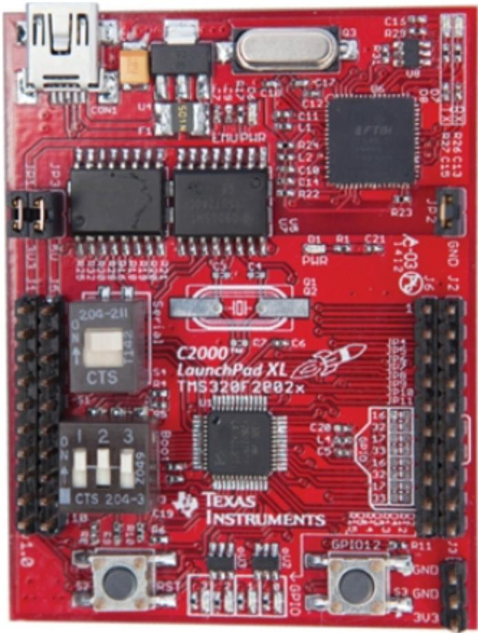

text_image

C16
R20
U0
D0
R26 C13
R22 C15
J2
GND J2
C17
C12
C11
L1
D2
L2
C10
C14
R22
R23
J2
GND
J2
C2000
LaunchPad XL
TMS320F2e02x
C28
L4
C5
16
17
16
17
16
17
16
17
16
17
16
17
16
17
16
17
16
17
16
17
16
17
16
17
16
17
16
17
16
17
16
17
16
17
16

不同点 ：形态，功能，资源，价值，功耗，开发方式。

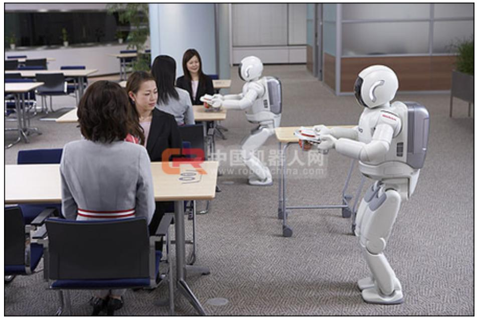

natural_image

Interior of a modern office with people interacting around tables and robots (no visible text or symbols)

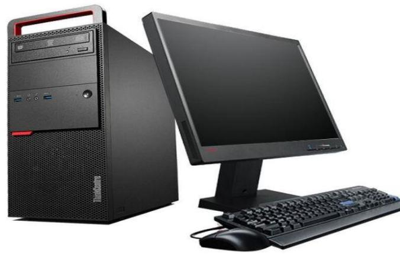

natural_image

Black desktop computer setup with tower, monitor, keyboard, and mouse (no visible text or labels)

natural_image

Stacked smartphone screens in various orientations, showing app icons and screen interfaces (no visible text or symbols)

1.专用性强：嵌入式系统按照具体应用需求进行设计，完成指定的任务，只能面向某个特定应用。  
2.可裁剪性：嵌入式系统的硬件和软件必须高效率地设计，根据实际应用需求量体裁衣，去除冗余。  
3.实时性好：嵌入式系统能够在可预知的极短时间内对事件或用户的干预做出响应。  
4. 可靠性高：很多嵌入式系统必须持续不间断工作。  
5. 生命周期长：嵌入式系统的生命周期与其嵌入的产品或设备同步。  
6. 不易被垄断：各类嵌入式系统软硬件差别显著

## 1. 冯·诺依曼结构和哈佛结构

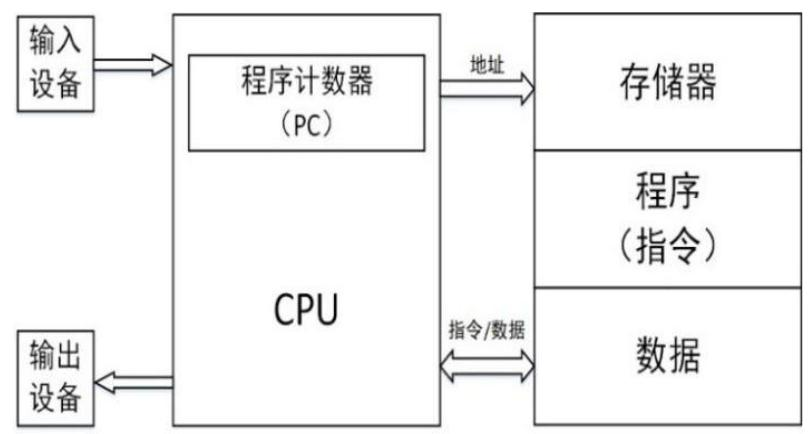

flowchart

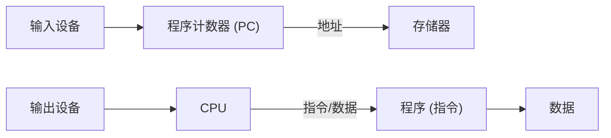

冯·诺依曼结构

三个基本原则：采用二进制逻辑、程序存储执行以及计算机由五个部分组成（运算器、控制器、存储器、输入设备、输出设备）

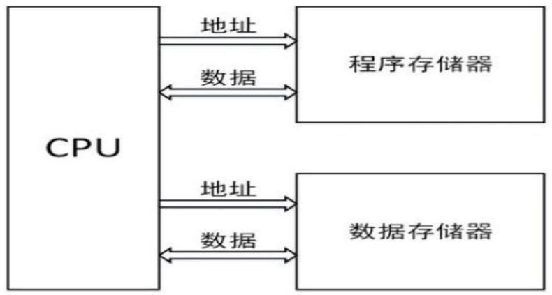

flowchart

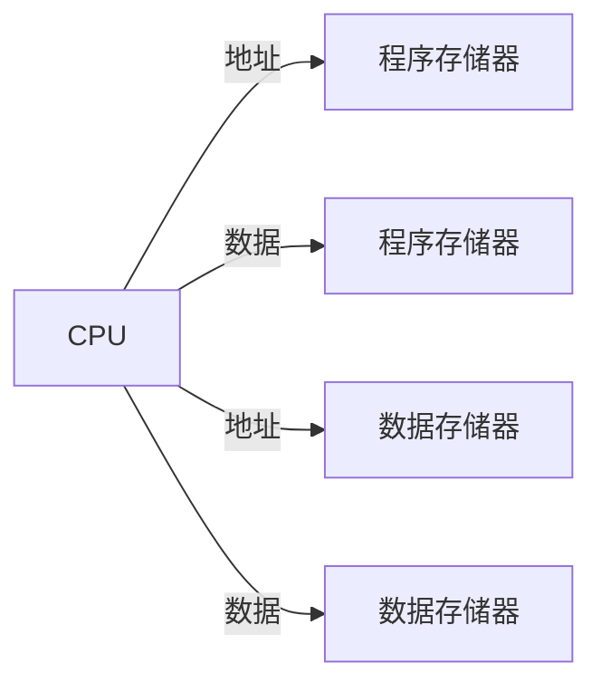

哈佛体系储存系统结构图

存储器结构：程序存储器和数据存储器是两个独立的存储器，每个存储器独立编址、独立访问。

## 2. CISC和RISC

CISC: 复杂指令集计算机，包括一个丰富的微指令集，这些微指令简化了在处理器上运行的程序的创建，指令集越丰富，为微处理器编写程序就越容易。CISC技术的复杂性在于硬件，在于CPU和控制单元的设计及实现。

RISC: 精简指令集计算机，RISC结构优先选取使用频率最高的简单指令，避免复杂指令；将指令长度固定，指令格式和寻址方式种类减少。相对于CISC，RISC技术的复杂性在于软件，在于编译程序的编写和优化。

## 3. 嵌入式系统处理器种类

嵌入式处理器一般包含微处理器（MPU）、微控制器（MCU，俗称单片机）、数字信号处理器（DSP）和嵌入式片上系统（System on Chip ，简称SoC）

嵌入式微控制器（MCU）:又称单片机，一般以某种微处理器内核为核心，芯片内部集成了ROM/EPROM/RAM 、总线、定时器/计数器、看门狗、I/O接口、ADC、PWM、通信接口等各种必要功能的外设。其片上外设资源一般比较丰富，适合于控制，因此称为微控制器。与嵌入式微处理器相比，MCU的最大特点是单片化，体积大大减小，从而使功耗和成本下降，可靠性提高。微控制器是目前嵌入式系统工业的主流产品。

1.2.1 MCU的概念  
1.2.2 MCU的基本组成  
1.2.3 MCU的特点  
1.2.4 MCU的发展  
1.2.5 MCU的应用

## MCU的概念

微控制器的英文名称MCU（Micro Control Unit），又称单片微型计算机（Single Chip Microcomputer）或者单片机，是把中央处理器（Central Process Unit；CPU）、存储器（memory）、I/O接口、定时器/计数器（Timer）、ADC、通信接口等外设以及连接它们的总线都集成在一块芯片上，形成芯片级的计算机，为不同的应用场合实现不同组合控制。

MCU分为通用型和专用型两大类。通常所说的单片机，包括本书介绍的TMS320F28027微控制器都属于通用型单片机。通用型单片机把可开发的资源全部提供给使用者。专用型单片机也称专用微控制器，是针对某些应用专门设计的，例如打印机控制器、频率合成调谐器等。

中央处理单元（CPU）：单片机的CPU由运算器和控制器组成，是单片机的“大脑”，具有运算和控制的功能。单片机的指令代码就是通过CPU执行的。单片机另外增设了“面向控制”的处理功能，如位处理、查表、跳转、乘除法运算、状态检测、中断处理等，增强了实用性。

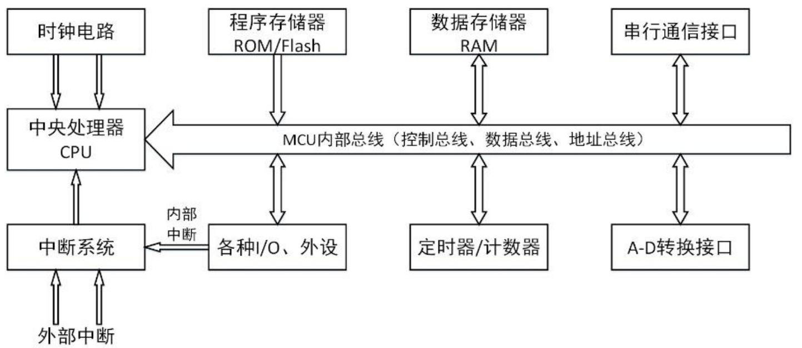

flowchart

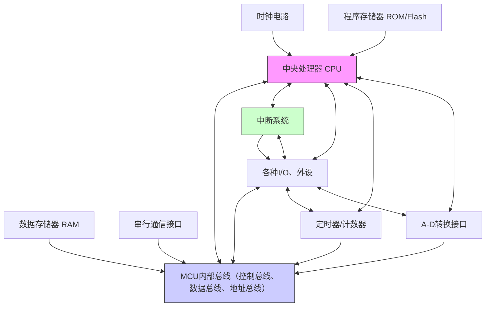

时钟：单片机的CPU由运算器和控制器组成，是单片机的“大脑”，具有运算和控制的功能。单片机的指令代码就是通过CPU执行的。单片机另外增设了“面向控制”的处理功能，如位处理、查表、跳转、乘除法运算、状态检测、中断处理等，增强了使用性。

存储器：单片机的存储器包括存放代码指令的ROM（或Flash），以及存放变量、数据的SRAM。存储空间有两种基本结构：冯·诺依曼结构和哈佛结构。

通用I/O口：单片机一般都提供一定数量、使用灵活的通用I/O口（GPIO），可以当作输入或输出接口。大部分单片机为了减少引脚数量，I/O口还复用作为其它特殊功能引脚，比如PWM输出、捕获输入、串行通信、外部中断输入等。

定时器/计数器：单片机的定时器/计数器能够提供精确定时，或者对外部事件进行计数。内部硬件本质是计数器，当计数器脉冲来源是固定频率脉冲时，可通过计数来实现计时，称之为定时器。

中断系统：中断系统是单片机的重要组成部分。单片机的中断系统能够加强CPU对多任务事件的处理能力。中断是CPU对系统发生的某个事件作出的一种反应。引起中断的事件称为中断源。中断源向CPU提出处理的请求称为中断请求。发生中断时被打断程序的暂停点称为断点。CPU暂停现行程序而转去响应中断请求的过程称为中断响应。中断响应的程序称为中断处理程序。CPU执行有关的中断处理程序称为中断处理。而返回断点的过程称为中断返回。中断的实现通过软件和硬件综合完成，硬件部分叫做硬件装置，软件部分称为软件处理程序。

看门狗定时器：看门狗定时器（WDT，Watch Dog Timer）是单片机的一个组成部分，其目的是为了避免程序进入死循环（或者说程序“跑飞”）。看门狗实际上是一个计数器，程序运行后看门狗开始计数。看门狗有一个预先设定的值，如果程序运行正常，在计数器的计数值达到设置值之前，用户编写的程序会将看门狗计数器清零（俗称“喂狗程序”），看门狗计数器重新开始计数。如果程序异常，看门狗计数器不会被清零，当增加到设定值时，看门狗电路会输出信号复位单片机系统。

外设：随着硬件的发展，单片机集成的外设越来越多，实时微控制器常用的外设模块有：模数转换模块（ADC）、PWM模块、捕获模块（CAP）、通信模块等等。不同芯片有不同的外设配置，用户需要根据产品的需求选择最佳性价比的芯片。

总线（BUS）：总线是一组相关逻辑信号的集合。不同芯片有不同的总线标准。单片机的常用总线分类包括：控制总线、地址总线和数据总线。

地址总线(Address Bus，AB)：单向，用于传递地址信息。地址线的数目决定了可寻址的存储空间。一根地址线有两种状态，即可以区分两个不同的存储单元，或者说可以寻址两个存储单元；两根地址线有四种状态，可以寻址四个存储单元，其他以此类推。如果有n根地址线，则可以寻址2n个存储单元。

数据总线(Data Bus，DB)：一般为双向，用于CPU与存储器、CPU与外设、或外设与外设之间传送数据信息。我们平常说的8位单片机、16位单片机或32位单片机，指的就是CPU一次能够处理的数据位数，这也决定了单片机数据总线的根数。比如，32位单片机具有32根数据总线，运算器一次能处理32位的数据。

控制总线(Control Bus：CB)：是单片机系统中所有控制信号线的总称，用来传递控制信息。

## MCU的特点 ：

## （1）集成度高

体积小、易于产品化，能方便地组装成各种智能式控制设备以及各种智能仪器仪表。

## （2）控制功能强

面向控制，能针对性地完成从简单到复杂的各种控制任务。可以方便地实现多机和分布式控制，使整个控制系统的效率和可靠性大为提高。

## （3） 可靠性高

抗干扰能力强，适应温度范围宽，能在各种恶劣环境下可靠工作。

## （4） 低功耗

单片机体系结构的改进，以及采用CMOS工艺，极大地降低了单片机的功耗。目前主流单片机的供电电压是3.3V。

## （5） 性价比高

各大单片机公司在提高单片机性能的同时，进一步降低价格，提高性价比是各公司竞争的主要策略。

## （6） 系统设计周期短

由于单片机丰富的外设功能，因而能使硬件设计得到极大的简化；软件方面，各芯片厂家提供了各种可供调用的程序和配套的仿真器，使用户的编程和调试变得很方便，大大减少了用户系统的软件设计和调试的时间，降低了开发周期和成本。

## 飞速发展：

由于单片机功能的飞速发展，其应用领域已远远超出了传统计算机科学的范畴。国内外不同厂家、不同类型的单片机，其年销售量达数十亿片。在20世纪80年代到90年代，国内广泛使用Intel的MCS51系列和Motorola的68HC系列8位单片机。目前，除了TI的C2000系列、MSP430、MSP432系列单片机外，还有Microchip的PIC16/32系列、Atmel的AVR系列、NXP、ST的ARM系列、英飞凌的XC800、XC2000系列单片机等。

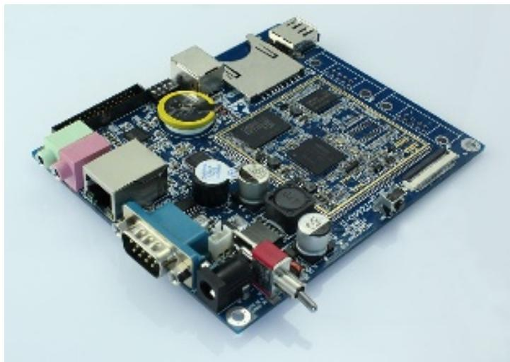

natural_image

Blue printed circuit board with various electronic components and connectors (no visible text or symbols)

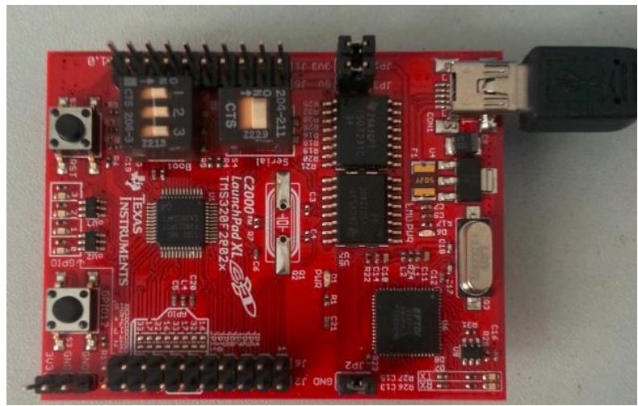

natural_image

Red electronic circuit board with various components and connectors, no visible text or symbols on the board itself.

## 广泛应用：

（1）消费电子类产品：单片机可用于空调、冰箱、洗衣机、电视机、扫地机器人、智能玩具、电子秤、家用多功能报警器等家电领域。  
（2）智能仪器仪表：单片机用于温度、湿度、流量、流速、电压、频率、功率等各类仪器仪表中。  
（3）测控系统：例如各种电机控制、电力电子控制、工业机器人、过程控制、检测系统、汽车电子产品、军工产品等等。  
（4）机电一体化产品：数控机床、医疗器械以及机器人等。  
（5）物联网应用领域：嵌入式技术是物联网技术的最为关键的底层技术，物联网的兴起，给单片机技术提供了一个更为宽广的舞台，同时也给单片机技术发展提供了新的方向。  
（6）计算机网络与通信领域：各种分布式网络系统、智能通信设备、无线遥控系统等。

1.3.1 TI C2000实时微控制器简介  
1.3.2 芯片命名规则  
1.3.3 器件特性  
1.3.4 芯片封装

## 德州仪器

美国德州仪器（TI）是世界著名的半导体公司。经过40多年的不断优化和改进，目前TI的微控制器产品主要系列有：MSP430超低功耗MCU系列、MSP432低功耗高性能MCU系列、无线MCU系列和高性能实时控制C2000系列。

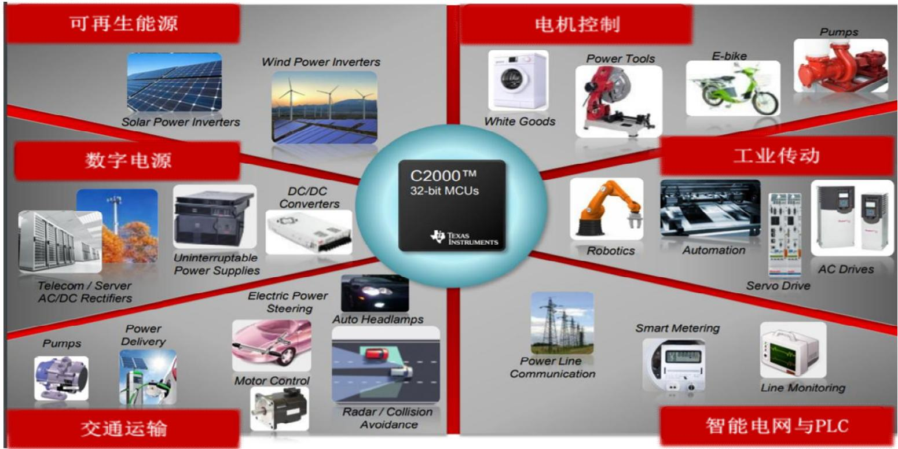

flowchart

```mermaid
graph TD
  A["C2000™ 32-bit MCUs"] --> B["可再生能源"]
  A --> C["电机控制"]
  A --> D["工业传动"]
  A --> E["智能电网与PLC"]
  A --> F["交通运输"]
  A --> G["数字电源"]
  A --> H["智能电网与PLC"]

  B --> B1["Solar Power Inverters"]
  B --> B2["Wind Power Inverters"]
  B --> B3["DC/DC Converters"]
  B --> B4["Uninterruptable Power Supplies"]
  B --> B5["Telecom / Server AC/DC Rectifiers"]
  B --> B6["Pumps"]
  B --> B7["Power Delivery"]
  B --> B8["Motor Control"]
  B --> B9["Radar / Collision Avoidance"]

  C --> C1["Power Tools"]
  C --> C2["White Goods"]
  C --> C3["E-bike"]
  C --> C4["Pumps"]
  C --> C5["Robotics"]
  C --> C6["Automation"]
  C --> C7["Servo Drive"]
  C --> C8["AC Drives"]

  D --> D1["Smart Metering"]
  D --> D2["Line Monitoring"]

  E --> E1["Power Line Communication"]
  E --> E2["Smart Metering"]
```

## 命名规则

芯片的命名包含前缀和后缀。TI的TMS320™MCU器件有三种前缀：

TMX ：试验器件，不一定满足最终器件的电气规范标准。

TMP ：芯片符合器件的电气规范标准，但是未经完整的质量和可靠性验证。

TMS ：完全合格的产品器件

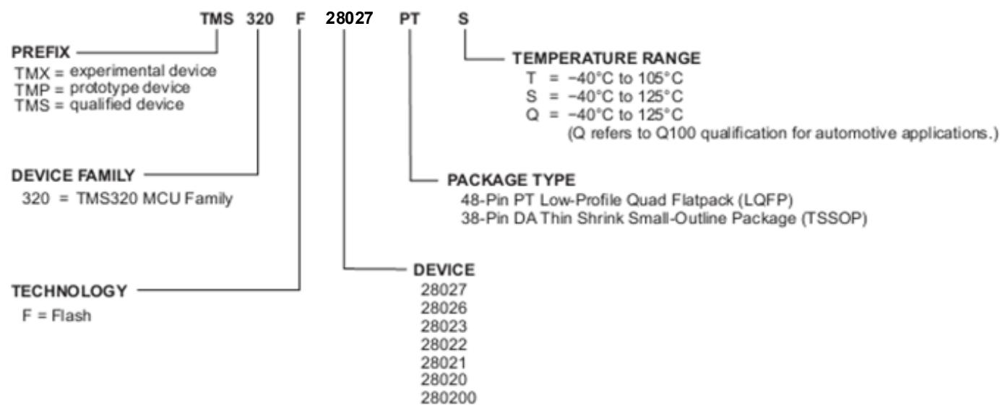

flowchart

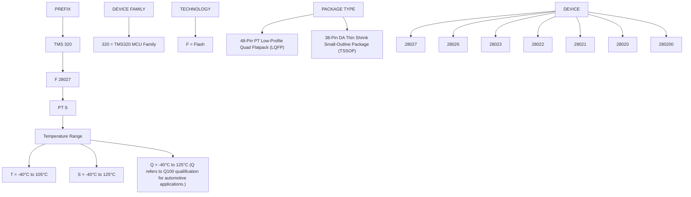

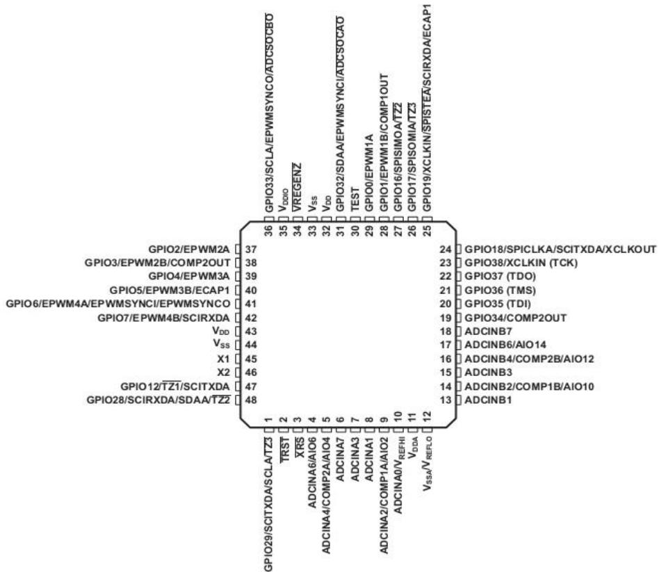

pinout diagram

| Pin Number | Label | Value |
|---|---|---|
| GPIO2/EPWM2A | 37 | 36 |
| GPIO3/EPWM2B/COMP2OUT | 38 | 35 |
| GPIO4/EPWM3A | 39 | 34 |
| GPIO5/EPWM3B/ECAP1 | 40 | 33 |
| GPIO6/EPWM4A/EPWMSYNCI/EPWMSYNCO | 41 | 32 |
| GPIO7/EPWM4B/SCIRXDA | 42 | 31 |
| V_DD | 43 | 30 |
| V_SS | 44 | 29 |
| X1 | 45 | 28 |
| X2 | 46 | 27 |
| GPIO12/TZ1/SCITXDA | 47 | 26 |
| GPIO28/SCIRXDA/SDAA/TZ2 | 48 | 25 |
| TRST | 1 | 24 |
| XRS | 2 | 23 |
| ADCINA6/AIO6 | 3 | 22 |
| ADCINA4/COMP2A/AIO4 | 4 | 21 |
| ADCINA7 | 5 | 20 |
| ADCINA3 | 6 | 19 |
| ADCINA1 | 7 | 18 |
| ADCINA1 | 8 | 17 |
| ADCINA2/COMP1A/AIO2 | 9 | 16 |
| ADCINA0/V_REFHI | 10 | 15 |
| V_DD | 11 | 14 |
| V_SS^V_REFLO | 12 | 13 |
GPIO18/SPICLKA/SCITXDA/XCLKOUT
GPIO38/XCLKIN (TCK)
GPIO37 (TDO)
GPIO36 (TMS)
GPIO35 (TDI)
GPIO34/COMP2OUT
ADCINB7
ADCINB6/AIO14
ADCINB4/COMP2B/AIO12
ADCINB3
ADCINB2/COMP1B/AIO10
ADCINB1

2802x 48引脚 LQFP封装（俯视图）

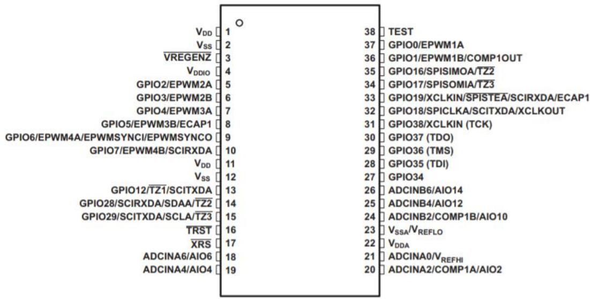

text_image

VDD
VSS
VREGENZ
VDDIO
GPIO2/EPWM2A
GPIO3/EPWM2B
GPIO4/EPWM3A
GPIO5/EPWM3B/ECAP1
GPIO6/EPWM4A/EPWMSYNCI/EPWMSYNCO
GPIO7/EPWM4B/SCIRXDA
VDD
VSS
GPIO12/TZ1/SCITXDA
GPIO28/SCIRXDA/SDAA/TZ2
GPIO29/SCITXDA/SCLA/TZ3
TRST
XRS
ADCINA6/AIO6
ADCINA4/AIO4
O
38 TEST
37 GPIO0/EPWM1A
36 GPIO1/EPWM1B/COMP1OUT
35 GPIO16/SPISIMOA/TZ2
34 GPIO17/SPISOMIA/TZ3
33 GPIO19/XCLKIN/SPISTEA/SCIRXDA/ECAP1
32 GPIO18/SPICLKA/SCITXDA/XCLKOUT
31 GPIO38/XCLKIN (TCK)
30 GPIO37 (TDO)
29 GPIO36 (TMS)
28 GPIO35 (TDI)
27 GPIO34
26 ADCINB6/AIO14
25 ADCINB4/AIO12
24 ADCINB2/COMP1B/AIO10
23 VSSA/VREFLO
22 VDDA
21 ADCINA0/VREFHI
20 ADCINA2/COMP1A/AIO2

## 思考题：

§1-1 什么是嵌入式系统？  
§1-2 嵌入式系统的特点？  
§1-3 嵌入式系统的分类？  
§1-4 嵌入式系统与通用计算机的异同点？  
§1-5 针对嵌入式系统的专业名词，查阅文献进一步深入理解其基本概念。  
§1-6 微控制器 （MCU）的特点？  
§1-7 微控制器 （MCU） 的基本组成有哪些？  
1-8 微控制器的应用领域有哪些？  
§1-9 登录www.ti.com官网，了解C2000微控制器的特点和应用场合。  
§1-10 查阅文献资料，了解国产单片机的性能特点和发展趋势。