## 单片机原理及应用

## Principle And Application Of Microcontroller

福州大学电气学院

教材：《微控制器原理及应用--基于TI C2000实时微控制器》，蔡逢煌、王武、江加辉，机械工业出版社

参考资料：

¯TMS320F2802x, TMS320F2802xx Piccolo Technical Reference Manual.

¯TMS320F2802x Microcontrollers datasheet.

## 本章目录

1 F28027硬件资源简介  
2 功能概述  
3 简要说明  
4 内存映射  
5 时钟  
6 看门狗电路

## 本章目录

7 低功耗模式  
8 片内电压稳压器/欠压复位/上电复位  
9 F28027最小系统设计

2.1.1 资源概览  
2.1.2 F28027的封装  
2.1.3 芯片引脚说明

硬件是软件工作的基础  
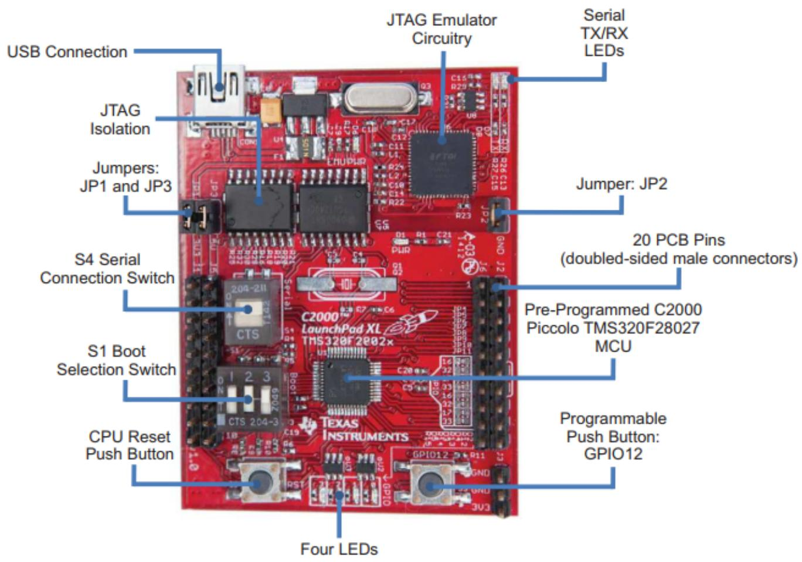

text_image

USB Connection
JTAG Isolation
Jumpers: JP1 and JP3
S4 Serial Connection Switch
S1 Boot Selection Switch
CPU Reset Push Button
Four LEDs
JTAG Emulator Circuitry
Serial TX/RX LEDs
Jumper: JP2
20 PCB Pins (doubled-sided male connectors)
Pre-Programmed C2000 Piccolo TMS320F28027 MCU
Programmable Push Button: GPIO12

## 硬件是软件工作的基础

1.高效32位中央处理单元(CPU) (TMS320C28x™)  
2.存储方式：小端存储  
3.器件低成本  
4.时钟  
5.丰富外设资源  
6.安全  
7.高级仿真特性  
8.其他：封装，工作温度等

F28027的引脚按其功能进行分类，可以分为JTAG接口、Flash、时钟信号、复位引脚、ADC模拟输入信号、CPU和I/O电源引脚、电压调节控制引脚、GPIO和外设信号。具体引脚功能如表2-1所示。需要说明的是，表中的I表示输入，O表示输出，Z表示高阻态，OD表示开漏，↑表示内部上拉，↓表示内部下拉。GPIO与外设引脚复用，最多有四种不同的功能。除JTAG引脚以外，GPIO功能为引脚复位后的默认功能。所有GPIO引脚为I/O/Z且有一个可独立使能/禁止的内部上拉电阻。具有PWM功能的引脚（GPIO0\~GPIO7）的上拉电阻在复位时不启用，其它GPIO引脚的上拉电阻在复位时会被启用。

图2-1 F28027封装图（俯视图）  
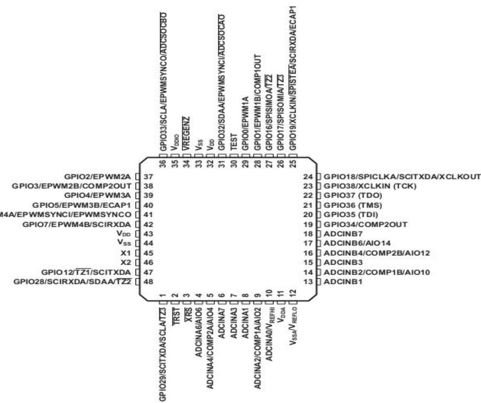

text_image

GPIO2/EPWM2A
GPIO3/EPWM2B/COMP2OUT
GPIO4/EPWM3A
GPIO5/EPWM3B/ECAP1
14A/EPWMSYNCI/EPWMSYNCO
GPIO7/EPWM4B/SCIRXDA
VDD
Vss
X1
X2
GPIO12/TZ1/SCITXDA
GPIO28/SCIRXDA/SDAA/TZ2
1
2
3
4
5
6
7
8
9
10
11
12
13
14
15
16
17
18
19
20
21
22
23
24
25
26
27
28
29
30
31
32
33
34
35
36
37
GPIO33/SCLA/EPWMSYNCO/ADCSOCD
VDDO
VREGENZ
Vss
VDD
GPIO32/SDAA/EPWMSYNCI/ADCSOCD
TEST
GPIO0/EPWM1A
GPIO1/EPWM1B/COMP1OUT
GPIO16/SPISIMOATTZ
GPIO17/SPISOMIATTZ3
GPIO19/XCLKIN/SPISTEA/SCIRXDA/ECAP1
GPIO18/SPICLKA/SCITXDA/XCLKOUT
GPIO38/XCLKIN (TCK)
GPIO37 (TDO)
GPIO36 (TMS)
GPIO35 (TDI)
GPIO34/COMP2OUT
ADCINB7
ADCINB6/AIO14
ADCINB4/COMP2B/AIO12
ADCINB3
ADCINB2/COMP1B/AIO10
VDDA/VSSA/VREFLO

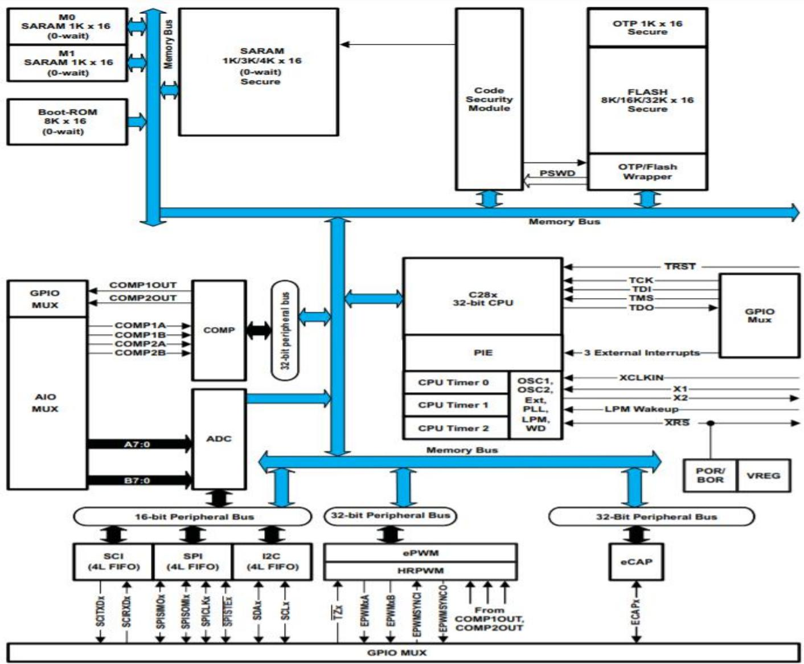

flowchart

```mermaid
graph TD
    subgraph Memory Bus
        M0["SARAM 1K x 16 (0-wait)"]
        M1["SARAM 1K x 16 (0-wait)"]
        Boot-ROM["Boot-ROM 8K x 16 (0-wait)"]
    end

    subgraph ADC
        AIO["MUX"]
        AIO_MUX
    end

    subgraph C28x_CPU
        C28x_32bit_CPU["C28x 32-bit CPU"]
        PIE["PIE"]
        CPU_Timer_0["CPU Timer 0"]
        CPU_Timer_1["CPU Timer 1"]
        CPU_Timer_2["CPU Timer 2"]
        OSC1_OSC2_Ext_PLL_LPM_WD["OSC1, OSC2, Ext_PLL_LPM_WD"]
        XCLKIN["XCLKIN"]
        X1["X1"]
        X2["X2"]
        LPM_Wakeup["LPM_Wakeup"]
        XRS["XRS"]
    end

    subgraph sg_32_bit_Peripheral_Bus["32-bit Peripheral Bus"]
        ADC["ADC"]
        SPI["SPI (4L FIFO)"]
        I2C["I2C (4L FIFO)"]
        ePWM["ePWM HRPWM"]
        16Bit["16-bit Peripheral Bus"]
        32Bit["32-bit Peripheral Bus"]
        32BitPer["32-Bit Peripheral Bus"]
        eCAP["eCAP"]
    end

  MEMS["Memory Bus"] --> ROM["Code Security Module"]
  ROM --> OTPFF["OTP/Flash Wrapper"]
  ROM --> FLASH["FLASH 8K/16K/32K x 16 Secure"]
  ROM --> OTP1["OTP 1K x 16 Secure"]

  MEMS --> COMPOUT["COMP1OUT COMP2OUT"]
  COMPOUT --> COMP
  COMP --> COMP1A["COMP1A"]
  COMP --> COMP1B["COMP1B"]
  COMP --> COMP2A["COMP2A"]
  COMP --> COMP2B["COMP2B"]

  MEMS --> TRST["TRST"]
  TRST --> TCK["TCK"]
  TRST --> TDI["TDI"]
  TRST --> TMS["TMS"]
  TRST --> TDO["TDO"]

  MEMS --> GPIOMux["GPIO Mux"]
  MEMS --> PORBOR["POR/BOR VREG"]

  MEMS --> XCLKIN["XCLKIN"]
  MEMS --> X1["X1"]
  MEMS --> X2["X2"]

  MEMS --> XRS["XRS"]

  MEMS --> eCAP["eCAP"]

  MEMS --> GPIOMUX["GPIO MUX"]

  MEMS --> SCTXDx["SCI (4L FIFO)"]
  MEMS --> SCRXDx["SCRXDx"]
  MEMS --> SPISMOx["SPISMOx"]
  MEMS --> SPICLKx["SPICLKx"]
  MEMS --> SPISTEX["SPISTEX"]
  MEMS --> SDAx["SDAx"]
  MEMS --> SCLx["SCLx"]

  MEMS --> TZx["TZx"]
  MEMS --> EPWMxA["EPWMxA"]
  MEMS --> EPWMxB["EPWMxB"]
  MEMS --> EPWMSYNC1["EPWMSYNC1"]
  MEMS --> EPWMSYNCO["EPWMSYNCO"]
  MEMS --> FromCOMP1OUT["From COMP1OUT, COMP2OUT"]

  MEMS --> ECAPx["ECAPx"]

  MEMS --> GPIOMUX["GPIO MUX"]

  MEMS --> B7.0["A7:0"]
  MEMS --> B7.0["B7:0"]

  MEMS --> CompOUT
  MEMS --> CompOUT
  MEMS --> CompOUT
  MEMS --> CompOUT
  MEMS --> CompOUT
  MEMS --> CompOUT
```

图2-2 MCU原理框图

## MCU 硬件功能概述

F28027有一个32位的CPU内核（TMS320C28x），主频高达60MHz，同时它具有GPIO、模数转换器ADC、增强型PWM模块、增强型捕获模块、串口通信接口、串行外设接口等外设。功能丰富强大，用户可以方便地用它来开发高性能的微控制系统。片内集成了Flash存储器，程序可以直接烧写到Flash中，实现脱机运行。

## 硬件配置

## CPU:

2802x（C28x）系列是TMS320C2000TM微控制器平台的成员，是32位定点CPU架构。

C2000开发平台具有非常高效的C/C++编译器，编程者可以使用C/C++高级语言开发系统控制软件和数字算法。数字算法任务与系统控制任务的处理效率同样高效，这一特性免除了在许多系统中对第二个微处理器的需要。

32×32位的乘法器、乘累加器（Multiply and Accumulate,MAC）的64位处理能力能提高数字信号处理的分辨率，减少数字处理误差。

具有增强型快速中断响应机制和重要控制寄存器自动写保护机制，并能够以最小的延迟中断处理多个异步事件。

具有8级深度并受保护的流水线和流水线存储器存取机制，无需昂贵的高速存储器便可高速运行。

具有专门的转移超前（Branch-look-ahead）硬件，使条件不连续延迟最小化。专门的条件操作存储机制进一步提高了控制器性能。

## 硬件配置

## 内存总线 （Memory Bus）

F28027内存总线结构属于C28x内存总线架构，是一种哈佛总线架构，即在内存、外设和CPU之间采用多总线结构。总线架构包含程序读总线、数据读总线和数据写总线。程序读总线由22条地址线和32条数据线组成。数据读和数据写总线由32条地址线和32条数据线组成。32位的数据总线可实现单周期32位操作，使得C28x能够在单周期内取一个指令、读取一个数据和写入一个数据。内存总线访问的优先级概括如下：

最高级：数据写（内存总线上不能同时进行数据和程序写入操作）

程序写（内存总线上不能同时进行数据和程序写入操作）

数据读

程序空间数据读（内存总线上不能同时进行程序空间数据和指令的读取）

最低级：取指令（内存总线上不能同时进行程序空间数据和指令的读取）

## 硬件配置

## 外设总线 （Peripheral Bus）

为了在TI系列MCU之间方便地实现外设迁移，MCU采用一种针对外设互联的外设总线标准。外设总线桥复用了多种总线，并将CPU内存总线组装进一个由16条地址线和16或32条数据线和相关控制信号组成的单总线中。有3种类型的外设总线版本，一种是支持16位访问（外设帧2），一种是支持16位或32位访问（外设帧1）。外设帧0通过CPU内存总线访问。

## 闪存（Flash）:

F28027微控制器包含：32K×16的嵌入式闪存存储器，分别放置在4个8K×16扇区内；一个1K×16OTP内存（一次性可编程内存）。用户可以单独擦除、编辑和验证一个闪存扇区，但不能使用闪存的一个扇区或者OTP来执行擦除/编辑其他扇区的闪存算法。Flash采用特殊的流水线存储器操作使得闪存实现更高的性能。闪存/OTP被映射到程序和数据空间，可用于执行代码或存储数据。闪存或OTP受代码安全保护。

## 硬件配置

## M0、 M1 SARAMs:

SARAM（Single Access RAM）即单周期访问RAM，一个周期只能访问一次，不能同时进行读写操作。M0和M1大小为1K×16，可以被映射到程序空间或数据空间。用户能够使用M0和M1来执行代码或者保存数据变量。不同的分区由连接器进行连接。这种统一的内存映射，使得用高级语言编程变得更加容易。

## L0 SARAM:

该SARAM为4K×16大小，可以映射到程序和数据空间。一般在程序调试阶段用来作为程序存储空间。

## 硬件配置

## 引导ROM （Boot-ROM）

保存芯片厂家烧写的引导程序。上电复位后，F28027的3个引脚信号（GPIO34、GPIO37和/TRST3）电平被检测，引导程序根据这3个引脚信号电平决定执行哪种引导模式。用户可以选择正常引导或者从外部连接下载更新用户软件（引导过程的具体细节参见4.5.2）。引导ROM还包含数学运算的相关表格，比如SIN/COS表格。

## 代码安全模块（Code Security Module）

代码安全模块（CSM）保护程序的安全性，它禁止未授权的用户访问片内存储器，禁止未授权的代码复制或者逆向工程操作。可以用于保护闪存/OTP和L0SARAM。安全模块有一个128位密钥，密钥由用户编程时写入闪存。用户访问受保护的存储空间时，必须写入与存储在闪存密钥位置内的128位密钥值一致的密钥。

## 硬件配置

## 外设中断扩展模块 （PIE）

PIE用于管理众多的外设中断，能够支持多达96个外设中断。96个外设中断分成12组，每组8个外设中断，每个中断都有一个对应的中断入口地址（中断向量）。CPU响应中断时自动获取中断入口地址并保存关键的CPU寄存器值，这个过程需要8个时钟周期，因此CPU能够对中断事件快速作出响应。可以通过硬件和软件控制中断的优先级，在PIE模块使能/禁止相应的外设中断。

## 外部中断 （External Interrupts）

有3个可屏蔽的外部中断XINT1\~XINT3。每一个中断可选择上升沿、下降沿或两者都可以触发，并能够使能/禁止。外部中断还包含一个16位自由运行的增计数计数器，当检测到一个有效的触发沿时，计数器复位为0。外部中断没有专用引脚，可以选择GPIO0-GPIO31任意引脚作为外部中断的输入。

## 硬件配置

## 内部振荡器，振荡器，锁相环（PLL）

F28027有两个内部振荡器、一个外接晶振源的振荡器和一个外部时钟输入接口。提供可编程的PLL对时钟信号进行倍频。PLL模块可设定为旁路工作模式。

## 看门狗 （Watch Dog）

包含监测内核的CPU看门狗电路和监测时钟丢失的NMI看门狗电路。当发生时钟故障时，NMI看门狗电路可生成一个中断和器件复位信号。CPU看门狗电路需要定期“喂狗”，否则，将输出复位CPU信号。用户可以禁止CPU看门狗。

## 硬件配置

## 通用输入/输出多功能复用器(GPIO MUX) :

大多数的外设信号与通用输入/输出共用引脚，复位时，GPIO引脚配置为输入，用户可以配置每个引脚为通用GPIO或者特殊功能引脚，对于特定的输入，用户可以配置噪声滤波，GPIO引脚输入信号也可以作为芯片低功耗模式的唤醒。

## 32位定时器0，1，2（Watch Dog）

3个32位的定时器，分别是CPU Timer0、CPU Timer1和CPU Timer2。它们功能一样，都有一个32位的减计数器。输入的计数脉冲可以进行预分频。当计数到0，在下一个计数脉冲信号到来时产生一个中断信号，并且重新装载周期值。

## 硬件配置

## 通用输入/输出多功能复用器(GPIO MUX) :

大多数的外设信号与通用输入/输出共用引脚，复位时，GPIO引脚配置为输入，用户可以配置每个引脚为通用GPIO或者特殊功能引脚，对于特定的输入，用户可以配置噪声滤波，GPIO引脚输入信号也可以作为芯片低功耗模式的唤醒。

## 32位定时器0，1，2（Watch Dog）

3个32位的定时器，分别是CPU Timer0、CPU Timer1和CPU Timer2。它们功能一样，都有一个32位的减计数器。输入的计数脉冲可以进行预分频。当计数到0，在下一个计数脉冲信号到来时产生一个中断信号，并且重新装载周期值。

## 硬件配置

## 器件支持以下用于嵌入式控制的外设:

ePWM：增强型脉冲宽度调制。F28027中拥有4组ePWM模块，分别是ePWM1，ePWM2，ePWM3和ePWM4。每组模块有两路输出，分别是ePWMxA和ePWMxB。在描述ePWM模块时，为了泛指，采用ePWMx来表示，字母“x”取值从1到n，n为芯片具有的ePWM模块数。每个ePWM模块内部由8个子模块组成，分别是时基（TB）子模块、计数器比较（CC）子模块、动作限定（AQ）子模块、死区（DB）子模块、斩波（PC）子模块、事件触发（ET）子模块、触发保护区（TZ）子模块和数字比较器（DC）子模块。

eCAP：增强型捕获模块。F28027有1个eCAP输入。使用32位定时器时基实现事件捕获，主要应用在速度测量、脉冲序列周期测量等方面。该外设还可以配置为辅助的PWM输出。

ADC：F28027有一个12位的模数转换器，其前端为两个八选一多路切换器和两路采样/保持器，构成16路模拟输入通道（实际只有13路外部输入）。模拟通道的切换由硬件自动控制，转换结果存入对应的结果寄存器中。

Comparator：模拟比较器。比较器的一个输入由内部10位参考量设定。

## 硬件配置

## 串行通信外设:

SCI：异步串行通信接口，通常称为UART。有4级接收/发送FIFO寄存器。

SPI：串行外设接口。SPI是一个高速、同步串行接口。常用于MCU和外设之间的通信。有4级接收/发送FIFO寄存器。

IIC：内部集成电路总线，是两线式串行总线。常用于MCU和其他器件之间的接口。有4级接收/发送FIFO寄存器。

## 储存空间分配

F28027内部集成了各种不同的存储介质，有32K×16位的Flash，6K×16位的SRAM，8K×16位的BOOT ROM，1K×16位的OTP ROM和外设帧寄存器等。F28027的数据空间和程序空间是统一编址的，各存储器地址都是连续而且唯一的。存储器单元的地址在设计时就确定下来了，也就是存储器映像（Map），根据存储器单元的地址，就能找到相应的存储单元。

图2-3 存储空间映射图

<table><tr><td></td><td>Data Space</td><td>Prog Space</td></tr><tr><td>0x00 0000</td><td colspan="2">M0 Vector RAM (Enabled if VMAP = 0)</td></tr><tr><td>0x00 0040</td><td colspan="2">M0 SARAM (1K x 16, 0-Wait)</td></tr><tr><td>0x00 0400</td><td colspan="2">M1 SARAM (1K x 16, 0-Wait)</td></tr><tr><td>0x00 0800</td><td>Peripheral Frame 0</td><td rowspan="3">Reserved</td></tr><tr><td>0x00 0D00</td><td>PIE Vector - RAM (256 x 16) (Enabled if VMAP = 1, ENPIE = 1)</td></tr><tr><td>0x00 0E00</td><td>Peripheral Frame 0</td></tr><tr><td>0x00 2000</td><td colspan="2">Reserved</td></tr><tr><td>0x00 6000</td><td>Peripheral Frame 1 (4K x 16, Protected)</td><td rowspan="2">Reserved</td></tr><tr><td>0x00 7000</td><td>Peripheral Frame 2 (4K x 16, Protected)</td></tr><tr><td>0x00 8000</td><td colspan="2">L0 SARAM (4K x 16) (0-Wait, Secure Zone + ECSL, Dual Mapped)</td></tr><tr><td>0x00 9000</td><td colspan="2">Reserved</td></tr><tr><td>0x3D 7800</td><td colspan="2">User OTP (1K x 16, Secure Zone + ECSL)</td></tr><tr><td>0x3D 7C00</td><td colspan="2">Reserved</td></tr><tr><td>0x3D 7C80</td><td colspan="2">Calibration Data</td></tr><tr><td>0x3D 7CC0</td><td colspan="2">Get_mode function</td></tr><tr><td>0x3D 7CE0</td><td colspan="2">Reserved</td></tr><tr><td>0x3D 7E80</td><td colspan="2">Calibration Data</td></tr><tr><td>0x3D 7EB0</td><td colspan="2">Reserved</td></tr><tr><td>0x3D 7FFF</td><td colspan="2">PARTID</td></tr><tr><td>0x3D 8000</td><td colspan="2">Reserved</td></tr><tr><td>0x3F 0000</td><td colspan="2">FLASH (32K x 16, 4 Sectors, Secure Zone + ECSL)</td></tr><tr><td>0x3F 7FF8</td><td colspan="2">128-Bit Password</td></tr><tr><td>0x3F 8000</td><td colspan="2">L0 SARAM (4K x 16) (0-Wait, Secure Zone + ECSL, Dual Mapped)</td></tr><tr><td>0x3F 9000</td><td colspan="2">Reserved</td></tr><tr><td>0x3F E000</td><td colspan="2">Boot ROM (8K x 16, 0-Wait)</td></tr><tr><td>0x3F FFCO</td><td colspan="2">Vector (32 Vectors, Enabled if VMAP = 1)</td></tr></table>

## 储存空间分配

## 1. 0x000000\~0x0007FF

M0 SARAM和M1 SARAM大小均为1K×16位，地址范围分别为0x000000\~0x0003FF、0x000400\~0x0007FF。当复位后，堆栈指针指向M1块的起始地址，堆栈指针向上生长。M0、M1可以映射到程序区和数据区。

## 2. 0x000800\~0x0001FFF

（1）外设帧0寄存器支持16位和32位访问。  
（2）如果寄存器是受EALLOW保护的，那么在对寄存器进行写操作时必须先执行EALLOW指令，否则写操作无效。写操作结束后必须执行EDIS指令，防止非法代码或指针破坏寄存器内容。  
（3）闪存寄存器也受到代码安全保护模块CSM的保护。

对应图中的外设帧0，为寄存器映射空间，该空间直接通过CPU内存总线访问。具体内容见表。

<table><tr><td>名称</td><td>地址范围</td><td>大小(×16)</td><td>EALLOW保护(2)</td></tr><tr><td>器件仿真寄存器</td><td>0x00 0880 - 0x00 0984</td><td>261</td><td>是</td></tr><tr><td>系统电源控制寄存器</td><td>0x00 0985 - 0x00 0987</td><td>3</td><td>是</td></tr><tr><td>闪存寄存器 (3)</td><td>0x00 0A80 - 0x00 0ADF</td><td>96</td><td>是</td></tr><tr><td>代码安全模块寄存器</td><td>0x00 0AE0 - 0x00 0AEF</td><td>16</td><td>是</td></tr><tr><td>ADC结果寄存器(0等待只读)</td><td>0x00 0B00 - 0x00 0B0F</td><td>16</td><td>否</td></tr><tr><td>CPU-定时器0/1/2寄存器</td><td>0x00 0C00 - 0x00 0C3F</td><td>64</td><td>否</td></tr><tr><td>PIE寄存器</td><td>0x000CEO - 0x000CFF</td><td>32</td><td>否</td></tr><tr><td>PIE向量表</td><td>0x000D00 - 0x000DFF</td><td>256</td><td>否</td></tr></table>

## 储存空间分配

## 3. 0x006000\~0x0006FFF

（1）有些寄存器是受EALLOW保护的。更多信息参见数据手册。

对应图中的外设帧1，为寄存器映射空间，该空间通过32位外设总线访问。具体内容见表。

<table><tr><td>名称</td><td>地址范围</td><td>大小(×16)</td><td>EALLOW保护</td></tr><tr><td>比较寄存器1</td><td>0x00 6400 - 0x00 641F</td><td>32</td><td>(1)</td></tr><tr><td>比较寄存器2</td><td>0x00 6420 - 0x00 643F</td><td>32</td><td>(1)</td></tr><tr><td>ePWM1+HRPWM1寄存器</td><td>0x00 6800 - 0x00 683F</td><td>64</td><td>(1)</td></tr><tr><td>ePWM2+HRPWM2寄存器</td><td>0x00 6840 - 0x00 687F</td><td>64</td><td>(1)</td></tr><tr><td>ePWM3+HRPWM3寄存器</td><td>0x00 6880 - 0x00 68BF</td><td>64</td><td>(1)</td></tr><tr><td>ePWM4+HRPWM4寄存器</td><td>0x00 68C0 - 0x00 68FF</td><td>64</td><td>(1)</td></tr><tr><td>eCAP1寄存器</td><td>0x00 6A00 - 0x00 6A1F</td><td>32</td><td>否</td></tr><tr><td>GPIO寄存器</td><td>0x00 6F80 - 0x00 6FFF</td><td>128</td><td>(1)</td></tr></table>

## 储存空间分配

## 4. 0x006000\~0x0006FFF

（1）有些寄存器是受EALLOW保护的。更多信息参见数据手册。

对应图中的外设帧2，为寄存器映射空间，该空间通过16位外设总线访问。具体内容见表。

<table><tr><td>名称</td><td>地址范围</td><td>大小(×16)</td><td>EALLOW保护</td></tr><tr><td>系统控制寄存器</td><td>0x00 7010 - 0x00 702F</td><td>32</td><td>是</td></tr><tr><td>SPI-A寄存器</td><td>0x00 7040 - 0x00 704F</td><td>16</td><td>否</td></tr><tr><td>SCI-A寄存器</td><td>0x00 7050 - 0x00 705F</td><td>16</td><td>否</td></tr><tr><td>NMI看门狗中断寄存器</td><td>0x00 7060 - 0x00 706F</td><td>16</td><td>是</td></tr><tr><td>外部中断寄存器</td><td>0x00 7070 - 0x00 707F</td><td>16</td><td>是</td></tr><tr><td>ADC寄存器</td><td>0x00 7100 - 0x00 717F</td><td>128</td><td>(1)</td></tr><tr><td>I2C-A寄存器</td><td>0x00 7900 - 0x00 793F</td><td>64</td><td>(1)</td></tr></table>

## 储存空间分配

## 5. 0x008000\~0x0008FFF

L0 SARAM的大小为4K×16位，即可以映射到程序区，也可以映射到数据区。L0 SRAM受片上的Flash中的密码保护和仿真代码安全保护（ECSL：Emulation Code Security Logic），可以避免程序和数据被他人非法复制。L0 SRAM地址为双映射，可以映射到0x008000\~0x008FFF，也可以映射到0x03F8000\~0x3F8FFF。

## 6. 0x3D7800\~0x3D7BFF

用户OTP区的大小为1K×16位，即可以映射到程序区，也可以映射到数据区。受片上的Flash中的密码保护和仿真代码安全保护，该存储区只能编程一次而且不可擦除。

## 7. 0x3D7C80\~0x3D7CBF

该空间为内部振荡器和ADC模块的校正数据空间。由厂家进行编程，用户不可编程。

## 储存空间分配

## 8. 0x3D7CC0\~0x3D7CDF

该存储空间保存MCU工作模式引导程序。在MCU初始化引导时调用引导程序进入相应模式。具体引导方法参见4.5.2。

## 9. 0x3D7E80\~0x3D7EAF

预留给TMX/TMP系列芯片使用。

## 10. 0x3D7FFF

保存设备相关信息，对于TI 28027PT读取值为0x00CF。

## 储存空间分配

## 11. 0x3F0000\~0x3F7FF7

F28027的闪存分为四个扇区，每个扇区8K×16，分别是扇区D、扇区C、扇区B、扇区A。如表2-5所示。

如果使用代码安全模式，Flash空间0x3F 7F80 - 0x3F 7FF5不能用来保存程序代码或数据，必须将这些区域编程为0。

如果不使用安全代码模式，FLASH空间0x3F 7F80 - 0x3F 7FEF可以用来保存程序或数据，但是0x3F7FF0\~0x3F7FF5只能用于保存数据，不能用于保存程序代码。 表2-5 F28027 FLASH扇区地址 表2-5 F28027FLASH扇区地址

<table><tr><td>地址范围</td><td>程序和数据空间</td></tr><tr><td>0x3F 0000 - 0x3F1FFF</td><td>扇区D(8K×16)</td></tr><tr><td>0x3F 2000 - 0x3F3FFF</td><td>扇区C(8K×16)</td></tr><tr><td>0x3F 4000 - 0x3F5FFF</td><td>扇区B(8K×16)</td></tr><tr><td>0x3F 6000 - 0x3F7F7F0x3F 7F80 - 0x3F7FF50x3F 7FF6 - 0x3F7FF70x3F 7FF8 - 0x3F7FFF</td><td>扇区A(8K×16)当使用代码安全模式时,编程为0x0000。保存程序分支指令,引导模式为Flash时的程序入口地址。128位的安全密钥(用户不可设置为全零,否则永久锁定芯片)。</td></tr></table>

## 储存空间分配

## 12. 0x3F7FF8\~0x3F7FFF

128位密码区。密钥由用户编程时写入闪存。为了使能访问安全存储区间（Secure Zone），用户必须写入与存储在闪存密钥位置内的128位密钥值一致的密钥。

除了CSM，仿真代码安全逻辑电路ECSL也已经实现防止未经授权的用户代码访问。在仿真器连接时，任何对于闪存、用户OTP或者L0内存的代码或者数据访问将进入ECSL陷阱并断开仿真连接。为了实现安全代码仿真，同时保持CSM安全内存读取，用户必须向KEY寄存器的低64位写入正确的值。这个值与存储在闪存密钥位置的低64位的值相吻合。请注意仍须执行闪存内128位密钥的假读取。如果密钥位置的低64位为全1（未被编辑），那么无需写入KEY值。

## 储存空间分配

## 13. 0x3FE000\~0x3FFFFF

BOOT ROM用于保存TI的引导装载程序和IQ数学表，在芯片出厂时已经编程好。BOOT ROM的存储空间分配图如图所示，包含IQ数学表、IQ数学函数、Boot loader函数、Flash应用程序接口库、ROM版本和ROM校验和、复位向量和CPU向量表几个部分。

针对TMS320C28x系列芯片，TI公司推出了C28x IQ数字库，库中包含了高度优化和高精度的数学函数，利用存储在Boot ROM中的定点数学表和函数来将器件上的浮点算法转换成定点代码，来加快芯片执行浮点运算的速度。

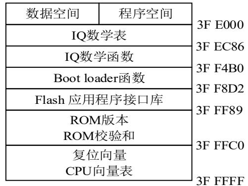

text_image

数据空间	程序空间
IQ数学表
IQ数学函数
Boot loader函数
Flash 应用程序接口库
ROM版本
ROM校验和
复位向量
CPU向量表
3F E000
3F EC86
3F F4B0
3F F8D2
3F FF89
3F FFC0
3F FFFF

图2-4 BOOT ROM存储空间分配

## 储存空间分配

## 13. 0x3FE000\~0x3FFFFF

F28027的CPU向量表位于Boot ROM的0x3F FFC0-0x3F FFFF地址内，CPU向量表如表2-6所示。在复位后，当VMAP=1，ENPIE=0（PIE向量表禁止）时，CPU向量表被激活。其中VMAP位于状态寄存器（ST1）中，复位后为1，在正常工作模式下值保持为1。ENPIE位于PIECTRL寄存器，在复位后默认状态值为0，此时禁止PIE模块。在CPU向量表中，唯一可以直接使用的是位于0x3FFFC0的复位向量，复位向量保存着InitBoot函数的入口地址。其他向量作为TI测试使用，指向M0存储空间地址，正常操作时没有使用。

表2-6 F28027 CPU向量表

<table><tr><td>Vector</td><td>Location in Boot ROM</td><td>Contents</td><td>Vector</td><td>Location in Boot ROM</td><td>Contents</td></tr><tr><td>Reset</td><td>0x3F FFC0</td><td>InitBoot</td><td>RTOSINT</td><td>0x3F FFE0</td><td>0x00 0060</td></tr><tr><td>INT1</td><td>0x3F FFC2</td><td>0x00 0042</td><td>Reserved</td><td>0x3F FFE2</td><td>0x00 0062</td></tr><tr><td>INT2</td><td>0x3F FFC4</td><td>0x00 0044</td><td>NMI</td><td>0x3F FFE4</td><td>0x00 0064</td></tr><tr><td>INT3</td><td>0x3F FFC6</td><td>0x00 0046</td><td>ILLEGAL</td><td>0x3F FFE6</td><td>ITRAP Isr</td></tr><tr><td>INT4</td><td>0x3F FFC8</td><td>0x00 0048</td><td>USER1</td><td>0x3F FFE8</td><td>0x00 0068</td></tr><tr><td>INT5</td><td>0x3F FFCA</td><td>0x00 004A</td><td>USER2</td><td>0x3F FFEA</td><td>0x00 006A</td></tr><tr><td>INT6</td><td>0x3F FFCC</td><td>0x00 004C</td><td>USER3</td><td>0x3F FFEC</td><td>0x00 006C</td></tr><tr><td>INT7</td><td>0x3F FFCE</td><td>0x00 004E</td><td>USER4</td><td>0x3F FFEE</td><td>0x00 006E</td></tr><tr><td>INT8</td><td>0x3F FFD0</td><td>0x00 0050</td><td>USER5</td><td>0x3F FFF0</td><td>0x00 0070</td></tr><tr><td>INT9</td><td>0x3F FFD2</td><td>0x00 0052</td><td>USER6</td><td>0x3F FFF2</td><td>0x00 0072</td></tr><tr><td>INT10</td><td>0x3F FFD4</td><td>0x00 0054</td><td>USER7</td><td>0x3F FFF4</td><td>0x00 0074</td></tr><tr><td>INT11</td><td>0x3F FFD6</td><td>0x00 0056</td><td>USER8</td><td>0x3F FFF6</td><td>0x00 0076</td></tr><tr><td>INT12</td><td>0x3F FFD8</td><td>0x00 0058</td><td>USER9</td><td>0x3F FFF8</td><td>0x00 0078</td></tr><tr><td>INT13</td><td>0x3F FFDA</td><td>0x00 005A</td><td>USER10</td><td>0x3F FFFA</td><td>0x00 007A</td></tr><tr><td>INT14</td><td>0x3F FFDC</td><td>0x00 005C</td><td>USER11</td><td>0x3F FFFC</td><td>0x00 007C</td></tr><tr><td>DLOGINT</td><td>0x3F FFDE</td><td>0x00 005E</td><td>USER12</td><td>0x3F FFFE</td><td>0x00 007E</td></tr></table>

2.4.1 时钟来源选择  
2.4.2 锁相环PLP（Phase Locked Loop） 参数l设置  
2.4.3 时钟的管理机制

## “心脏”

如果把CPU比喻为人的“大脑”，那么时钟就相当于人的“心脏”，能为MCU提供其正常运行的动力和节奏。时钟本质上就是固定频率的脉冲信号，为MCU工作提供基准时序。

F28027提供了灵活的方式来产生系统时钟信号SYSCLKOUT。系统时钟信号有两个设置：其一就是时钟来源的选择，其二就是锁相环的参数设置。另外，系统还对时钟提供了管理机制。

## 时钟来源选择

F28027提供了四种时钟来源。如图2-5所示，包括：1、提供外接晶振的接口来实现内部振荡电路的工作；2、直接用外接时钟信号XCLKIN；3、内部振荡器Internal OSC1；4、内部振荡器Internal OSC2。内部振荡器的工作频率是10MHz，单片机上电复位后默认的时钟来源是Internal OSC1。内部振荡器无需额外的元器件，使用简单，本书所采用的实验平台就是采用内部振荡器OSC1来产生时钟信号的。

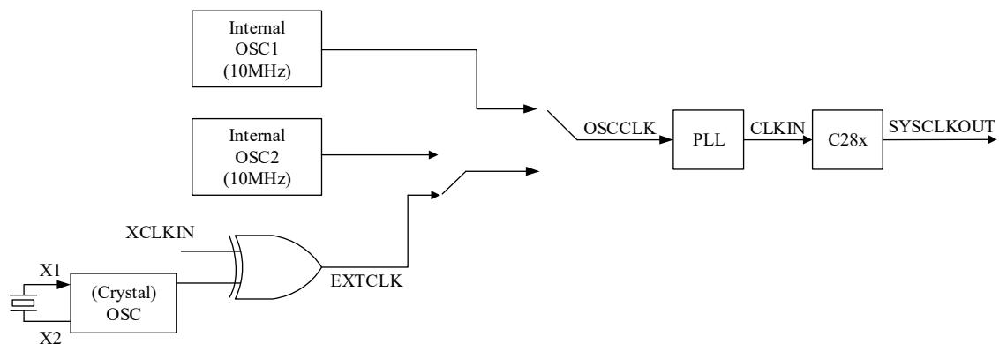

flowchart

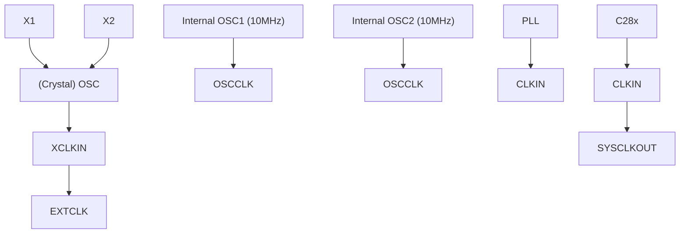

图2-5时钟源示意图

F28027系统时钟的工作频率一般是40～60MHz。这样就需要对振荡器工作产生的时钟信号进行倍频，这项工作由锁相环电路来完成，用户可以根据选定的系统时钟频率来设置锁相环倍频参数。

锁相环是一种反馈电路，其特点是：利用外部输入的参考信号控制环路内部振荡信号的频率和相位。其基本工作原理如图2-6所示。锁相环由鉴相器、环路滤波器和压控振荡器组成。鉴相器用来鉴别输入信号与输出信号之间的相位差，并输出偏差电压，偏差电压的噪声和干扰成分被低通性质的环路滤波器滤除，形成压控振荡器（VCO）的控制电压Uc。Uc作用于压控振荡器的结果是把它的输出振荡频率fout拉向环路输入信号频率fr，当二者相等时，环路被锁定。这也是锁相环名称的由来。

MCU的片上锁相环，可以通过软件配置锁相环的输出频率，提高系统的灵活性和可靠性。锁相环可以对输入的信号频率进行倍频，允许外接晶振的工作频率较低，经过锁相环后输出较高的系统时钟。这种设计可以有效降低系统对外部时钟的依赖和电磁干扰，提高系统启动和运行的可靠性，降低系统对硬件的设计要求。

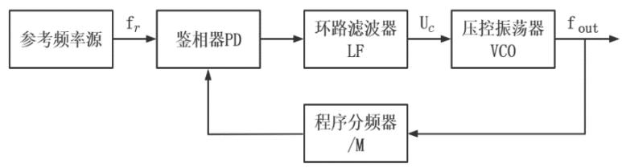

flowchart

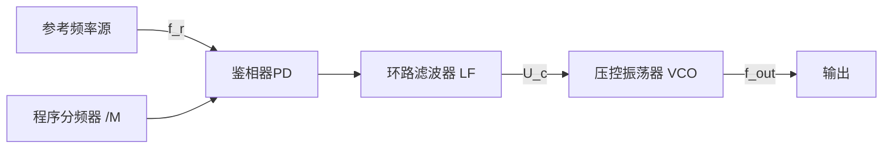

图2-6 锁相环电路原理框图

锁相环模块除了为C28x内核提供时钟外，还输出系统时钟SYSCLKOUT给外设使用。为了达到节能目的，TI对时钟提供一种管理机制，每个外设模块都可以对时钟输入进行使能或禁止（CLK ENABLE），只对需要工作的模块提供时钟信号，不工作的模块不提供时钟信号。系统时钟和各模块的关联图见图2-7。从图2-7中还可以看到，系统时钟可以再次被处理，生成低速时钟信号LSPCLK，用于低速外设模块，如SCI模块和SPI模块。

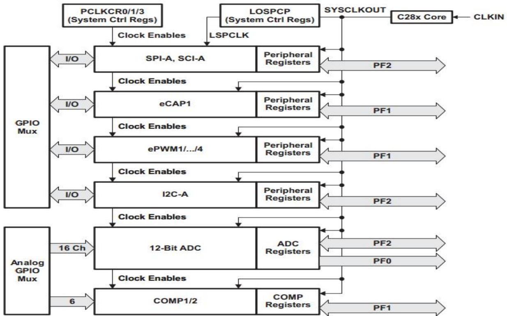

flowchart

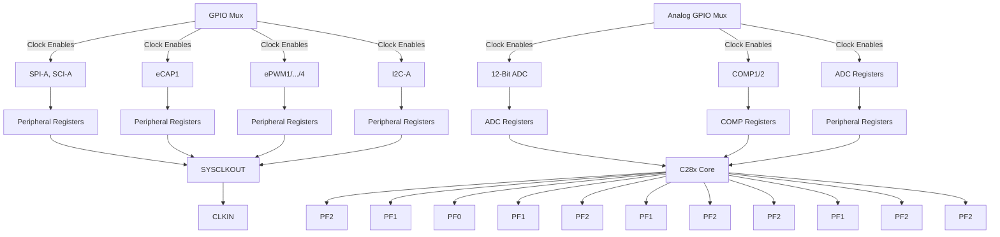

图2-7系统控制及外设时钟

## “喂狗”

在MCU工作过程中，可能由于某种原因导致CPU无法按照设定的程序运行，出现死机情况。为了MCU能够自主处理这类故障，F28027提供了看门狗模块。该模块本质上是一个计数器，在计数器溢出时，它会产生一个复位信号，来复位CPU或者产生看门狗中断。为了不让它产生复位信号，那就需要在计数器溢出前对它清零，俗称“喂狗”。当程序运行出现问题，那么设定的“喂狗”程序也将无法执行，这样看门狗就会产生复位信号或发出看门狗中断信号。

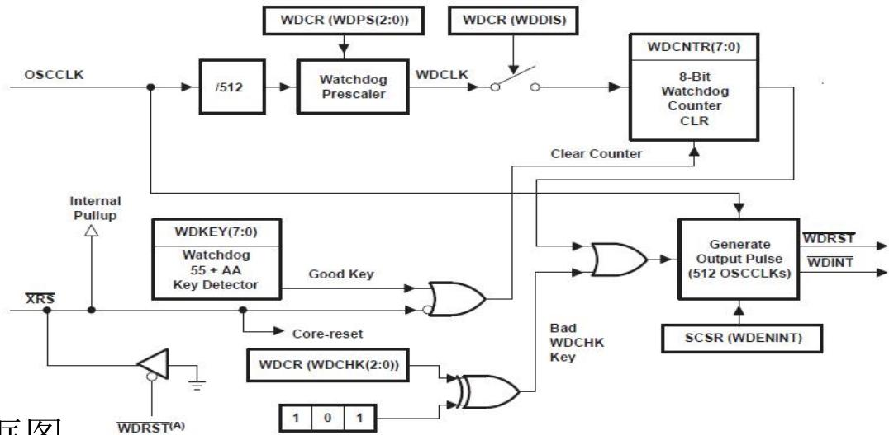

flowchart

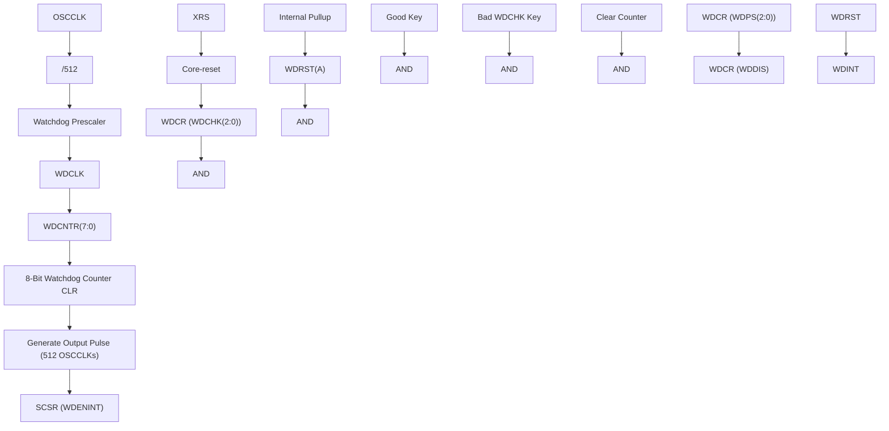

图2-8看门狗原理框图

## “喂狗”

时钟源OSCCLK经过512分频后再进行可编程的预分频（WatchdogPrescaler)，输出脉冲作为看门狗计数器（Watchdog Counter）的计数脉冲。Watchdog 55+AA Key Detector是看门狗的“喂狗”操作。“喂狗”时，需要先写入数据“55”给寄存器WDKEY，接着写入“AA”给寄存器WDKEY，硬件就会发出有效的信号Good Key，用于复位看门狗计数器。如果不是以上方法的写入数据，都无法实现“喂狗”。

当程序运行出现问题，比如“死机”或进入“死循环”，那么设定的“喂狗”程序将无法执行，看门狗计数器将溢出并发出触发信号，通过Generate Output Pulse模块输出512个时钟周期的低电平信号。该信号可以是看门狗复位信号或看门狗中断信号（由WDENINT位决定）。

用户还可以通过WDCR(WDCHK(2:00)) 写入一个非101的数据，该数据与101异或后输出一个有效的高电平触发信号，触发看门狗电路输出复位信号或看门狗中断信号。这种操作一般用在调试看门狗时使用。

## 3种低功耗模式

（1）空闲模式（IDLE）：任何中断都可以退出该模式。在此模式期间，LPM模块本身不执行任何任务。  
（2）待机模式（STANDBY）：如果寄存器LPMCR0[1:0]为01，当执行到IDLE指令时，控制器进入待机模式。该模式下，CPU输入时钟信号停止，系统时钟信号SYSCLKOUT停止。内部晶振、PLL和看门狗正常工作。根据需要，选择用于唤醒的GPIO PORT A（GPIO[31:0]）引脚，并通过LPMCRO寄存器配置引脚需要保持的低电平时钟数。  
（3）暂停模式（HALT）：如果寄存器LPMCR0[1:0]为10或11，当执行到IDLE指令时，控制器进入暂停模式。该模式下，CPU输入时钟信号停止，系统时钟信号SYSCLKOUT停止，PLL停止工作。可以通过XRS、GPIO PORT A（GPIO[31:0]）引脚唤醒。

## 3种低功耗模式

## 1. 片内电压稳压器

尽管MCU的内核和I/O电路工作电压不同，但是用户应用板无需另外的外部稳压器，可以通过芯片内部的电压稳压器（VREG）来生成内核所需的VDD电压，用户应用板只需给VDDIO供电即可。为了使用片内电压稳压器，VREGNZ引脚应该被接至低电平，每个VDD引脚需连接电容值为1.2uF(最小值)的电容。这些电容应放置在尽量靠近VDD引脚的位置。

为了节约片内资源，也可禁止片内电压稳压器（VREG），并使用一个效率更高的外部稳压器给VDD引脚提供内核逻辑电压。为了使能此选项，VREGNZ引脚应接至高电平。

## 3种低功耗模式

## 2.片内上电复位（POR）和欠压复位 （BOR）

## 电路

芯片内部提供了两种电压监测电路：上电复位电路和欠压复位电路。上电复位电路（POR）的目的是在整个上电过程，对器件产生一个有效的复位信号。器件上电过程结束后，欠压复位电路（BOR）对VDDIO进行监测，如果使能片内电压稳压器，还对VDD进行监测。POR的电压保护点比BOR低。当电压低于相应的保护点时，复位电路把XRS拉至低电平引起复位过程。

图2-9显示了片内电压稳压器（VREG）、上电复位（POR）和欠压复位（BOR）。其中，WDRST为看门狗复位信号， PBRS为上电或掉电复位信号。欠压复位功能可以通过寄存器进行禁止。 图2-9 VR

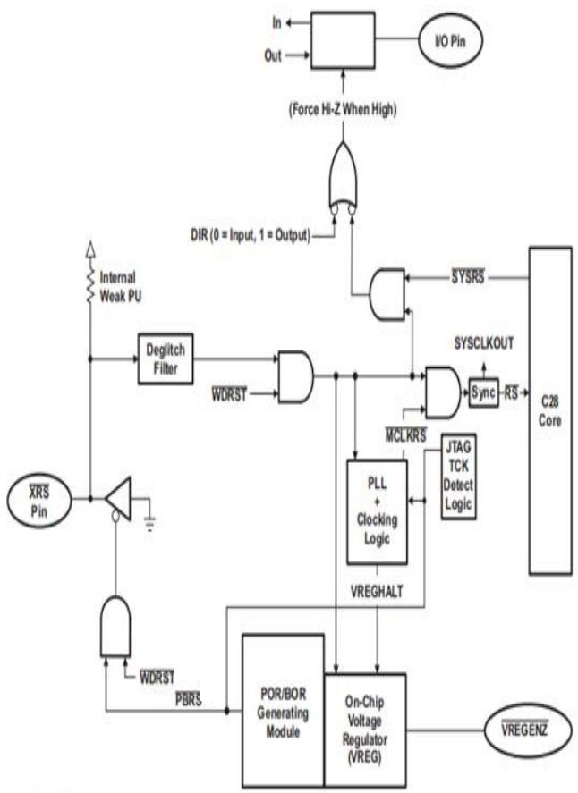

flowchart

```mermaid
graph TD
  A["In"] --> B["Block"]
  C["Out"] --> B
  B --> D["I/O Pin"]
  B --> E["(Force Hi-Z When High)"]
  E --> F["AND Gate"]
  F --> G["AND Gate"]
  G --> H["DEGLITCH Filter"]
  H --> I["AND Gate"]
  I --> J["Sync"]
  J --> K["C28 Core"]
  L["DIR (0 = Input, 1 = Output)"] --> F
  M["XRS Pin"] --> N["AND Gate"]
  N --> O["AND Gate"]
  O --> P["DEGLITCH Filter"]
  P --> Q["WDRST"]
  Q --> R["AND Gate"]
  R --> S["Sync"]
  S --> T["SYSCLKOUT"]
  U["INS"] --> V["Inverter"]
  W["OUT"] --> X["Inverter"]
  Y["INS"] --> Z["Inverter"]
  AA["INS"] --> AB["INverter"]
  AC["INS"] --> AD["INverter"]
  AE["INS"] --> AF["INverter"]
  AG["INS"] --> AH["INverter"]
  AI["INS"] --> AJ["INverter"]
  AK["INS"] --> AL["INverter"]
  AM["INS"] --> AN["INverter"]
  AO["INS"] --> AP["INverter"]
  AQ["INS"] --> AR["INverter"]
  AS["INS"] --> AT["INverter"]
  AU["INS"] --> AV["INverter"]
  AW["INS"] --> AX["INverter"]
  AY["INS"] --> AZ["INverter"]
  BA["INS"] --> BB["INverter"]
  BC["INS"] --> BD["INverter"]
  BE["INS"] --> BF["INverter"]
  BG["INS"] --> BH["INverter"]
  BI["INS"] --> BJ["INverter"]
  BK["INS"] --> BL["INverter"]
  BM["INS"] --> BN["INverter"]
  BO["INS"] --> BP["INverter"]
  BQ["INS"] --> BR["INverter"]
  BS["INS"] --> BT["INverter"]
  BU["INS"] --> BV["INverter"]
  BW["INS"] --> BX["INverter"]
  BY["INS"] --> BZ["INverter"]
  CA["INS"] --> CB["INverter"]
  CC["INS"] --> CD["INverter"]
  CE["INS"] --> CF["INverter"]
  CG["INS"] --> CH["INverter"]
  CI["INS"] --> CJ["INverter"]
  CK["INS"] --> CL["INverter"]
  CM["INS"] --> CN["INverter"]
  CO["INS"] --> CP["INverter"]
  CS["INS"] --> CY["INverter"]
  CZ["INS"] --> DA["INverter"]
  DB["INS"] --> DC["INverter"]
  DD["INS"] --> DJ["INverter"]
  DK["INS"] --> DL["INverter"]
  DV["INS"] --> DW["INverter"]
  DX["VREGENZ"] --> DW
```

EG+POR+BOR+Reset信号连接图

## MCU最小系统

最小系统是指仅包含必须的元器件，仅可运行最基本软件的简化系统。无论多么复杂的嵌入式系统都可以认为是由最小系统和扩展功能组成的。最小系统是嵌入式系统硬件设计中复用率最高，也是最基本的功能单元。典型的最小系统由MCU芯片、供电电路、时钟电路、复位电路和程序下载电路构成。

## LaunchPad实验板

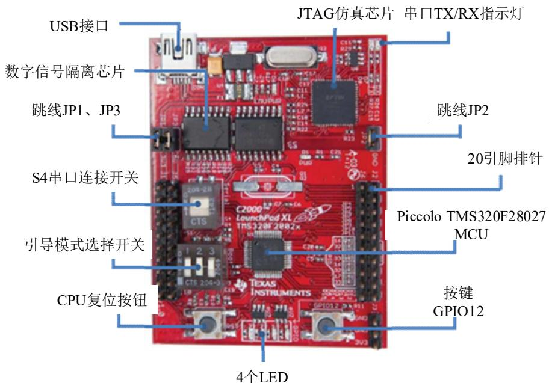

text_image

USB接口
数字信号隔离芯片
跳线JP1、JP3
S4串口连接开关
引导模式选择开关
CPU复位按钮
JTAG仿真芯片 串口TX/RX指示灯
跳线JP2
20引脚排针
Piccolo TMS320F28027 MCU
按键 GPIO12
4个LED

图2-10 LAUNCHXL- F28027开发板示意图

## LaunchPad实验板功能特点

 小巧易用，携带方便。LaunchPad开发板通过USB接口与电脑连接，学习者做实验不再局限于传统的实验室，而是能超越课堂的空间和时间的限制完成软件的测试，所以也称为“口袋实验室”。  
 完善的开发生态系统。TI所有的MCU系列都具有结构相似的LaunchPad，同时TI官网还提供详尽的硬件设计、软件开发指南，以帮助用户尽快进行原型系统的开发。  
 集成了隔离式的 XDS100 JTAG 仿真器，使编程和调试简单易行。  
复位按钮。  
 1个输入开关----对应引脚GPIO12。  
 4个LED显示----对应引脚GPIO0、GPIO1、GPIO2、GPIO3。  
 引导模式选择开关。如表2-8所示，常用的两种引导模式为：

（1）仿真模式：在CCS软件平台下进行仿真或编程时必须把 置高，也就是拨码开关3拨到ON位置。

（2） 运行模式：独立运行时，设置为模式3，也就是拨码开关1/2/3设置为ON/ON/OFF。

 1个串行通信选通开关。

4个引脚外接端子：J1、J2、J5、J6。

## LaunchPad实验板电路模块

## 1. 电源

XDS100V2仿真器与最小系统板可以独立供电，其中XDS100V2仿真器通过USB端口供电。如图2- 11所示，USB端口输入5V电压经过TLV1117-33芯片得到3.3V电压。最小系统板可以通过接线排J1、J2、和J5上的电源端子外接电源供电，也可以通过USB直接供电。将JP1、JP2和JP3三个端子通过短接帽短接可以将两部分电源相连，由USB提供最小系统板电源。

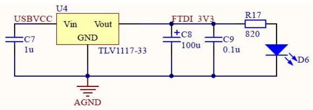

text_image

USBVCC
U4
Vin Vout
GND
TLV1117-33
AGND
C7
1u
FTDI 3V3
C8
100u
C9
0.1u
R17
820
D6

图2-11 3.3V电源

表2-11跳线电源

<table><tr><td>跳线</td><td>电源</td></tr><tr><td>JP1</td><td>3.3 V</td></tr><tr><td>JP2</td><td>Ground</td></tr><tr><td>JP3</td><td>5 V</td></tr></table>

## LaunchPad实验板电路模块

## 2. 串口连接

LaunchPad内置了USB和UART信号转换的功能。当拨码开关S4拨到ON时，F28027芯片通过仿真器直接与PC机实现串口通信，可以方便地把调试的信息送到PC端显示。当拨码开关拨到OFF时，F28027的串口与仿真器断开，串口可以通过接线排的GPIO28、GPIO29引脚与其它设备实现串口通信。

## 3. 引导模式选择开关

F28027芯片内置引导程序，可以执行开机检查和不同的引导模式（见表2-9）。如图2-12所示，引导模式通过拨码开关S1来选择，GPIO34、TDO、TRST引脚通过一个2.2k的下拉电阻连接到地。

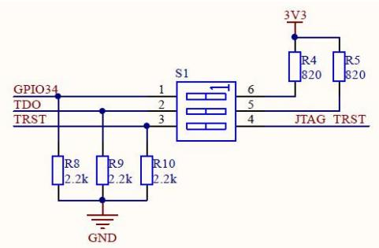

text_image

GPIO34
TDO
TRST
1
2
3
S1
6
5
4
JTAG
TRST
R4
820
R5
820
R8
2.2k
R9
2.2k
R10
2.2k
GND
3V3

图2-12 引导模式选择开关

## LaunchPad实验板电路模块

## 晶振电路

F28027有内部晶振电路，能满足大多数应用。如果需要更高精度的时钟，可以使用外部晶振，并在程序中将参考时钟配置为外部晶振。

## 5. 复位按键

如图2-13所示，按键S2为复位控制，当按键按下时，芯片的复位引脚为低电平，F28027进行硬件复位。

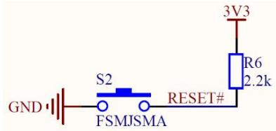

text_image

GND
S2
FSMJSMA
RESET#
3V3
R6
2.2k

图2-13 复位按键

## 6. 按键

如图2-14所示，按键S3为普通按键。芯片的GPIO12引脚通过一个10k的上拉电阻连接到3.3V，按键未按下时，GPIO12引脚为低电平；当按键按下时，GPIO12引脚为高电平。

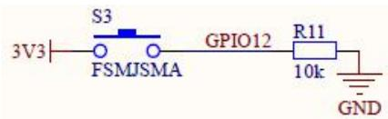

text_image

3V3
S3
FSMJSMA
GPIO12
R11
10k
GND

图2-14 按键电路

## LaunchPad实验板电路模块

## 7. LED 接口

如图所示，LaunchPad板上有4个分别由GPIO0、GPIO1、GPIO2和GPIO3引脚控制的LED，引脚经过SN74LVC2G07缓冲芯片对LED进行控制。对应的GPIO引脚输出低电平时LED亮。 表2-12 引脚与JTAG功能 表2-12引脚与JTAG功能

text_image

GPIO0 1
GND 1
GPIO1 3
U2
1A 1Y
GND VCC
2A 2Y
SN74LVC2G07
6
5
4
D2
R12
330
D4
R13
330
3V3

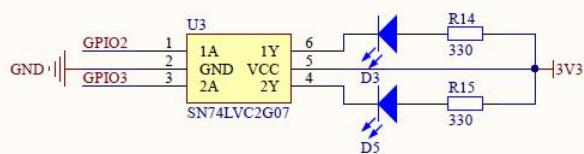

text_image

GPIO2 1
GND 2
GPIO3 3
U3
1A 1Y
GND VCC
2A 2Y
SN74LVC2G07
6
5
4
D3
R14
330
3V3
R15
330
D5

图2-15 LED电路

<table><tr><td>芯片引脚</td><td>功能</td></tr><tr><td>TRST</td><td>测试复位</td></tr><tr><td>TDI</td><td>测试数据输入</td></tr><tr><td>TMS</td><td>测试模式选择</td></tr><tr><td>TDO</td><td>测试数据输出</td></tr><tr><td>TCK</td><td>测试时钟输入</td></tr></table>

## 8. XDS100V2仿真器

LaunchPad板的XDS100V2仿真器采用JTAG接口来对F28027芯片进行编程和调试， JTAG接口引脚的描述见表2-12。JTAL是基于IEEE1149.1标准的一种边界扫描测试方式，通过这个接口，CCS可以访问DSP内部的所有资源，包括片内寄存器和所有的存储空间，从而可以实现DSP实时的在线仿真和调试。

XDS100V2仿真器选择FT2232H芯片作为USB-UART/FIFO转换芯片，选择EEPROM芯片作为存储器，并利用ISO7231和ISO7240两款数字隔离芯片将FT2232H芯片引脚与F28027引脚进行隔离。

## 思考题：

2-1 F28027包含哪些资源？  
2-2 F28027的引脚功能可分为哪几类？  
2-3 看门狗电路的作用是什么？请简述其工作原理。  
2-4 F28027有几个时钟源？系统时钟如何管理？  
2-5 理解F28027的内存映射。  
2-6 什么是最小系统，了解最小系统的组成及各部分功能？  
2-7 如何控制开发板上的LED亮或暗？  
2-8 按键按下时，开发板的MCU端口是高电平还是低电平？  
2-9 查阅文献资料，理解JTAG接口的特点。  
2-10 查阅数据手册（参考文献1,2），进一步学习F28027的硬件资源。