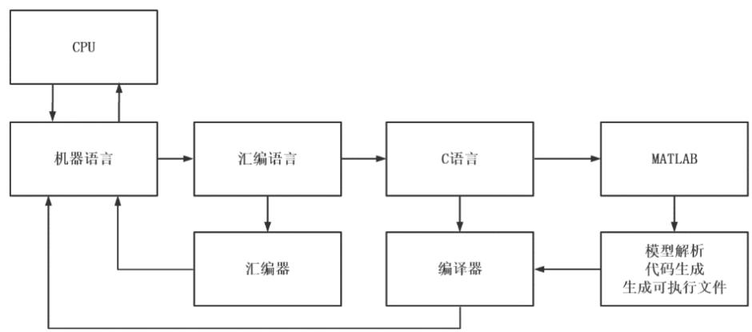
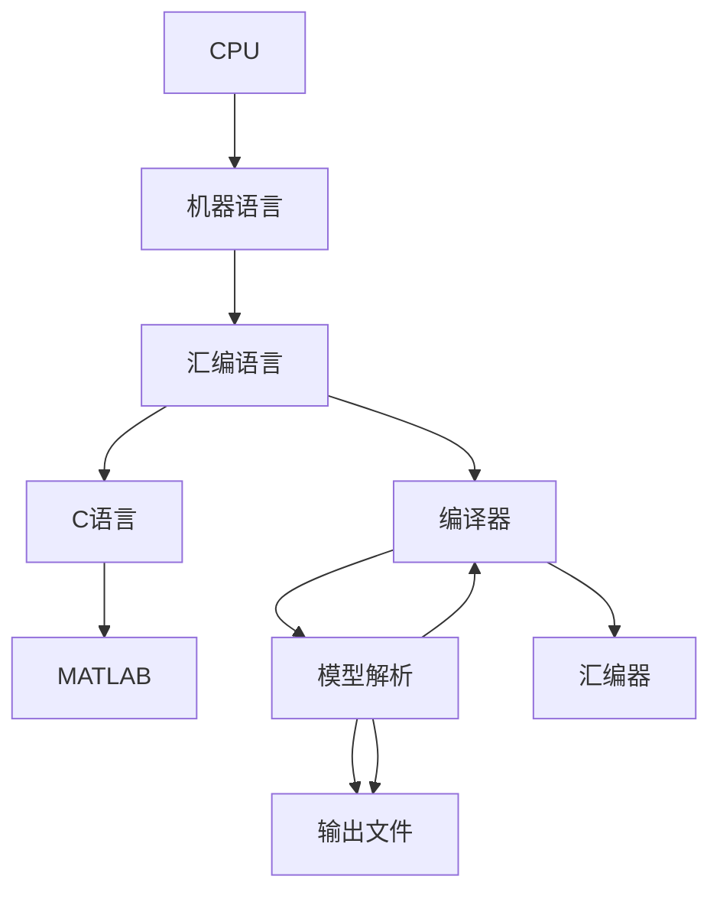
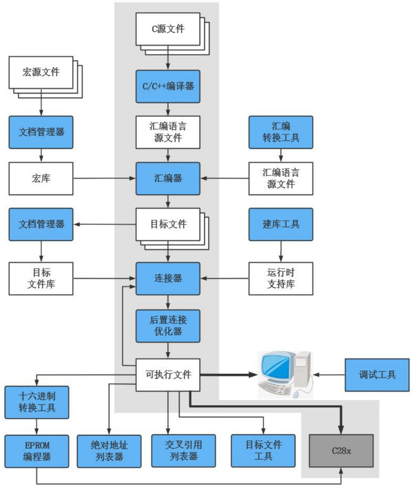
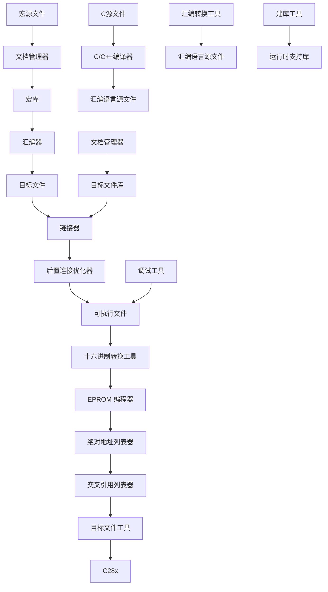

## 单片机原理及应用

## Principle And Application Of Microcontroller

福州大学电气学院

教材：《微控制器原理及应用--基于TI C2000实时微控制器》，蔡逢煌、王武、江加辉，机械工业出版社

参考资料：

¯TMS320F2802x, TMS320F2802xx Piccolo Technical Reference Manual.

¯TMS320F2802x Microcontrollers datasheet.

1 计算机编程语言  
2 TMS320C28X指令系统  
3 嵌入式C语言简介

编程语言：计算机硬件逻辑只能执行由“0”和“1”组成的机器语言，但是机器语言难以理解，就诞生了便于理解和记忆的助记符，即汇编语言。汇编语言的开发效率较低，又诞生了高级语言。高级语言更接近于自然语言和数学公式编程，相对于低级语言而言，基本上脱离了机器的硬件系统，以符合人类逻辑思维、更容易理解的方式编写程序。高级语言不能被机器直接识别，需要进行编译。



<details>
<summary>flowchart</summary>


</details>

## 1.机器语言：

CPU完成特定操作需要有相应的指令，机器语言就是用二进制代码表示的计算机能直接识别和执行的一种机器指令集合，每一条机器指令在计算机内部都有相应的电路来完成它，是唯一的计算机能够直接识别和执行的语言。CPU的所有指令集构成该计算机的指令系统。机器语言具有简洁、直接执行、计算速度快等优点，但是存在直观性差、难以理解、容易出错、程序检查和调试困难等缺点，同时对计算机的依赖性也很强。

例如：FF10 0400指令代表累加器ACC加上1024。

## 2.汇编语言：

汇编语言是面向机器的程序设计语言，解决了机器语言难以理解和记忆的缺陷，使用容易理解和记忆的助记符来代替机器语言的操作码和操作数，将机器语言转化为汇编语言，也称为符号语言。由汇编语言编写的程序，计算机无法直接识别，需把汇编语言翻译成机器语言，这种具有翻译功能的程序叫做汇编程序。汇编程序把汇编语言翻译成机器语言的过程称为汇编。汇编语言的指令一般都由操作码和操作数组成，操作码也被称为指令助记符，它是指令中的关键字，表示本条指令的操作类型，不能省略。

例子：MOV ACC，#1024。

MOV为指令助记符，表示数据传送，ACC为目标操作数，#1024表示源操作数，该指令的功能是将源操作数传送到目标地址，即把数据1024写入累加器ACC。 汇编语言与硬件关系密切，效率较高，但使用起来不方便，程序开发和维护的效率比较低。

## 3.高级语言：

机器语言和汇编语言都是低级语言，没法跨平台使用。高级语言是一种贴合人类逻辑思维、便于直观理解的计算机语言，高级语言既接近自然语言又可以使用数学表达式，并且相对独立于计算机，可以跨计算机使用。与汇编语言一样，由高级语言编写的程序计算机也无法直接运行，同样需要先将高级语言翻译成机器语言。

高级语言具有较强的表达能力，可方便表示数据操作和程序控制结构，可以较好地描述各种算法，易于学习掌握。但是，它编译的程序代码通常比用汇编语言设计的程序代码更长、执行更慢。高级语言不是特指某一种语言，而是包括许多编程语言，如Java、C、C++、C#、Pascal、Matlab、Python等等。

C语言是一种“高级语言中的低级语言”，它既具有高级语言的特点，又比较“接近”于硬件，而且效率比较高。

## 4.基于Matlab的自动代码生成：

为了加速软件开发过程，提高代码可靠性，MATLABCoder/Simulink Coder/Embedded Code可以将MATLAB代码（M代码、MATLAB工具箱、Simulink模块）生成工程中常用的嵌入式或其他硬件平台的C或C++代码。该代码可以运行于实时的或非实时的微控制器。这就是基于模型设计（Model Based Design，MBD）的系统开发理念。其意义在于：用Simulink模型描述系统和子系统的物理原型，并在统一仿真环境中对整个系统进行仿真，以便及时做出设计改进。核心思想是可执行的规范、快速的控制原型设计、早期验证和代码自动生成，这将逐渐成为嵌入式系统开发的主要手段。

## TMS320C28x汇编指令：

不同的CPU，汇报指令是不一样的。TMS320C28x的汇编指令，主要分为以下几类。

## 1.数据传送类指令

数据传送指令是将源操作数传送到目标操作数的操作，包括装载指令、堆栈指令等。

示例：

MOV ACC, #1024<<#6 ;将1024左移6位后装载到ACC

MOV IER,@VarA ;用VarA值装载IER

PUSH ACC ;ACC数据入栈，SP增加2

POP DP ;SP先减1。SP指向的内容装载到寄存器DP

## TMS320C28x汇编指令：

## 2.算术运算类指令

算术运算指令是指实现数学运算功能的指令，包括加法、减法、乘法等。

示例：

<table><tr><td>ADD</td><td>ACC, #56&lt;&lt;#2</td><td>;立即数56左移2位后加到ACC, 结果保存到ACC</td></tr><tr><td>SUBB</td><td>ACC, #78&lt;&lt;#3</td><td>;ACC减去立即数78左移3位后的值, 结果保存到ACC</td></tr><tr><td>MPY</td><td>ACC,T,@M16</td><td>;ACC=T×M16,T是被乘数寄存器</td></tr><tr><td>DEC</td><td>@VarA</td><td>;VarA的值减1</td></tr></table>

## TMS320C28x汇编指令：

## 3.逻辑运算类指令

逻辑运算指令是指实现逻辑运算功能的指令，包括逻辑与、逻辑或、逻辑异或、移位指令和其他逻辑运算指令。

示例：

AND ACC, #0xFFFF ,<<12

;将ACC和0xFFFF000进行“与”操作

OR @VarA,#(1,<<7 )

;置位VarA的第7位

ROL ACC

;ACC的值循环左移

## TMS320C28x汇编指令：

## 4.控制转移类指令

程序控制指令包括返回指令、调用子程序指令、跳转指令等。

示例：

IDLE ；处理器进入空闲模式，等待使能或非屏蔽中断。

IRET ；中断返回。IRET恢复PC值和中断操作时自动保存的其他寄存器的值。

LB Switch0 ；PC=Switch0，跳转到Switch0标号处的程序

LC FuncA ；调用函数FuncA，返回地址保存在堆栈

RPT #8 ；重复下一条指令8次

## TMS320C28x汇编指令：

## 5.位操作指令

<table><tr><td>SETC INTM</td><td>;状态寄存器ST1位INTM置1</td></tr><tr><td>SETC C</td><td>;进位标志位C置1</td></tr><tr><td>CLRC INTM</td><td>;状态寄存器ST1位INTM清0</td></tr></table>

由于F28027的软件开发模板全部采用C/C++语言编程，需要C/C++编程操作的寄存器只有状态寄存器和中断控制寄存器，其他寄存器对用户而言都是透明的。其中，主要的汇编指令是对状态寄存器ST1的位EALLOW和中断控制寄存器的位INTM的位操作。

## 两个位域变量的功能和操作方法：

## (1)EALLOW（仿真访问使能位、写保护使能位）

位域变量EALLOW为仿真访问使能位，系统复位默认值为0，表示禁止对写保护寄存器进行写访问，防止非法代码或指针破坏寄存器内容。若要对写保护寄存器进行写操作，必须执行汇编指令EALLOW，对EALLOW置1。寄存器的写操作结束后，要把EALLOW位清0，重新使能写保护，对应的汇编指令为EDIS。

在F28027的头文件cpu.h中，定义了两条EALLOW被置1和清0的宏定义C语句代码。

#define EALLOW asm(" EALLOW") //EALLOW=1;

#define EDIS asm(" EDIS") //EALLOW=0;

其中，括号里面的EALLOW和EDIS为汇编指令，前面的EALLOW和EDIS为宏定义语句，可以在C程序里面调用。

## 两个位域变量的功能和操作方法：

## (2)INTM （中断全局屏蔽位）

位域变量INTM是中断全局屏蔽位，系统默认值为1，表示禁止F28027所有可屏蔽中断请求信号送给CPU内核，相当于可屏蔽中断总开关被断开。

#define DINT asm(" DINT"); //INTM=1,禁止中断

或#define DINT asm(" setc INTM")

#define EINT asm(" EINT"); // INTM=0,允许中断

或#define EINT asm(" clrc INTM")

## 两个位域变量的功能和操作方法：

## (2)INTM （中断全局屏蔽位）

使用时，可以在C程序中直接调用宏语句。比如，初始化程序结束后开启中断总开关。

```txt
void main(void)
{
DINT; //INTM=1,中断总开关禁止
(初始化程序)
EINT; //INTM=0,中断总开关允许
(主程序)
}
```

## CPU 执行指令的过程:

CPU执行指令有五个过程：取指令、指令译码、取操作数、执行指令、结果写回。

## 1. 取指令（Fetches instructions from program memory）

将指令从程序存储器取出。程序计数器PC中的数值，用来指示当前指令在程序存储器中的位置。当一条指令被取出后，PC中的数值将根据指令长度自动递增，指向下一条指令。

## 2．指令译码（Decodes instructions）

指令译码器按照预定的指令格式，对取回的指令进行译码，识别出不同的指令类别以及各种获取操作数的方法。

## 3．取操作数（Reads data values from memory or fromCPU registers）

从存储器或者CPU寄存器中获取操作数。操作数是指令的一个重要组成部分，它指出了参与运算的数据或数据所在的地址，而如何得到这个地址就由芯片的寻址方式决定。C28x支持四种基本寻址方式：直接寻址方式、间接寻址方式、堆栈寻址方式、寄存器寻址方式。同时，C28x还支持一些特殊寻址方式，如数据/程序/IO空间寻址方式、程序空间间接寻址方式等。

## 4．执行指令 （Executes instructions）

完成指令所规定的操作，实现指令的功能。为此，CPU的不同部分被连接起来，以执行所需的操作。

## 5．结果写回（Writes results to memory or to CPUregisters）

把执行指令阶段的运行结果数据写回到存储器或CPU寄存器。在结果数据写回之后，当条指令执行完毕。CPU从程序计数器PC中取得下一条指令地址，开始新一轮的循环。

为了提高效率，C28x采用8个独立阶段来完成以上5个过程。指令以流水线方式执行，在任何时候，最多可以执行八个指令，每个指令处于不同的完成阶段。以下是八个阶段的说明。

阶段1（Fetch 1，F1）：CPU通过22位的程序地址总线PAB（21:0）发送程序存储器地址，选通对应的存储单元。

阶段2（Fetch 2，F2）: CPU通过32位的程序数据总线PDB（31:0）读取程序存储器的指令，并将指令加载到指令提取队列中。

阶段3（Decode 1，D1）：C28x支持32位和16位指令，可以偶数地址或奇数地址对齐。这个阶段硬件识别指令提取队列中的指令边界，确定要执行的指令的大小。它还判断该指令是否合法。

阶段4（Decode 2，D2）：硬件从指令获取队列取出指令到指令寄存器中，在指令寄存器中进行解码。一旦一条指令到达D2阶段，它将运行到指令结束，而不会被中断中止。

阶段5（Read 1，R1）：发送操作数的地址总线信号，选通待读取单元。

阶段6（Read 2，R2）：通过数据总线，读取R1阶段地址总线选通单元的数据。

阶段7（Execute，E）：这个阶段CPU执行乘法、移位或算术逻辑运算。运算涉及到的CPU寄存器的值在该阶段开始时读取，在该阶段结束时更新。

阶段8（Write，W）：数据写入存储器。这个阶段CPU发送目标地址，把数据写入目标单元。

CPU 执行指令的过程:

<table><tr><td>F1</td><td>F2</td><td>D1</td><td>D2</td><td>R1</td><td>R2</td><td>E</td><td>W</td><td>Cycle</td></tr><tr><td>I1</td><td></td><td></td><td></td><td></td><td></td><td></td><td></td><td>1</td></tr><tr><td>I2</td><td>I1</td><td></td><td></td><td></td><td></td><td></td><td></td><td>2</td></tr><tr><td>I3</td><td>I2</td><td>I1</td><td></td><td></td><td></td><td></td><td></td><td>3</td></tr><tr><td>I4</td><td>I3</td><td>I2</td><td>I1</td><td></td><td></td><td></td><td></td><td>4</td></tr><tr><td>I5</td><td>I4</td><td>I3</td><td>I2</td><td>I1</td><td></td><td></td><td></td><td>5</td></tr><tr><td>I6</td><td>I5</td><td>I4</td><td>I3</td><td>I2</td><td>I1</td><td></td><td></td><td>6</td></tr><tr><td>I7</td><td>I6</td><td>I5</td><td>I4</td><td>I3</td><td>I2</td><td>I1</td><td></td><td>7</td></tr><tr><td>I8</td><td>I7</td><td>I6</td><td>I5</td><td>I4</td><td>I3</td><td>I2</td><td>I1</td><td>8</td></tr><tr><td></td><td>I8</td><td>I7</td><td>I6</td><td>I5</td><td>I4</td><td>I3</td><td>I2</td><td>9</td></tr><tr><td></td><td></td><td>I8</td><td>I7</td><td>I6</td><td>I5</td><td>I4</td><td>I3</td><td>10</td></tr><tr><td></td><td></td><td></td><td>I8</td><td>I7</td><td>I6</td><td>I5</td><td>I4</td><td>11</td></tr><tr><td></td><td></td><td></td><td></td><td>I8</td><td>I7</td><td>I6</td><td>I5</td><td>12</td></tr><tr><td></td><td></td><td></td><td></td><td></td><td>I8</td><td>I7</td><td>I6</td><td>13</td></tr><tr><td></td><td></td><td></td><td></td><td></td><td></td><td>I8</td><td>I7</td><td>14</td></tr><tr><td></td><td></td><td></td><td></td><td></td><td></td><td></td><td>I8</td><td>15</td></tr></table>

C语言是一种受到广泛重视并得到普遍应用的计算机程序设计语言，是国际上公认的最重要的少数几种通用程序设计语言之一。嵌入式C语言是在嵌入式环境下使用的C语言，其符合标准C语言的规范，且具有嵌入式自身的特点。

使用嵌入式C语言进行程序设计，就是采用C语言对嵌入式环境进行配置，利用嵌入式资源实现设计者的想法，完成产品功能。从本质上讲，嵌入式软件（或程序）就是对输入数据进行处理，使之产生符合用户需要的输出数据。

嵌入式C语言的四大要素就是数据及其处理、程序流程控制、函数与中断服务程序以及指针。掌握了这四大要素，就基本掌握了嵌入式C语言的精髓。

## 基本数据类型

在日常生活中，我们会碰到各种数据，比如天气预报中的气温，人的身高体重等生理指标等数据。这些数据在计算机中该怎么表示？如何区分出各种数据？如果知道一个数据其数值的大小和可能的变化范围，那么我们就可以选择一种合适的数据类型来描述。比如气温，大部分的地方其范围应该在-100℃～100℃，那么在计算机中就可以用一个8位的数据来表示它。有些数据变化的范围很大，可能要用16位的数据或者更多位数来表示。计算机根据数据占用空间的大小以及数据表现，主要分为整型数和浮点型数。

表3-1 TMS320C28x系列MCU中数据类型

<table><tr><td rowspan="2">类型</td><td rowspan="2">大小</td><td rowspan="2">表现</td><td></td><td>范围</td></tr><tr><td>最小值</td><td>最大值</td></tr><tr><td>char, signed char</td><td>16 bits</td><td>ASCII</td><td>-32 768</td><td>32 767</td></tr><tr><td>unsigned char,_Bool</td><td>16 bits</td><td>ASCII</td><td>0</td><td>65 535</td></tr><tr><td>short</td><td>16 bits</td><td>2s complement</td><td>-32 768</td><td>32 767</td></tr><tr><td>unsigned short</td><td>16 bits</td><td>Binary</td><td>0</td><td>65 535</td></tr><tr><td>int, signed int</td><td>16 bits</td><td>2s complement</td><td>-32 768</td><td>32 767</td></tr><tr><td>unsigned int</td><td>16 bits</td><td>Binary</td><td>0</td><td>65 535</td></tr><tr><td>long, signed long</td><td>32 bits</td><td>2s complement</td><td>-2 147 483 648</td><td>2 147 483 647</td></tr><tr><td>unsigned long</td><td>32 bits</td><td>Binary</td><td>0</td><td>4 294 967 295</td></tr><tr><td>long long, signed long long</td><td>64 bits</td><td>2s complement</td><td>-9 223 372 036 854 775 808</td><td>9 223 372 036 854 775 807</td></tr><tr><td>unsigned long long</td><td>64 bits</td><td>Binary</td><td>0</td><td>18 446 744 073 709 551 615</td></tr><tr><td>enum</td><td>16 bits</td><td>2s complement</td><td>-32 768</td><td>32 767</td></tr><tr><td>float</td><td>32 bits</td><td>IEEE 32-bit</td><td>1.19 209 290e-38</td><td>3.40 282 35e+38</td></tr><tr><td>double</td><td>32 bits</td><td>IEEE 32-bit</td><td>1.19 209 290e-38</td><td>3.40 282 35e+38</td></tr><tr><td>long double</td><td>64 bits</td><td>IEEE 64-bit</td><td>2.22 507 385e-308</td><td>1.79 769 313e+308</td></tr><tr><td>pointers</td><td>16 bits</td><td>Binary</td><td>0</td><td>0xFFFF</td></tr><tr><td>far pointers</td><td>22 bits</td><td>Binary</td><td>0</td><td>0x3FFFFFF</td></tr></table>

数据的基本类型是整型数和浮点型数。在嵌入式C语言中，由于嵌入式MCU资源有限，一般根据乘法器的性能，分为定点型MCU和浮点型MCU，定点型MCU只能处理定点数，不能处理浮点数，处理浮点型数据是采用特别的计算程序包来处理，耗时耗空间。目前是采用IQ算法来处理，就是采用定点数来表示浮点数，即浮点数放大2的n次方倍转换为定点数，然后采用定点数来计算。TMS320F28027就是一类定点型MCU，因此在这种MCU中，如果非必要，建议不要使用浮点型数据类型。

对于定点型MCU，由于排除了浮点型数据类型，只要掌握的基本数据类型就剩2个，即整型数据类型（int）和长整型数据类型（long）。整型数据类型占据16位存储空间，长整型数据类型占据32位存储空间。在标准C语言中，字符型数据类型是8位的，但在32位MCU中，由于最小的数据存储空间是16位的，因此字符型数据类型变成16位了。

## 基本数据类型

为了区分数据是否可以为负值，数据分为有符号和无符号。在数据类型中如何表示？标准C语言中，保留字unsigned表示无符号数，signed表示有符号数，通常signed被省略掉。

定点型MCU的基本数据类型为：

int(signed int)， 有符号整型数

unsigned int， 无符号整型数

long(signed long)， 有符号长整型数

unsigned long， 无符号长整型数

## 基本数据类型

我们采用typedef对数据类型进行重定义，类型中体现出数据的位数，即：

typedef char int16\_t // char, signed char

typedef unsigned char uint16\_t // unsigned char

typedef int int16\_t // int, signed int, short, signed short

typedef unsigned int uint16\_t // unsigned int, unsigned long

typedef long int32\_t // long, signed long

typedef unsigned long uint32\_t // unsigned long

## 常量和变量：

数据类型只是表示一个数据的大小范围，或占用空间多少。在程序设计时，数据是会变化的，需要用一个存储空间来保存这个数据。在MCU中，存储空间是采用编号（或地址）形式来管理的，每个空间有唯一的一个地址，利用这个地址就可以访问存在空间里的数据了，可想而知，要记住每个空间的地址是不太可能的事情。因此为了方便记忆，对存储空间起个别名，这个别名就是变量。

变量名的命名规则很简单，必须是字母（大小写）、下划线字符和数字（0～9）的组合，且第一个字符应当是字母或下划线字符。变量名不仅要合法，还要取得有意义，一看就知道变量所代表的含义，较好变量名如myClk、EPwm\_CMPA\_Direction等。定义变量的格式为：

数据类型 变量名； 示例：unsigned short interruptCount；

## 变量的实质含义：

常量和变量类似，也是需要定义，占用一定的存储空间，只是其值在程序执行过程中是无法被改变的。常量的定义格式就是在变量中增加修饰符“const”，并需要在定义时初始化赋值，常量定义格式为：

const 数据类型 变量名 = 表达式；

示例：const int interruptCountMax = 20；

## 常量与常数：

在C语言中，常常用宏定义伪指令来增加常数的可读性，如：

#define EPWM1\_TIMER\_TBPRD 2000

常数不占用数据存储空间，它是在编译中直接作为代码的一部分存在。而常量是放在数据存储空间中，其与变量不同就是值无法被改变。

现在的程序设计基本是采用工程的形式来组织和管理各个程序模块文件，在某个文件中定义了一个变量，那么在另一个文件中也要使用这个变量，那该怎么办。在C语言编译时，是每个C文件单独编译的，对其他文件定义过的变量，编译器无法确认，因此会认为变量没定义给出编译错误警告。为了解决这个问题，需要对已经定义过的变量进行声明，变量声明仅仅是告诉编译器被声明的变量在其他文件已经定义过了，这个变量已经有实实在在的存储器空间与之对应。变量声明的格式：

extern 数据类型 变量名；示例：extern unsigned short interruptCount;

## 数据处理的基本方法

## （1） 算术运算

在C语言中算术运算符有：+（加）、-（减）、\*（乘）、/（除）、%（求余）、++（加1）、--（减1）。

示例:

$$
2 5 / 2 ^ {*} 2 = ?
$$

这个例子的结果是多少？很多同学会说是25。在计算机世界里结果是24，因为它被看成整型数运算了，25/2=12，小数被省去了。

## （2） 赋值运算

赋值运算符：=。赋值运算就是把等号右边的表达式值赋值给左边的变量。

## （3） 关系运算

关系运算符有：<（小于）、<=（小于等于）、>（大于）、>=（大于等于）、==（等于）、!=（不等于）。关系运算的结果只有2种情况，分别是真（TRUE）和假（FALSE）。在C语言中，这样定义真和假，整数零代表假，非整数零就是真。

## （4） 逻辑运算

逻辑运算符有：&&（与）、||（或）、！（非）。逻辑运算要求操作数为整数零或者非零，其运算规则为：

a. 如果两个操作数都是非零整数，则相与的结果为1，否则为0；  
b. 如果两个操作数都是零整数，则相或的结果为0，否则为1；  
c. 如果操作数为非零整数，求非的结果为0，否则为1。

## （5）按位运算

按位运算符有：&（按位与）、|（按位或）、^（按位异或）。按位运算针对两个整型数据进行位运算，不产生进位。

## （6） 求反运算

求反运算符有：～。这个是求操作数的反码。

## （7）移位运算

移位运算符有：>>（右移）、<<（左移）。移位运算符在定点数运算中特别有用。

## （8）括号

在C语言中，各种操作符是有优先级关系的，而且操作数和操作数的结合也分左结合和右结合，为了避免操作数因为规则应用错误带来的不必要麻烦，建议用好括号。在运算中C语言只用小括号，即“(”和“)”成对出现。

## 控制流语句

程序是由许多条指令构成的，程序流控制就是控制CPU执行指令的走向，正因为程序的走向不是顺序的，程序才能适应不同需要完成任务。C语言中，控制流语句分成2类：

一类是选择语句，就是按照条件选择程序分支，有两路选择（if-else）和多路选择（else if 和switch）语句；

另一类是循环语句，有while循环、for循环和do-while循环语句。

## 控制流语句

## 1. 选择语句

（1） if语句规则为：

```txt
if (表达式)
{
    语句1;
}
语句2;
```

它表示如果表达式成立，即表达式的运算结果是非零，则执行语句1，然后执行语句2。如果表达式不成立，不执行语句1，直接执行语句2。

## 控制流语句

## 1. 选择语句

（2）if-else语句规则为：

if（表达式）

```txt
{
    语句1;
}
else
{
    语句2;
}
```

它的功能是如果表达式成立，则执行语句1，否则执行语句2。

【花括号“{”和“}”】

花括号“{”和“}”需要配对使用，在花括号里面的语句可以认为是一条语句，也称为复合语句。这样灵活使用花括号和if-else可以设计出很复杂的选择语句。

## 控制流语句

## 1. 选择语句

（3）复合的if-else语句规则

```txt
if (表达式1)
{
语句1;
}
else if (表达式2)
{
语句2;
}
else
{
语句3;
}
```

该复合if-else语句多出了else-if的部分，这种结构要特别留意if和else的配对，技巧就是从最后一个else往上逆推。

## 控制流语句

## 1. 选择语句

（4） switch开关语句规则为：

switch（表达式）

case 表达式1： 语句1；break；

case 表达式2： 语句2；break；

case 表达式n： 语句n；break；

default： 语句n+1；break；

switch语句中的表达式为开关控制表达式，一般是整型或者字符型变量，语句多为复合语句。执行switch语句时，先计算表达式，再与每一个情况表达式结果相比较，如果匹配，就执行该情况下的语句，碰到break语句，结束switch语句；如果没有找到匹配的，那就执行default情况后的语句。

## 控制流语句

## 1. 循环语句

while循环语句格式：

```txt
while (表达式)
{
语句;
}
```

执行while语句时先判断表达式的值，如果为真则执行语句，否则执行后续语句。

（2） for循环语句格式：

```txt
for ( 表达式1; 表达式2; 表达式3)
{
语句;
}
```

for循环语句中，表达式1是赋值语句，设置循环变量的初值。表达式2是关系表达式，用来控制循环的结束条件（终止条件），表达式2为零时，结束循环。表达式3一般也是赋值语句，用来控制循环变量的增量，常用++和--运算。

## 控制流语句

## 1. 循环语句

（3） do-while循环语句格式：

do

语句；

}while(表达式)；

do-while的执行过程是，先执行语句，再计算表达式，如果表达式的值是真，则返回再次执行语句，否则终止循环。

（4）循环的强制终止

上述的三种循环语句，终止循环都是依赖表达式的结果。如果语句是复合语句，那么在执行过程中，可能需要根据新情况提前终止本次循环或终止整个循环。终止本次循环的语句为continue语句，终止整个循环的语句为break语句。

continue语句终止的是本次循环，对于for语句则立即执行循环表达式，对于while语句和do-while语句那么意味着立即执行条件测试部分。

## 函数

在程序设计中，程序的结构有顺序结构、分支结构、循环结构和子程序结构。C语言中，子程序结构由函数来完成。把具有相对完整的功能块封装起来，就成为函数。函数对程序的模块化设计作用很大，它使得程序变得简洁，有层次，而且可读性也更好。C语言提供很多标准函数库，可以大大缩短开发时间。

## 函数的定义、 调用和声明

## 函数的定义

函数定义的格式：

类型 函数名（形式参数列表）

{ 语句； return 返回值； }

## 函数的调用

函数的调用格式：

函数名 （实际参数列表）；

## （3） 函数的声明

函数的声明格式： 类型 函数名（形式参数列表）；

## 函数的定义、 调用和声明

示例：GPIO初始化函数（来源自TI TMS320F28027库函数）

//函数定义， （存放文件：gpio.c）

```txt
GPIO_Handle GPIO_init(void *pMemory, const size_t numBytes)
{
    GPIO_Handle gpioHandle;
    if(numBytes < sizeof(GPIO_Obj))
    {
    return((GPIO_Handle)NULL);
    }
    // assign the handle
    gpioHandle = (GPIO_Handle)pMemory;
    return(gpioHandle);
} // end of GPIO_init() function
```

## 函数的定义、 调用和声明

示例：GPIO初始化函数（来源自TI TMS320F28027库函数）

//函数声明， （存放文件：gpio.h）

GPIO\_Handle GPIO\_init(void \*pMemory,const size\_t numBytes)；

//函数调用， （存放文件：用户程序）

```txt
myGpio = GPIO_init((void *)GPIO_BASE_ADDR, sizeof(GPIO_Obj));
```

## 变量作用域

引入函数后，为了体现函数的封装性，变量有了四类：

自动变量 （auto）

外部变量 （extern）

静态变量 （static）

寄存器变量 （register）

自动变量最常用，在每个函数中定义的变量都是自动变量，用“auto”来修饰，一般省略不写。这类变量从属于定义它的函数，在这个函数内部有效，其它函数不能调用。这类变量是函数内部的局部变量。上一示例中的“GPIO\_Handle gpioHandle”就是定义一个自动变量。

## 变量作用域

## 【自动变量】

自动变量只有在定义它的函数被调用时才存在，该函数退出时消失。在两次调用之间不保存变量值，因此对自动变量，每次调用都要赋予明确的初值。函数main（）是C语言中一个特殊的函数，它的变量一样也是局部于main的自动变量，对其他函数没有影响。在不同函数中使用相同的变量名称不会引起冲突。

## 【外部变量】

在函数外定义的变量叫做外部变量，也称为全局变量。这类变量在所有函数外部定义，能被许多函数存取。外部变量定义时，系统会分配实际的存储空间。某函数要使用外部变量时，通常要在函数中对外部变量通过“extern”加以说明，这个说明仅仅是告诉编译器这个变量在其它地方已经定义过了。不同文件中的全局变量使用也需要类似的操作。

## 【静态变量】

静态变量分为静态局部变量和静态全局变量。静态局部变量是在两次函数调用之间仍能保持其值的局部变量。有些程序要求在多次调用之间仍然保持变量的值，使用自动变量无法做到这一点。使用全局变量有时会带来意外的副作用，这时可采用静态局部变量。静态全局变量具有全局作用域，它与全局变量的区别在于如果程序包含多个文件的话，它作用于定义它的文件里，不能作用到其它文件里，即被static关键字修饰过的变量具有文件作用域。这样即使两个不同的源文件都定义了相同名字的静态全局变量，它们也是不同的变量。

## 【寄存器变量】

寄存器变量就是变量直接使用寄存器，在程序中建议不要定义这种变量，因为它会占用寄存器。

由基本数据类型经过组合，可以构造出几种复杂的数据类型，即数组、结构体、共用体和枚举类型。

## 1.数组类型

数组是由相同的基本数据类型组合而成。数组变量的格式为：

数据类型 数组名[表达式1][表达式2][表达式3]…[表达式n]；

上面给出了n维数组定义的格式。特别要注意，表达式需要能得到确切的值，因为编译器需要知道具体要分配给这个数组多少空间。对于一维数组，只有表达式1；二维数组，有表达式1和表达式2，以此类推。

示例：int number[100]；

该 语 句 定 义 了 1 0 0 个 整 型 变 量 ， 分 别 是 n u m b e r [ 0 ] ，number[1]，…，number[99]。

## 2.结构体类型

```txt
结构体是由不同的数据类型构成，结构体类型的定义格式为：
struct 结构体类型名
{
    数据类型 变量名1;
    ...
    数据类型 变量名n;
}
```

其中的数据类型，可以是基本数据类型，也可以是构造型数据类型，包括结构体类型本身。

结构体类型变量定义为：struct 结构体类型名 结构体类型变量名；

也可以在定义结构体类型时直接定义结构体类型变量。对结构体类型内部成员的访问，采用运算符“.”，具体操作见示例。

## 2.结构体类型

示例：定义一个GPIOA控制寄存器的位结构体类型和变量

struct GPACTRL\_BITS { // 位结构体类型

unsigned int QUALPRD0:8; // 7:0 Qual period

unsigned int QUALPRD1:8; // 15:8 Qual period

unsigned int QUALPRD2:8; // 23:16 Qual period

unsigned int QUALPRD3:8; // 31:24 Qual period

};

struct GPACTRL\_BITS bit; // 位结构体类型变量bit

bit. QUALPRD0=10; // 对bit变量的成员QUALPRD0赋值10

说明：在嵌入式系统中，寄存器的每个位都有特别含义，可以利用结构体类型来定义每个位域。

## 3.共用体(联合体)类型

共用体提供一种节约存储空间的机制，对一个对象，希望在不同时间里拥有不同数据类型和不同长度，只提供单一的变量，合理保存几种类型中的任何一种变量，达到在一个存储区管理不同类型的数据。共用体类型存储空间是其中数据类型最大的成员。

共用体类型的定义为：

union 共用体类型名

数据类型 变量名1；

数据类型 变量名2；

数据类型 变量名n；

共用体类型变量的定义为：

union 共用体类型名 共用体类型变量名；

也可以在定义类型时直接定义变量。共用体的使用方法类似于结构体。

## 3.共用体类型

示例：定义GPIOA控制寄存器的共用体。

```txt
union GPACTRL_REG    //GPIOA控制寄存器共用体
{
    unsigned long    all;    //整体寄存器
    struct GPACTRL_BITS bit;    //位
};
union GPACTRL_REG GPACTRL; //GPIOA控制寄存器
```

采用共用体来定义寄存器，就可以方便对整体寄存器进行一次性操作，也可以对其中的某些位进行具体的设置。

## 3.枚举类型

在有些场合，希望变量的取值是在特定值中选取，这时可以使用枚举类型。枚举类型的定义为：

enum 枚举类型名{ 枚举值1, 枚举值2, 枚举值3, ...... };

枚举类型变量的定义为：

enum 枚举类型名 枚举类型变量名；

也可以在定义类型时直接定义变量。

## 3.枚举类型

示例：时钟枚举类型变量定义。

```txt
typedef enum //时钟枚举类型定义
{
```

```txt
CLK_Timer2Src_SysClk=(0 << 3),
```

```txt
CLK_Timer2Src_ExtOsc=(1 << 3),
```

```txt
CLK_Timer2Src_IntOsc1=(2 << 3),
```

```txt
CLK_Timer2Src_IntOsc2=(3 << 3)
```

```txt
} CLK_Timer2Src_e;
```

```txt
CLK_Timer2Src_e src; //时钟枚举类型变量src
```

```txt
src= CLK_Timer2Src_SysClk; //对变量src赋值
```

其中，不同的枚举变量的值不是连续的，所以每个变量都给予赋值，如果是连续的，默认值是增加1的。

## 指针

定义一个变量，不管是基本数据类型还是构造类数据类型，这个变量都是一个存储空间的别名，就是这个存储空间起始地址的一个好记的名字。在程序设计中，可能希望采用统一的方式对不同的变量进行访问，这时指针就提供了一种很好的途径。因为指针直接访问的是地址，而不是变量名。指针变量的定义：

## 数据类型 \* 指针变量名；

和定义变量不同，多了个“\*”，指针变量本身也是变量，只是它保存的内容是地址。从汇编语言的角度来看，变量的寻址方式是直接寻址，而指针是间接寻址。在C语言的程序里，不仅基本数据类型变量名是地址，数组类型变量名、结构体类型变量名、共用体类型变量名、函数名等等都是地址。

## 指针

变量的数据类型表明变量所占用的存储空间大小，指针的大小与MCU内部存储器的空间大小有关，比如TMS320F28027的指针就是22位的，向上取整为32位，也就是不管哪种数据类型的指针，都是32位的，真正只用到22位。对于指针变量的数据类型名，真正的作用是对指针运算而言的，即“指针+1”运算就是“指针+sizeof（数据类型） 99。

变量名是地址的别名，C语言提供取地址运算符“&”，&变量名就可以取到变量名所代表的地址。对于构造型变量，其成员的访问，在指针这里，需要用新的运算符“->”。

## 指针

示例：时钟模块的寄存器组类型CLK\_Obj以及时钟模块句柄指针CLK\_Handle

```c
typedef struct _CLK_Obj_
{
volatile uint16_t XCLK;    //!< XCLKOUT/XCLKIN Control
volatile uint16_t rsvd_1;    //!< Reserved
volatile uint16_t CLKCTL;    //!< Clock Control Register
volatile uint16_t rsvd_2[8];    //!< Reserved
volatile uint16_t LOSPCP;    //!< Low-Speed Peripheral Clock Pre-Scaler Register
volatile uint16_t PCLKCR0;    //!< Peripheral Clock Control Register 0
volatile uint16_t PCLKCR1;    //!< Peripheral Clock Control Register 1
volatile uint16_t rsvd_3[2];    //!< Reserved
volatile uint16_t PCLKCR3;    //!< Peripheral Clock Control Register 3
} CLK_Obj;
typedef struct CLK_Obj *CLK_Handle;
```

## 编译预处理

编译预处理命令是指导编译器对代码进行有效编译的命令。编译预处理命令包括宏命令、文件包含命令、条件编译命令等。编译预处理命令以“#”开头，末尾不加分号。

（1）宏命令的作用是用标识符来代表一个字符串，系统在编译之前自动将标识符替换为字符串。宏代换只做简单的字符串替换，不做语法检查。

```c
#define PWM_ePWM1_BASE_ADDR (0x00006800)
```

后续程序中所有PWM\_ePWM1\_BASE\_ADDR用(0x00006800)代替。

（2）文件包含是指在一个文件中将另一个文件的全部内容包含进来，通常用来将定义程序中用到的系统函数、宏标识符、自定义函数等的文件包含进来。文件包含编译预处理命令的格式为：

#include “文件名”或 #include <文件名>，其中的文件名必须带有扩展名。

用户可以将自己编写的自定义函数独立保存在一个文件里，在使用时也可以用#include预处理语句包含进来，所以要积累自己定义的功能函数，方便其它程序模块调用，提高编程效率。

用户自定义标题文件。用户将自己定义的宏定义、变量、函数声明等组成一个文件。然后在各个源程序中用“include”命令包含进来，无需重复定义。

（3）条件编译的格式如下，#ifdef和#endif，#ifndef和#endif成对出现。

#ifdef \_FLASH

memcpy(&RamfuncsRunStart, &RamfuncsLoadStart, (size\_t)&RamfuncsLoadSize)；

#endif

## 1.浮点数归一化

在定点数中，数以整数的形式表现。在C语言中，描述整数的数据类型有字符型、整型、长整型。定点型MCU处理定点数，可以一条汇编指令完成，速度非常快。实际应用中，大量使用的是小数，C语言描述小数的数据类型有单精度浮点型和双精度浮点型。但是在定点型MCU，对浮点型数据运算，相对复杂和耗时。如何在保证运算精度的前提下，快速完成浮点数的运算呢？解决办法就是用定点数来表示浮点数，即归一化的方法。通俗说，就是小数中的“1.0”用多大的整数来表示。举例来说，如果整数2表示1.0，那么就有下列的对应关系：

整数： 0 1 2 3

小数： 0.0 0.5 1.0 1.5

这里每个数之间的间距是0.5，也就是归一化误差为0.5。

## 1.浮点数归一化

我们把小数1.0对应的数不断放大，为了计算机计算方便，放大2的n次方。同时考虑定点型MCU乘法器的最大计算能力，因此在TI的IQ 数学函数库中，定点数是用长整型（long）来表示。根据n的取值，重新声明符合IQ格式的数据类型，见表3-2，其中\_iqn（n代表该数据放大2的n次方）

不同的IQ格式数据类型，其表示数据的大小以及精度见表3-3，根据表3-3选择合适的IQ类型来归一化小数。

表3-2 IQ格式数据类型声明

<table><tr><td>typedef long _iq30; /* Fixed point data type: Q30 format*/</td></tr><tr><td>typedef long _iq29; /* Fixed point data type: Q29 format*/</td></tr><tr><td>typedef long _iq28; /* Fixed point data type: Q28 format*/</td></tr><tr><td>typedef long _iq27; /* Fixed point data type: Q27 format*/</td></tr><tr><td>typedef long _iq26; /* Fixed point data type: Q26 format */</td></tr><tr><td>typedef long _iq25; /* Fixed point data type: Q25 format*/</td></tr><tr><td>typedef long _iq24; /* Fixed point data type: Q24 format */</td></tr><tr><td>typedef long _iq23; /* Fixed point data type: Q23 format*/</td></tr><tr><td>typedef long _iq22; /* Fixed point data type: Q22 format*/</td></tr><tr><td>typedef long _iq21; /* Fixed point data type: Q21 format*/</td></tr><tr><td>typedef long _iq3; /* Fixed point data type: Q3 format */</td></tr><tr><td>typedef long _iq2; /* Fixed point data type: Q2 format */</td></tr><tr><td>typedef long _iq1; /* Fixed point data type: Q1 format */</td></tr></table>

表3-3 不同IQ格式下的数据大小和精度

<table><tr><td rowspan="2">数据类型</td><td colspan="2">数据范围</td><td rowspan="2">精度</td></tr><tr><td>Min</td><td>Max</td></tr><tr><td>_iq30</td><td>-2</td><td>1.999 999 999</td><td>0.000 000 001</td></tr><tr><td>_iq29</td><td>-4</td><td>3.999 999 998</td><td>0.000 000 002</td></tr><tr><td>_iq28</td><td>-8</td><td>7.999 999 996</td><td>0.000 000 004</td></tr><tr><td>_iq27</td><td>-16</td><td>15.999 999 993</td><td>0.000 000 007</td></tr><tr><td>_iq26</td><td>-32</td><td>31.999 999 985</td><td>0.000 000 015</td></tr><tr><td>_iq25</td><td>-64</td><td>63.999 999 970</td><td>0.000 000 030</td></tr><tr><td>_iq24</td><td>-128</td><td>127.999 999 940</td><td>0.000 000 060</td></tr><tr><td>_iq23</td><td>-256</td><td>255.999 999 981</td><td>0.000 000 119</td></tr><tr><td>_iq22</td><td>-512</td><td>511.999 999 762</td><td>0.000 000 238</td></tr><tr><td>_iq21</td><td>-1024</td><td>1023.999 999 523</td><td>0.000 000 477</td></tr><tr><td>_iq20</td><td>-2048</td><td>2047.999 999 046</td><td>0.000 000 954</td></tr><tr><td>_iq19</td><td>-4096</td><td>4095.999 998 093</td><td>0.000 001 907</td></tr><tr><td>_iq18</td><td>-8192</td><td>8191.999 996 185</td><td>0.000 003 815</td></tr><tr><td>_iq17</td><td>-16384</td><td>16383.999 992 371</td><td>0.000 007 629</td></tr><tr><td>_iq16</td><td>-32768</td><td>32767.999 984 741</td><td>0.000 015 259</td></tr><tr><td>_iq15</td><td>-65536</td><td>65535.999 969 482</td><td>0.000 030 518</td></tr><tr><td>_iq14</td><td>-131072</td><td>131071.999 938 965</td><td>0.000 061 035</td></tr><tr><td>_iq13</td><td>-262144</td><td>262143.999 877 930</td><td>0.000 122 070</td></tr><tr><td>_iq12</td><td>-524288</td><td>524287.999 755 859</td><td>0.000 244 141</td></tr><tr><td>_iq11</td><td>-1048576</td><td>1048575.999 511 719</td><td>0.000 488 281</td></tr><tr><td>_iq10</td><td>-2097152</td><td>2097151.999 023 437</td><td>0.000 976 563</td></tr><tr><td>_iq9</td><td>-4194304</td><td>4194303.998 046 875</td><td>0.001 953 125</td></tr><tr><td>_iq8</td><td>-8388608</td><td>8388607.996 093 750</td><td>0.003 906 250</td></tr><tr><td>_iq7</td><td>-16777216</td><td>16777215.992 187 500</td><td>0.007 812 500</td></tr><tr><td>_iq6</td><td>-33554432</td><td>33554431.984 375 000</td><td>0.015 625 000</td></tr><tr><td>_iq5</td><td>-67108864</td><td>67108863.968 750 000</td><td>0.031 250 000</td></tr><tr><td>_iq4</td><td>-134217728</td><td>134217727.937 500 000</td><td>0.062 500 000</td></tr><tr><td>_iq3</td><td>-268435456</td><td>268435455.875 000 000</td><td>0.125 000 000</td></tr><tr><td>_iq2</td><td>-536870912</td><td>536870911.750 000 000</td><td>0.250 000 000</td></tr><tr><td>_iq1</td><td>-1073741824</td><td>1 073741823.500 000 000</td><td>0.500 000 000</td></tr></table>

## 2.定点数的反归一化

在给定IQ格式情况下，需要求出定点数所表示的浮点数，就需要对该定点数进行反归一化，但是在实际应用中，只需要数据的整数部分，或者需要整数后保留几位小数，比如1位小数就是数放大10倍，依然是取整数部分。如果是只要取整数部分，就简单了，因为原来IQ就是对数进行2的n次方放大，现在对数进行2的n次方缩小，其实就是把数据往右移n位，C语言支持这种数的移位运算。

## 3.IQ数学函数库

TI提供了以IQ格式的浮点数的数学运算库，在调用库函数的时候，要注意形参的IQ格式来调用相应的函数。下面的例子是计算sin值，其中输入量是采用IQ29的格式，调用的函数就是\_IQ29sin。

## 3.IQ数学函数库

示例：计算sin值  
```c
#include <IQmathLib.h>
#define PI 3.14159
_iq29 input, sin_out;
void main(void) {
input=_IQ29(0.25*PI); /* 0.25 x PI radians represented in Q29 format */
sin_out=_IQ29sin(input);
}
```

在使用IQ数学函数库的时候，要把IQ显性表示出来，特别在不同IQ格式进行相互混合运算时，要调整到一致的IQ数据格式。另外，由于嵌入式系统的特殊性，在应用中要特别留意IQ数学库各函数的执行时间和占用的空间。部分IQ数学函数库用到的表格，TI已经固化到内部的ROM。

## 软件开发工具

MCU的开发需要一套完整的软、硬件开发工具，通常可分成代码生成工具和代码调试工具两大类。代码生成工具是指将高级语言或汇编语言编写的源程序转换成可执行的目标代码的工具程序，包括汇编器、C编译器、链接器等辅助工具程序；代码调试工具包括C/汇编语言源代码调试器、仿真器等。图3-4给出了C28x的软件开发流程，阴影部分是最常见的开发流程，其他部分是可选的，用来增强开发能力。下面简要介绍图3-4中的各个开发工具。



<details>
<summary>flowchart</summary>


</details>

图3-4 TMS320C28x软件开发流程图

## 软件开发工具

1.C/C++编译器(Compiler)：将C/C++语言的源代码转换成C28x的汇编语言源代码。  
2.汇编器(Assembler)：将汇编语言源文件转换为COFF（COFF的相关知识参见4.5.1节）格式的机器语言目标文件。源文件中可以包含指令、汇编伪指令以及宏伪指令。用户可以使用汇编伪指令来控制汇编器的操作，如源列表的格式、数据对齐和段的内容等。  
3.连接器(Linker)：将汇编器生成的多个可重新定位的COFF目标文件组合起来，生成一个可执行的COFF目标程序块。可执行的COFF目标程序块生成后，将符号与存储位置对应起来，并且解决对这些符号的访问。连接器伪指令用来组合目标文件的段，把段或符号限定在某个地址或某些存储器地址范围内，并定义或者重新定义全局符号等。  
4.文档管理器(Archiver)：允许用户将一组文件保存到单个档案文件中，称为库。例如，用户可以将若干个宏文件保存为一个宏文件库。汇编时，汇编器搜索宏文件库，并且将其中的成员作为宏块供源文件调用。用户也可以利用文档管理器，将多个目标文件集中到一个目标文件库。利用文档管理器，可以方便地替换、添加、删除和提取库文件。

## 软件开发工具

5. 建库工具(Library-build utility)：用来建立用户定制的C/C++运行时支持库。链接时，用rts.src中的源文件代码和rts.lib中的目标代码提供标准的支持运行的库函数。  
6. 十六进制转换工具(Hex conversion utility)：可以很方便地将COFF目标文件转换成TI、Intel、Motorola 或Tektronix公司的目标文件格式。转换后生成的文件可以下载到EPROM存储器中。  
7. 绝对地址列表器(Absolute lister)：将链接后的目标文件作为输入，生成abs输出文件。对.abs文件汇编产生一个包含绝对地址(而不是相对地址)的列表。如果不用绝对地址列表器，产生这样一个列表是很麻烦的，可能需要很多手工操作。  
8. 交叉引用列表器(Cross-reference lister)：利用目标文件生成一个交叉引用列表，显示连接的源文件中的符号、符号的定义以及它们在已连接的源文件中的引用情况。

## 思考题：

3-1 机器语言、汇编语言、C语言各有什么特点？  
3-2 嵌入式C语言的数据类型有哪些？  
3-3 C语言程序的结构有几种？各有什么特点？  
3-4 枚举变量有什么特点？如何使用？  
3-5 结构体指针如何定义？如何利用结构体指针对结构体成员进行操作?  
3-6 IQ格式的数据类型有什么特点？如何使用？  
3-7 TMS320C28x常用的软件开发工具有哪些？