## 单片机原理及应用

## Principle And Application Of Microcontroller

福州大学电气学院

教材：《微控制器原理及应用--基于TI C2000实时微控制器》，蔡逢煌、王武、江加辉，机械工业出版社

参考资料：

\* TMS320F2802x, TMS320F2802xx Piccolo Technical Reference Manual.

\* TMS320F2802x Microcontrollers datasheet.

1 概述  
2 寄存器的C语言访问  
3 嵌入式软件层次结构  
4 四层软件构架的文件管理  
5 CMD文件简介  
6 软件的启动与引导过程  
7 将函数从Flash复制到RAM运行  
8 CCS集成开发环境简介

本章介绍微控制器的软件架构和软件开发环境。软件架构采用四层架构，按照系统功能进行分层隔离封装，降低模块间的耦合关系。四层架构包含主程序层、应用模块层、功能模块层和MCU硬件驱动层等。该架构有利于提高微控制器软件开发的可靠性、拓展性和可移植性。软件开发环境介绍了CCS的常用功能。这一章的内容是后续章节的基础，同学们务必认真领会。

## 寄存器

MCU的软件设计离不开寄存器，寄存器是软件和硬件打交道的窗口，通过寄存器能够实现对系统或外设的功能配置与控制，或者获取它们的工作状态。对寄存器的操作是否方便会直接影响到MCU的开发是否方便。接下来，将以最简单的GPIO操作为例，详细介绍如何使用寄存器结构体指针对GPIO寄存器进行访问，在这个过程中，大家也可以了解F28027头文件的编写方法。

## GPIO寄存器

GPIO寄存器将在第五章进行详细介绍，为了让大家对GPIO的寄存器能够提前有所了解，故在此也稍作介绍。如表4-1，表4-2和表4-3所示，GPIO寄存器包括控制寄存器、数据寄存器、中断和低功耗模式选择寄存器。可以看出，存储器每个地址单元为16位，每个寄存器占据1或2个存储单元。GPIO寄存器地址从0x6F80到0x6FE8，但是地址不是连续的，有部分单元没有寄存器，比如0x6F8E，0x6F8D地址单元。中间缺少的这些地址为系统保留的寄存器空间，在该芯片中没有使用。

## GPIO寄存器

表4-1 GPIO控制寄存器

<table><tr><td>寄存器名</td><td>地址</td><td>大小 (x16)</td><td>寄存器描述</td></tr><tr><td>GPACTRL</td><td>0x6F80</td><td>2</td><td>GPIO A Control Register(GPIO0-GPIO31)</td></tr><tr><td>GPAQSEL1</td><td>0x6F82</td><td>2</td><td>GPIO A Qualifier Select 1 Register(GPIO0-GPIO15)</td></tr><tr><td>GPAQSEL2</td><td>0x6F84</td><td>2</td><td>GPIO A Qualifier Select 1 Register(GPIO16-GPIO31)</td></tr><tr><td>GPAMUX1</td><td>0x6F86</td><td>2</td><td>GPIO A MUX 1 Register(GPIO0-GPIO15)</td></tr><tr><td>GPAMUX2</td><td>0x6F88</td><td>2</td><td>GPIO A MUX 2 Register(GPIO16-GPIO31)</td></tr><tr><td>GPADIR</td><td>0x6F8A</td><td>2</td><td>GPIO A Direction Register(GPIO0-GPIO31)</td></tr><tr><td>GPAPUD</td><td>0x6F8C</td><td>2</td><td>GPIO A Pull Up Disable Register(GPIO0-GPIO31)</td></tr><tr><td>GPBCTRL</td><td>0x6F90</td><td>2</td><td>GPIO B Control Register(GPIO32-GPIO38)</td></tr><tr><td>GPBQSEL1</td><td>0x6F92</td><td>2</td><td>GPIO B Qualifier Select 1 Register(GPIO32-GPIO38)</td></tr><tr><td>GPBMUX1</td><td>0x6F96</td><td>2</td><td>GPIO B MUX 1 Register(GPIO32-GPIO38)</td></tr><tr><td>GPBDIR</td><td>0x6F9A</td><td>2</td><td>GPIO B Direction Register(GPIO32-GPIO38)</td></tr><tr><td>GPBPUD</td><td>0x6F9C</td><td>2</td><td>GPIO B Pull Up Disable Register(GPIO32-GPIO38)</td></tr><tr><td>AIOMUX1</td><td>0x6FB6</td><td>2</td><td>Analog,I/O MUX 1 register(AIO0-AIO15)</td></tr><tr><td>AIODIR</td><td>0x6FBA</td><td>2</td><td>Analog,I/O Direction Register(AIO0-AIO15)</td></tr></table>

## GPIO寄存器

表4-2 GPIO数据寄存器

<table><tr><td>寄存器名</td><td>地址</td><td>大小 (x16)</td><td>寄存器描述</td></tr><tr><td>GPADAT</td><td>0x6FC0</td><td>2</td><td>GPIO A Data Register(GPIO0-GPIO31)</td></tr><tr><td>GPASET</td><td>0x6FC2</td><td>2</td><td>GPIO A Set Register(GPIO0-GPIO31)</td></tr><tr><td>GPACLEAR</td><td>0x6FC4</td><td>2</td><td>GPIO A Clear Register(GPIO0-GPIO31)</td></tr><tr><td>GPATOGGLE</td><td>0x6FC6</td><td>2</td><td>GPIO A Toggle Register(GPIO0-GPIO31)</td></tr><tr><td>GPBDAT</td><td>0x6FC8</td><td>2</td><td>GPIO B Data Register(GPIO32-GPIO38)</td></tr><tr><td>GPBSET</td><td>0x6FCA</td><td>2</td><td>GPIO B Set Register (GPIO32-GPIO38)</td></tr><tr><td>GPBCLEAR</td><td>0x6FCC</td><td>2</td><td>GPIO B Clear Register(GPIO32-GPIO38)</td></tr><tr><td>GPATOGGLE</td><td>0x6FCE</td><td>2</td><td>GPIO B Toggle Register(GPIO32-GPIO38)</td></tr><tr><td>AIODAT</td><td>0x6FD8</td><td>2</td><td>Analog I/O Data Register(AIO0-AIO15)</td></tr><tr><td>AIOSET</td><td>0x6FDA</td><td>2</td><td>Analog I/O Data Set Register(AIO0-AIO15)</td></tr><tr><td>AIOCLEAR</td><td>0x6FDC</td><td>2</td><td>Analog I/O Clear Register(AIO0-AIO15)</td></tr><tr><td>AIOTOGGLE</td><td>0x6FDE</td><td>2</td><td>Analog I/O Toggle Register(AIO0-AIO15)</td></tr></table>

## GPIO寄存器

表4-3 GPIO中断和低功耗模式选择寄存器

<table><tr><td>寄存器名</td><td>地址</td><td>大小(x16)</td><td>寄存器描述</td></tr><tr><td>GPIOXINT1SEL</td><td>0x6FE0</td><td>1</td><td>XINT1 Source Select Register(GPIO0-GPIO31)</td></tr><tr><td>GPIOXINT2SEL</td><td>0x6FE1</td><td>1</td><td>XINT2 Source Select Register(GPIO0-GPIO31)</td></tr><tr><td>GPIOXINT3SEL</td><td>0x6FE2</td><td>1</td><td>XINT3 Source Select Register(GPIO0-GPIO31)</td></tr><tr><td>GPIOLPMSEL</td><td>0x6FE8</td><td>1</td><td>LPM wakeup Source Select Register(GPIO0-GPIO31)</td></tr></table>

## GPIO寄存器

GPIO寄存器位于存储器空间的外设帧1内（见表2-3），是在物理上实际存在的存储器单元。实际上，寄存器就是定义好具体功能的存储单位，系统会根据这些存储单元具体的配置来进行工作。存储单元的最小单位是位，对于寄存器来讲，每个位都有明确的功能。位的操作有读和写，操作数是“0”和“1”。对一个位的操作最多有四种可能，写“1”、写“0”、读“1”和读“0”。图4-1为GPIO端口A寄存器，该寄存器的每个位对应一个引脚，表4-4为该寄存器的操作描述。

## GPIO寄存器

<table><tr><td>31←</td><td>30←</td><td>29←</td><td>28←</td><td>27←</td><td>26←</td><td>25←</td><td>24←</td></tr><tr><td>GPIO31←</td><td>GPIO30←</td><td>GPIO29←</td><td>GPIO28←</td><td>GPIO27←</td><td>GPIO26←</td><td>GPIO25←</td><td>GPIO24←</td></tr><tr><td>R/W-x←</td><td>R/W-x←</td><td>R/W-x←</td><td>R/W-x←</td><td>R/W-x←</td><td>R/W-x←</td><td>R/W-x←</td><td>R/W-x←</td></tr><tr><td>23←</td><td>22←</td><td>21←</td><td>20←</td><td>19←</td><td>18←</td><td>17←</td><td>16←</td></tr><tr><td>GPIO23←</td><td>GPIO22←</td><td>GPIO21←</td><td>GPIO20←</td><td>GPIO19←</td><td>GPIO18←</td><td>GPIO17←</td><td>GPIO16←</td></tr><tr><td>R/W-x←</td><td>R/W-x←</td><td>R/W-x←</td><td>R/W-x←</td><td>R/W-x←</td><td>R/W-x←</td><td>R/W-x←</td><td>R/W-x←</td></tr><tr><td>15←</td><td>14←</td><td>13←</td><td>12←</td><td>11←</td><td>10←</td><td>9←</td><td>8←</td></tr><tr><td>GPIO15←</td><td>GPIO14←</td><td>GPIO13←</td><td>GPIO12←</td><td>GPIO11←</td><td>GPIO10←</td><td>GPIO9←</td><td>GPIO8←</td></tr><tr><td>R/W-x←</td><td>R/W-x←</td><td>R/W-x←</td><td>R/W-x←</td><td>R/W-x←</td><td>R/W-x←</td><td>R/W-x←</td><td>R/W-x←</td></tr><tr><td>7←</td><td>6←</td><td>5←</td><td>4←</td><td>3←</td><td>2←</td><td>1←</td><td>0←</td></tr><tr><td>GPIO7←</td><td>GPIO6←</td><td>GPIO5←</td><td>GPIO4←</td><td>GPIO3←</td><td>GPIO2←</td><td>GPIO1←</td><td>GPIO0←</td></tr><tr><td>R/W-x</td><td>R/W-x</td><td>R/W-x</td><td>R/W-x</td><td>R/W-x</td><td>R/W-x</td><td>R/W-x</td><td>R/W-x←</td></tr></table>

图4-1 GPIO Port A Data (GPADAT) 寄存器

## GPIO寄存器

表4-4 GPIO Port A Data (GPADAT) 寄存器说明

<table><tr><td>位</td><td>位名字</td><td>值</td><td>描述</td></tr><tr><td rowspan="2">31-0</td><td rowspan="2">GPIO31-GPIO0</td><td>0</td><td>每个位对应GPIO Port A的一个引脚,如图4-1所示。读0表示引脚的状态为低电平,不管引脚的模式配置为哪种。如果引脚配置为输出I/O,写0引脚输出低电平。如果引脚不是配置为输出,写0该位装载0,但是引脚不会被驱动为低电平。</td></tr><tr><td>1</td><td>读1表示引脚的状态为高电平,不管引脚的模式配置为哪种。如果引脚配置为输出I/O,写1则引脚输出高电平。如果引脚不是配置为输出,写1该位装载1,但是引脚不会被驱动为高电平。</td></tr></table>

通过第三章的学习，我们知道可以利用指针对MCU的存储单元进行操作。接下来以F28027的GPIO模块为例进行详细的说明。

## 1. 结构体指针的定义

第一步：声明结构体类型，结构体类型名为GPIO\_Obj。

结构体成员包含了GPIO模块的所有寄存器，结构体成员严格按照寄存器的地址顺序排列，并保留没有用到的地址空间，如图4-2所示。其中，rsvd符号表示保留的单元。

第二步：声明结构体指针类型，结构体指针类型名为GPIO\_Handle。

typedef GPIO\_Obj \* GPIO\_Handle;

第三步：定义结构体指针变量myGpio。

GPIO\_Handle myGpio;

第四步：结构体指针变量初始化。

myGpio = (void\*)GPIO\_BASE\_ADDR; //GPIO\_BASE\_ADDR为GPIO模块所有寄存器的首地址0x0000 6F80。

```txt
typedef struct _GPIO_Obj_
{
    volatile uint32_t GPACTRL;    //!< GPIO A Control Register
    volatile uint32_t GPAQSEL1;    //!< GPIO A Qualifier Select 1 Register
    volatile uint32_t GPAQSEL2;    //!< GPIO A Qualifier Select 2 Register
    volatile uint32_t GPAMUX1;    //!< GPIO A MUX 1 Register
    volatile uint32_t GPAMUX2;    //!< GPIO A MUX 2 Register
    volatile uint32_t GPADIR;    //!< GPIO A Direction Register
    volatile uint32_t GPAPUD;    //!< GPIO A Pull Up Disable Register
    volatile uint16_t rsvd_1[2];    //!< Reserved
    volatile uint32_t GPBCTRL;    //!< GPIO B Control Register
    volatile uint32_t GPBQSEL1;    //!< GPIO B Qualifier Select 1 Register
    volatile uint16_t rsvd_2[2];    //!< Reserved
    volatile uint32_t GPBMUX1;    //!< GPIO B MUX 1 Register
    volatile uint16_t rsvd_3[2];    //!< Reserved
    volatile uint32_t GPBDIR;    //!< GPIO B Direction Register
    volatile uint32_t GPBPUD;    //!< GPIO B Pull Up Disable Register
    volatile uint16_t rsvd_4[24];    //!< Reserved
    volatile uint32_t AIOMUX1;    //!< Analog, I/O Mux 1 Register
    volatile uint16_t rsvd_5[2];    //!< Reserved
    volatile uint32_t AIODIR;    //!< Analog, I/O Direction Register
    volatile uint16_t rsvd_6[4];    //!< Reserved
    volatile uint32_t GPADAT;    //!< GPIO A Data Register
    volatile uint32_t GPASET;    //!< GPIO A Set Register
    volatile uint32_t GPACLEAR;    //!< GPIO A Clear Register
    volatile uint32_t GPATOGGLE;    //!< GPIO A Toggle Register
    volatile uint32_t GPBDAT;    //!< GPIO B Data Register
    volatile uint32_t GPBSET;    //!< GPIO B Set Register
    volatile uint32_t GPBCLEAR;    //!< GPIO B Clear Register
    volatile uint32_t GPBTOGGLE;    //!< GPIO B Toggle Register
    volatile uint16_t rsvd_7[8];    //!< Reserved
    volatile uint32_t AIODAT;    //!< Analog I/O Data Register
    volatile uint32_t AIOSET;    //!< Analog I/O Data Set Register
    volatile uint32_t AIOCLEAR;    //!< Analog I/O Clear Register
    volatile uint32_t AIOTOGGLE;    //!< Analog I/O Toggle Register
    volatile uint16_t GPIOXINTnSEL[3];   //!< XINT1-3 Source Select Registers
    volatile uint16_t rsvd_8[5];    //!< Reserved
    volatile uint32_t GPIOLPMSEL;   //!< GPIO Low Power Mode Wakeup Select Register
} GPIO_Obj;
```  
图4-2 GPIO结构体类型声明

## 1. 结构体指针的定义

通过以上四步操作，就可以利用结构体指针myGpio对GPIO模块的寄存器进行读写操作。其他模块的结构体指针定义与此类似，后续章节不再赘述。各块结构体指针的初始化配置为：

```txt
myCpu=(void *)NULL;
myWDog=(void *)WDOG_BASE_ADDR; // WDOG_BASE_ADDR=0x00007022
myPll=(void *)PLL_BASE_ADDR; //PLL_BASE_ADDR=0x00007011
myClk=(void *)CLK_BASE_ADDR; //CLK_BASE_ADDR=0x00007010
myPie=(void *)PIE_BASE_ADDR; // PIE_BASE_ADDR=0x00000CE0
myTimer0=(void *)TIMER0_BASE_ADDR; //TIMER0_BASE_ADDR=0x00000C00
myTimer1=(void *)TIMER1_BASE_ADDR; //TIMER0_BASE_ADDR=0x00000C08
myTimer2=(void *)TIMER2_BASE_ADDR; //TIMER0_BASE_ADDR=0x00000C10
myCap=(void *)CAPA_BASE_ADDR; // CAP_BASE_ADDR=0x00006A00
//PWM_ePWM1_BASE_ADDR=0x00006800; //PWM_ePWM1_BASE_ADDR=0x00006840;
//PWM_ePWM1_BASE_ADDR=0x00006880; //PWM_ePWM1_BASE_ADDR=0x000068C0;
myPwm1=(void *)PWM_ePWM1_BASE_ADDR;
myPwm2=(void *)PWM_ePWM2_BASE_ADDR;
myPwm3=(void *)PWM_ePWM3_BASE_ADDR;
myPwm4=(void *)PWM_ePWM4_BASE_ADDR;
myAdc=(void *)ADC_BASE_ADDR; // ADC_BASE_ADDR=0x00000B00
mySci=(void *)SCIA_BASE_ADDR; // SCIA_BASE_ADDR=0x00007050
mySpi=(void *)SPIA_BASE_ADDR; // SPIA_BASE_ADDR=0x00007040
myI2c=(void *)I2CA_BASE_ADDR; // I2CA_BASE_ADDR=0x00007900
myFlash=(void *)FLASH_BASE_ADDR; // FLASH_BASE_ADDR=0x00000A80
```

## 2. 使用结构体指针操作寄存器

接下来，以GPADAT寄存器为例介绍寄存器的读写操作方法。

## (1) 寄存器的整体操作---寄存器读或写

myGpio ->GPADAT=5; //GPADAT寄存器值设置为5

data=myGpio ->GPADAT; //读取GPADAT寄存器值当前的值,保存到变量data中

## (2) 寄存器的位操作---寄存器位的写操作

寄存器位操作一般都是通过逻辑“与”和逻辑“或”来实现的。在对某个位操作的同时不能影响到寄存器的其他位。例如，对GPADAT的GPIO2这个位进行写操作。

myGpio ->GPADAT &= (\~((uint32\_t)1 << 2)); //待操作位清零，其他位保持不变

myGpio ->GPADAT |= (uint32\_t)1<< 2; //GPIO2位写1

或myGpio ->GPADAT |= (uint32\_t)0<< 2; //GPIO2位写0

## 2. 使用结构体指针操作寄存器

## (3) 寄存器的位操作---寄存器位的读操作

Bitdata= ((myGpio -> GPADAT >> 2) & 0x0001); //GPIO2位值保存到Bitdata变量中。

上面介绍的3种操作几乎涵盖了在F28027开发过程中对寄存器操作的所有方式，也就是说，掌握了这3种方式，就可以实现对F28027各种寄存器的操作了。

早期的MCU软件开发采用的是简单的前后台顺序执行程序，没有程序的架构，整个软件由一个C文件加上若干个库文件组成。这种程序设计方法简单，思路清晰，但是当应用程序比较复杂的时候，程序的可读性就很差，很难被理解。所以，MCU软件设计需要按照一定的规范进行，目的就是使得软件可读性强、易于维护、具有好的扩展性。

好的软件就如我们搭建房子一样，需要建好地基、搭好框架，最后根据功能需求进行房间的装修。房子建好，地基和框架一般是不改变的，但是房子的功能可以改变，可以拆去墙或增加墙，不管怎么改，房子还是牢固的。如图4-4所示的四层架构包括：主程序层、应用层、功能模块层和MCU驱动模块层。该软件架构的特点是：上层可以调用下层的模块函数；同一层模块不能互相调用。利用分层技术实现软件的“高内聚，低耦合”这一软件工程思想，实现软件开发和维护的高度灵活性以及功能模块的复用度。

该软件层次结构是后面各个单元软件开发的基础。接下来将对各个层进行详细论述。并以第一个案例“点亮一盏灯，迈出第一步”进行阐述。

如图4-3所示，通过GPIO0控制LED1的亮暗。从电路分析可知，当IO口输出低电平时，LED1亮，当GPIO口输出高电平时，LED1暗。

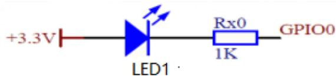

<details>
<summary>text_image</summary>

+3.3V
LED1
Rx0
1K
GPIO0
</details>

图4-3 LED接口电路图

由4.1.2节知，要控制LED1亮或暗，需要执行以下程序。

$$
\text { myGpio } \rightarrow \text { GPADAT } \&= (\sim ((\text { uint32\_t }) 1 <   <   2));
$$

//GPIO0位清零

$$
\text { myGpio } \rightarrow \text { GPADAT } \mid = (\text { uint32\_t }) 1 <   <   2;
$$

//GPIO2位写1，LED1暗

$$
\text { myGpio } \rightarrow \text { GPADAT } \mid = (\text { uint32\_t }) 0 <   <   2;
$$

//GPIO2位写0，LED1亮

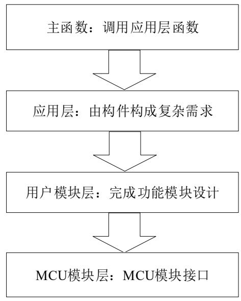

<details>
<summary>flowchart</summary>

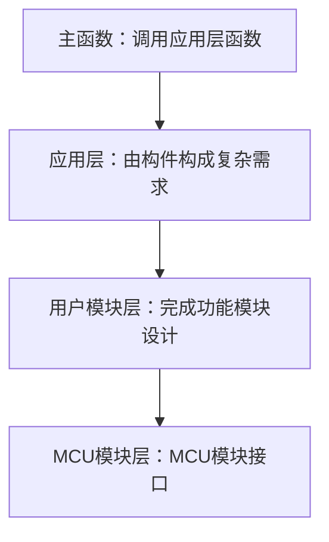
</details>

图4-4 四层软件架构示意图

这种基于寄存器的开发方式具有简单、直接、高效的特点。“简单”是说要实现某个功能，只要在数据手册找到实现这个功能的寄存器，按照说明设置即可，而无需下载其他的支持文件（比如固件函数库），前期准备相对较少，工程模板也比较简单。“直接”是指只要配置相应寄存器的某些位为1或0，就可以实现相应控制功能，而不需要函数调用、参数判断等一系列辅助操作。“高效”是指基于寄存器开发方式，其代码量小，执行速度快。

由于早期的MCU硬件资源相对有限，而且控制程序也相对简单，通过寄存器方式编程是直接、高效的，而且对于学习者来说也是容易掌握的。但是F28027外设资源十分丰富，寄存器数量和复杂程度显著增加，所以采用寄存器开发方式，对开发者要求比较高，开发时需要查询相关数据手册，所以目前寄存器开发方式主要适用于嵌入式系统底层开发，或是对执行速度和系统资源有严格要求的场合。对于一般的应用程序，推荐使用本书介绍的四层软件架构法。

## 固件函数库

TI公司为各系列MCU提供了丰富的固件库函数和技术支持。固件库是一个固件函数包，它由程序、数据结构和宏组成，包括MCU所有系统级和外设标准驱动函数(接口)。对于初学者而言，可以直接调用这些驱动函数，快速实现需要的应用。因此，使用固件库函数可以大大减少用户的程序编写时间，进而降低开发成本。

驱动函数把寄存器的操作封装成固件库函数，用户直接调用驱动函数即可完成相关位的操作，不用直接对寄存器操作，使用更简单，更直观。

LED1对应的GPIO0接口的驱动函数为：

GPIO\_setHigh(myGpio, GPIO\_Number\_0); //GPIO0输出高电平，LED1灯暗
GPIO\_setLow(myGpio, GPIO\_Number\_0); //GPIO0输出低电平，LED1灯亮

程序清单4-1和4-2给出了引脚输出低电平和高电平的程序代码。寄存器GPACLEAR、GPASET都是写1有效的，其中GPACLEAR寄存器控制引脚输出低电平，GPASET寄存器控制引脚输出高电平。具体信息可以查看数据手册，在此直接给出代码。

## 固件函数库

程序清单4-1 GPACLEAR寄存器控制引脚输出低电平  
```c
void GPIO_setLow(GPIO_Handle gpioHandle, const GPIO_Number_e gpioNumber)
{
    GPIO_Obj * gpio = (GPIO_Obj *) gpioHandle;
    ENABLE_PROTECTED_REGISTER_WRITE_MODE; //该寄存器具有写保护功能，写之前允许写操作
    if(gpioNumber < GPIO_Number_32)
    {
    gpio->GPACLEAR=(uint32_t) 1<<gpioNumber; //寄存器位写1，对应的引脚输出低电平
    }
    else
    {
    gpio->GPBCLEAR = (uint32_t) 1 << (gpioNumber - GPIO_Number_32); //端口B引脚对应位写1
    }
    DISABLE_PROTECTED_REGISTER_WRITE_MODE; //重新禁止写操作
    return;
}
```

## 固件函数库

程序清单4-2 GPASET寄存器控制引脚输出高电平  
```c
void GPIO_setHigh(GPIO_Handle gpioHandle, const GPIO_Number_e gpioNumber)
{
    GPIO_Obj *gpio = (GPIO_Obj *)gpioHandle;
    ENABLE_PROTECTED_REGISTER_WRITE_MODE; //该寄存器具有写保护功能，写之前允许写操作
    if(gpioNumber < GPIO_Number_32)
    {
    gpio->GPASET = (uint32_t)1 << gpioNumber; //寄存器位写1，对应的引脚输出高电平
    }
    else
    {
    gpio->GPBSET = (uint32_t)1 << (gpioNumber - GPIO_Number_32); //端口B引脚对应位写1
    }
    DISABLE_PROTECTED_REGISTER_WRITE_MODE; //重新禁止写操作
    return;
```

}

## 用户模块层

程序清单4-3 用户模块层LED亮暗控制程序  
```c
//LED亮控制
void inline LED_on(GPIO_Number_e led)
{
GPIO_setLow(myGpio, led); //GPIO口输出低电平，对应LED1亮
}
//LED暗控制
void inline LED_off(GPIO_Number_e led)
{
GPIO_setHigh(myGpio, led); //GPIO口输出高电平，对应LED1暗
}
```

用户模块层对MCU驱动函数进行封装，完成具体的功能操作。因为LED1的亮暗控制跟具体的硬件接口有关系，LED\_on和LED\_off函数根据硬件接口调用固件驱动函数实现对LED1的亮暗控制。

## 应用层

程序清单4-4 应用层LED亮暗控制程序  
```c
void LED_Control(void)
{
    LED_on(LED1); //LED1灯亮
    Delay(10000L); //延时函数
    LED_off(LED1); //LED1灯暗
    Delay(10000L); //延时函数
}
```

用户模块层对MCU驱动函数进行封装，完成具体的功能操作。因为LED1的亮暗控制跟具体的硬件接口有关系，LED\_on和LED\_off函数根据硬件接口调用固件驱动函数实现对LED1的亮暗控制。

## 主程序层

程序清单4-5 主程序main.c  
```txt
void main(void)
{
    //1. MCU系统运行环境配置
    User_System_pinConfigure();    初始化配置和的调用，实现复初始化部分包块配置函数和
    User_System_functionConfigure();    用户 System_functionConfigure();    用户 System_eventConfigure();    用户 System_eventConfigure();    用户 System_initial();    用户 System_initial();    用户 System_initial();    用户 System_initial();    用户 System_initial();    用户 System_initial();    用户 System_initial();    用户 System_initial();    用户 System_initial();    用户 System_initial();    用户 System_initial();    用户 System_initial();    用户 System_initial();    用户 System_initial();    用户 System_initial();    用户 System_initial();    用户 System_initial();    用户 System_initial();    用户 System_initial();    用户 System_initial();    用户 Systemisation()
```

主程序层主要是对MCU的初始化配置和应用层功能函数的调用，实现复杂的MCU功能。初始化部分包含系统和外设模块配置函数和初始化函数。

通过以上四层软件架构，完成了LED1的亮灭控制，总体程序调用关系如图4-5所示。从顶层开始，主程序main函数调用应用层的LED\_Control函数，LED\_Control函数调用用户模块层的功能实现函数LED\_on和LED\_off，LED\_on和LED\_off函数调用MCU模块层的驱动函数，实现对寄存器的操作，控制GPIO引脚输出高电平或者低电平，最终实现LED的亮暗控制。虽然这种程序架构增加了程序代码，降低了程序执行效率，但是，程序的可读性和规范性得到了比较大的提高，而且现在CPU的主频都比较高，基本上不影响实时控制的需求。
应用层 用户需求：控制LED灯

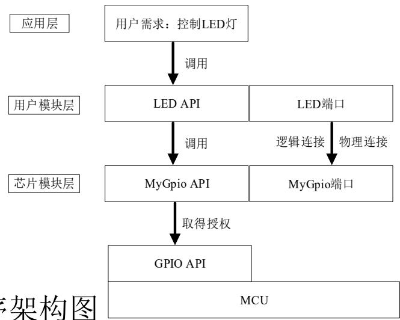

<details>
<summary>flowchart</summary>

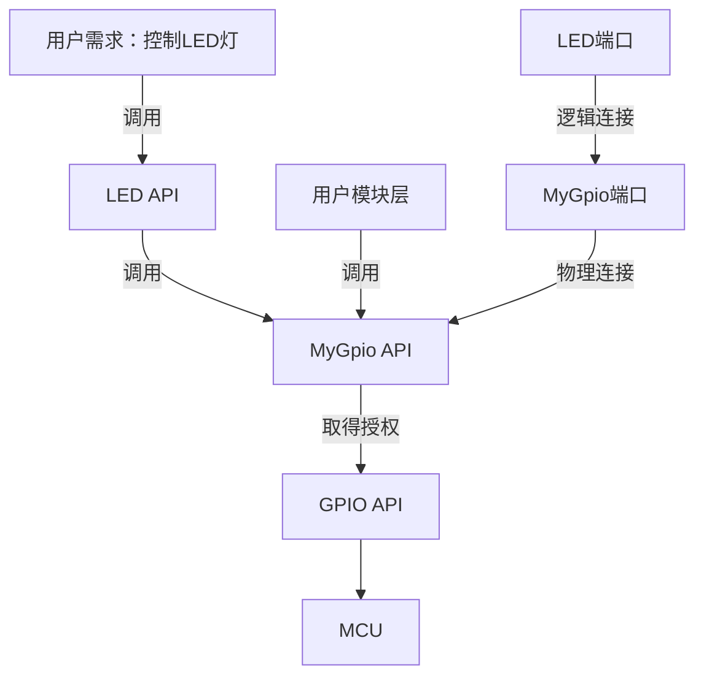
</details>

图4-5 程序架构图

如图4-6、4-7所示，工程文件与软件的四层架构相对应。其中main.c为主程序；Application为应用层；User\_Component为用户模块层；F2802x\_Component为MCU模块驱动函数固件层。各功能模块由.c文件和.h文件组成。.c文件包含了各功能函数，.h文件包含函数和变量的定义或声明以及各种宏定义等。

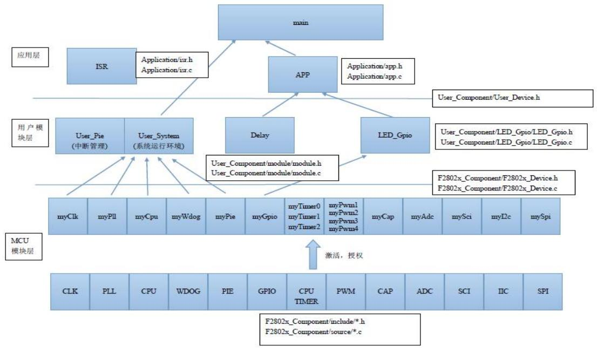

<details>
<summary>flowchart</summary>

```mermaid
graph TD
  A["main"] --> B["ISR"]
  A --> C["APP"]
  A --> D["User_Pie (中断管理)"]
  A --> E["User_System (系统运行环境)"]
  A --> F["Delay"]
  A --> G["LED_Gpio"]
  B --> H["Application/iar.h Application/iar.c"]
  C --> I["Application/app.h Application/app.c"]
  D --> J["User_Component/User_Device.h"]
  E --> K["User_Component/LED_Gpio/LED_Gpio.h User_Component/LED_Gpio/LED_Gpio.c"]
  F --> L["User_Component/module/module.h User_Component/module/module.c"]
  G --> M["F2802x_Component/F2802x_Device.h F2802x_Component/F2802x_Device.c"]
  N["MCU 模块层"] --> O["CLK"]
  N --> P["PLL"]
  N --> Q["CPU"]
  N --> R["WDOG"]
  N --> S["PIE"]
  N --> T["GPIO"]
  N --> U["CPU TIMER"]
  N --> V["PWM"]
  N --> W["CAP"]
  N --> X["ADC"]
  N --> Y["SCI"]
  N --> Z["IIC"]
  N --> AA["SPI"]
  AB["激活，授权"] --> AC["F2802x_Component/include/*.h F2802x_Component/source/*.c"]
```
</details>

图4-6 文件结构示意图

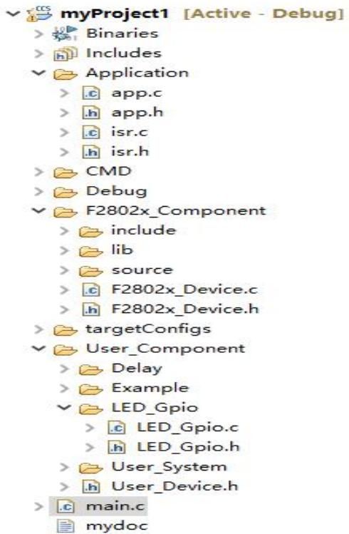

<details>
<summary>text_image</summary>

myProject1 [Active - Debug]
> Binaries
> Includes
✓ Application
  > app.c
  > app.h
  > isr.c
  > isr.h
> CMD
> Debug
✓ F2802x_Component
  > include
  > lib
  > source
  > F2802x_Device.c
  > F2802x_Device.h
> targetConfigs
✓ User_Component
  > Delay
  > Example
✓ LED_Gpio
    > LED_Gpio.c
    > LED_Gpio.h
  > User_System
  > User_Device.h
> main.c
  mydoc
</details>

图4-7 工程文件架构图

在MCU模块层，由于各个模块直接和硬件打交道，在这一层定义模块句柄变量，实质就是个指针，指针初始化后指向模块寄存器组的首地址。

用户模块层和应用层定义的变量可以看成模块的属性，依附于模块，在C++程序设计里一般是不建议直接操作模块的属性的，但是我们还是延续汇编的习惯，因为每个变量定义时就是个全局变量。变量定义后，也需要初始化，初始化在模块的初始化函数中进行。模块中定义的变量可以在模块内部函数（包括初始化函数、配置函数和API函数）调用，也能够在上一层的模块调用。同一层的函数不能相互调用，这个原则保证函数具有很好的移植性。在新建项目工程时，要用到旧工程中的用户模块，直接把目录拷贝过去就可以使用了。

C语言规定程序中用到的变量都要进行定义，而且只能定义一次，其他文件要用该变量，要对该变量进行声明。为了避免.h文件在被上层模块调用时出现重复定义的错误，在每一个模块声明文件中都有以下的编译伪指令程序段。

```c
#ifndef TARGET_GLOBAL
#define TARGET_EXT extern
#else
#define TARGET_EXT
#endif
```

在变量和函数声明前使用TARGET\_EXT进行修饰。当标识符TARGET\_GLOBAL没有声明时，TARGET\_EXT取值为extern，否则就是相当于空格。标识符TARGET\_GLOBAL仅在main.c文件中出现，即main.c文件的第一句为

#define TARGET\_GLOBAL 1

程序的执行从main开始，main调用的所有\*.h延续了这个定义，因此在\*.h中，这个TARGET\_EXT被解释为空格，进行变量的定义。其他文件中没有对TARGET\_GLOBAL进行定义，所以TARGET\_EXT被解释为extern，这时就是变量的声明了。

## 各层文件分析

## 1. 主程序层

主程序层就一个main.c文件。该文件执行系统初始化、各个功能模块的初始化，然后在主循环里调用各个应用层的功能函数。在main.c文件前面包含以下两条指令。

#define TARGET\_GLOBAL 1 //main文件里进行变量的定义

#include "Application\app.h" //包含应用层的h文件

## 2.应用层

应用层文件包括app.c、app.h、isr.c和isr.h。isr.c和isr.h将在第6章中断模块进行介绍。app.h文件进行应用层函数的定义或声明，并向下包含用户模块层的h文件User\_Device.h。

## 应用层文件

程序清单4-6 应用层函数的定义或声明  
```c
**********app.h文件**********
#ifndef _APP_H_
#define _APP_H_
// the includes
#include <stdint.h>
#include "User_Component/User_Device.h"    //向下包含用户模块层的h文件
#ifdef __cplusplus
extern "C" {
#endif
#ifndef TARGET_GLOBAL
    #define TARGET_EXT extern
#else
#define TARGET_EXT
#endif
TARGET_EXT void LED_Control(void);    //函数LED_Control定义
#ifdef __cplusplus
}
#endif // extern "C"
#endif    // end of _APP_H_ definition
```

## 应用层文件

程序清单4-7 应用层函数的实现  
```txt
******************************************************************************************
```

app.c文件必须包含app.h。文件里包含各个具体的功能实现函数。  
```txt
**********app.c文件**********
```  
#include "Application/app.h"

```txt
void LED_Control(void) //LED1 亮灭控制
{
```  
LED\_on(LED1); //LED1灯亮  
Delay(10000L); //延时函数

LED\_off(LED1); //LED1灯暗  
Delay(10000L); //延时函数  
```txt
}
```

```txt
******************************************************************************************
```

## 各层文件分析

## 3. 用户模块层

用户模块层包含了多个文件，每个文件就是一个相对独立的模块功能实现的集合，同样包含.c文件和.h文件。每个模块包括四个函数：引脚配置函数、功能配置函数、事件触发函数和初始化函数。有的函数暂时没有内容，为了程序结构的美观以及今后扩展使用，在程序中预留该函数。h文件要包含MCU驱动函数层的h文件<F2802x\_Device.h>。以下通过具体代码及注释进行解析。

## 模块层文件

## 程序清单4-8 用户模块层h文件

\*\*\*\*\*\*\*\*\*\*\*\*\*\*\*\*\*\*\*\*\*\*\*\*\*\*\*LED\_Gpio.h\*\*\*\*\*\*\*\*\*\*\*\*\*\*\*\*\*\*\*\*\*\*\*\*\*\*\*  
// \file User_Component/LED_Gpio/LED_Gpio.h
// \brief LED control by GPIO
#ifndef _LED_GPIO_H_
#define _LED_GPIO_H_
// the includes
#include <stdint.h>
// driver
#include "F2802x_Component/F2802x_Device.h"    //包含MCU驱动函数层h文件
#ifdef __cplusplus
extern "C" {
#endif
#ifndef TARGET_GLOBAL
    #define TARGET_EXT    extern
#else
    #define TARGET_EXT
#endif

#define LED1    GPIO_Number_0  //宏定义，便于程序阅读
#define LED2    GPIO_Number_1  //
#define LED3    GPIO_Number_2  //
#define LED4    GPIO_Number_3  //
// (1) module Initial
// \brief   LED_GPIO module initial
// \param[in] None
// \param[out] None
TARGET_EXT void LED_GPIO_initial(void);  // 初始化
// (2) module Configure
// (2.1) module Pin configure
// \brief   LED_GPIO Pin configure
// \param[in] None
// \param[out] None
TARGET_EXT void LED_GPIO_pinConfigure(void);    //引脚资源配置
//
// (2.2) module function configure
// \brief   LED_GPIO function configure

//!\param[in] None
//!\param[out] None
TARGET_EXT void LED_GPIO_functionConfigure(void); //功能配置
// (2.3) module Event configure
//!\brief LED_GPIO Event configure
//!\param[in] None
//!\param[out] None
TARGET_EXT void LED_GPIO_eventConfigure(void); //事件配置

//! \brief LED on  
//!\param[in] None
//!\param[out] None
TARGET_EXT void inline LED_on(GPIO_Number_e led)    //inline定义为内联函数，这样可以解决一些频繁调用的函数大量消耗栈空间内存）的问题。
{
    GPIO_setLow(LED_Gpio_obj, led);    LED1亮控制
}
//!\brief    LED off
//!\param[in] None
//!\param[out] None
TARGET_EXT void inline LED_off(GPIO_Number_e led)
{
    GPIO_setHigh(LED_Gpio_obj, led);    //LED1暗控制
}
//!\brief    LED toggle
//!\param[in] None
//!\param[out] None
TARGET_EXT void inline LED_toggle(GPIO_Number_e led)
{
    GPIO_toggle(LED_Gpio_obj, led);    //LED亮暗切换控制
}
#ifdef __cplusplus
}
#endif // extern "C"  
#endif // end of LED\_GPIO\_H definition

模块层文件  
程序清单4-9 用户模块层c文件  
```c
**********LED_Gpio.c**********  
#include "User_Component/LED_Gpio/LED_Gpio.h" //包含该模块的h文件  
void LED_GPIO_initial(void)    //模块的初始化  
{  
    LED_off(LED1);  
    LED_off(LED2);  
    LED_off(LED3);  
    LED_off(LED4);  
}  
// (2) module Configure    //模块配置  
// (2.1) module Pin configure    //第1步：引脚资源配置  
//!\brief LED_GPIO Pin configure  
void LED_GPIO_pinConfigure(void)  
{  
    // 1. set mode  
    //void GPIO_setMode(GPIO_Handle gpioHandle, const GPIO_Number_e gpioNumber, const GPIO_Mode_e mode);  
    GPIO_setMode(myGpio, LED1, GPIO_0_Mode_GeneralPurpose); //GPIO引脚为通用GPIO  
    GPIO_setMode(myGpio, LED2, GPIO_1_Mode_GeneralPurpose);  
    GPIO_setMode(myGpio, LED3, GPIO_2_Mode_GeneralPurpose);  
    GPIO_setMode(myGpioj, LED4, GPIO_3_Mode_GeneralPurpose);  
    // 2. set pullup  
    //void GPIO_setPullUp(GPIO_Handle gpioHandle, const GPIO_Number_e gpioNumber, const GPIO_PullUp_e pullUp);  
    GPIO_setPullUp(myGpio, LED1, GPIO_PullUp_Disable); //禁止上拉  
    GPIO_setPullUp(myGpio, LED2, GPIO_PullUp_Disable);  
    GPIO_setPullUp(myGpio, LED3, GPIO_PullUp_Disable);  
    GPIO_setPullUp(myGpio, LED4, GPIO_PullUp_Disable);  
    // 3. set direction  
    //void GPIO_setDirection(GPIO_Handle gpioHandle, const GPIO_Number_e gpioNumber, const GPIO_Direction_e direction);  
    GPIO_setDirection(myGpio, LED1, GPIO_Direction_Output); //配置为输出  
    GPIO_setDirection(myGpio, LED2, GPIO_Direction_Output);  
    GPIO_setDirection(myGpio, LED3, GPIO_Direction_Output);  
    GPIO_setDirection(myGpio, LED4, GPIO_Direction_Output);
```

```javascript
// (2.2) module function configure    //第2步：功能配置
void LED_GPIO_functionConfigure(void)    //预留
{
}
// (2.3) module Event configure    //第3步：事件配置。包括中断触发等事件
void LED_GPIO_eventConfigure(void)    //预留
{
}
// end of file
```

## 各层文件分析

## 3.MCU模块层—驱动函数库

如图4-8和图4-9所示，MCU模块层包括所有系统级和外设级模块的驱动程序，驱动函数直接对MCU的寄存器进行操作。接下来以GPIO模块的c文件和h文件展开分析。

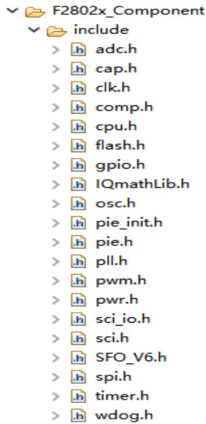

<details>
<summary>text_image</summary>

F2802x_Component
include
> h adc.h
> h cap.h
> h clk.h
> h comp.h
> h cpu.h
> h flash.h
> h gpio.h
> h IQmathLib.h
> h osc.h
> h pie_init.h
> h pie.h
> h pll.h
> h pwm.h
> h pwr.h
> h sci_io.h
> h sci.h
> h SFO_V6.h
> h spi.h
> h timer.h
> h wdog.h
</details>

图4-8 驱动函数的h文件

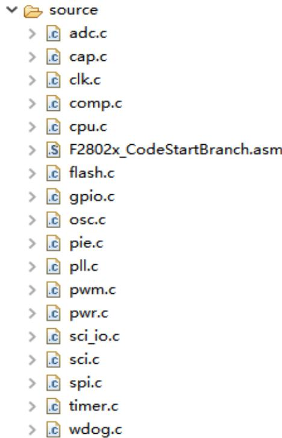

<details>
<summary>text_image</summary>

source
> .c adc.c
> .c cap.c
> .c clk.c
> .c comp.c
> .c cpu.c
> .$ F2802x_CodeStartBranch.asm
> .c flash.c
> .c gpio.c
> .c osc.c
> .c pie.c
> .c pll.c
> .c pwm.c
> .c pwr.c
> .c sci_io.c
> .c sci.c
> .c spi.c
> .c timer.c
> .c wdog.c
</details>

图4-9 驱动函数的c文件

程序清单4-10 驱动函数h文件的代码及解析  
```c
// \param[out] None
void LED_GPIO_eventConfigure(void)    //预留
{
}
// ***************************
// the API functions
// end of file
***************************
#define _GPIO_H_
// the includes
#include <assert.h>
#include <stdarg.h>
#include <stdbool.h>
#include <stddef.h>
#include <stdint.h>
#include "F2802x_Component/include/cpu.h"
#ifdef __cplusplus
extern "C" {
#endif
// ***************************
// \brief Defines the base address of the general purpose I/O (GPIO) registers
#define GPIO_BASE_ADDR    (0x00006F80)  //GPIO模块寄存器首地址
// \brief Defines the location of the CONFIG bits in the GPMUX register
//
#define GPIO_GPMUX_CONFIG_BITS    (3 << 0)
// ***************************
//定义枚举变量，变量值与引脚相应功能的寄存器配置值一致。
typedef enum
{
    GPIO_0_Mode_GeneralPurpose=0,    //0: 通用IO口
    GPIO_0_Mode_EPWM1A,    //1: 引脚为EPWM1A功能
    GPIO_0_Mode_Rsvd_2,    //2: 保留
    GPIO_0_Mode_Rsvd_3,    //3: 保留
```

```c
GPIO_1_Mode_GeneralPurpose=0,    //0: 通用IO口
GPIO_1_Mode_EPWM1B,    //1: 引脚为EPWM1B功能
GPIO_1_Mode_Rsvd_2,    //2: 保留
GPIO_1_Mode_COMP1OUT,    //3: 引脚为COMP1OUT
GPIO_2_Mode_GeneralPurpose=0,    //0: 通用IO口
GPIO_2_Mode_EPWM2A,    //1: 引脚为EPWM2A功能
GPIO_2_Mode_Rsvd_2,    //2: 保留
GPIO_2_Mode_Rsvd_3,    //3: 保留
GPIO_3_Mode_GeneralPurpose=0,    //0: 通用IO口
GPIO_3_Mode_EPWM2B,    //1: EPWM2B功能
GPIO_3_Mode_Rsvd_2,    //2: 保留
GPIO_3_Mode_COMP2OUT,    //3: 引脚为COMP2OUT
.    //中间略去
.
.
.
GPIO_38_Mode_JTAG_TCK=0,    //0: JTAG_TCK功能
GPIO_38_Mode_Rsvd_1,    //1: 保留
GPIO_38_Mode_Rsvd_2,    //2: 保留
GPIO_38_Mode_Rsvd_3    //3: 保留
} GPIO_Mode_e;
//!\brief Enumeration to define the general purpose I/O (GPIO) directions
```

程序清单4-10 驱动函数h文件的代码及解析  
```lisp
typedef enum
{
    GPIO_Direction_Input=0, //0: GPIO配置为输入
    GPIO_Direction_Output //1: GPIO配置为输出
} GPIO_Direction_e;

    //! \brief Enumeration to define the general purpose I/O (GPIO) pull up
typedef enum
{
    GPIO_PullUp_Enable=0, //0: 使能上拉电阻
    GPIO_PullUp_Disable //1: 禁止上拉电阻
} GPIO_PullUp_e;

    //! \brief Enumeration to define the general purpose I/O (GPIO) ports
typedef enum
{
    GPIO_Port_A = 0, //0: GPIO_Port_A
    GPIO_Port_B //1: GPIO_Port_B
} GPIO_Port_e;

    //! \brief Enumeration to define the general purpose I/O (GPIO) numbers
typedef enum
{
    GPIO_Number_0=0, //0:GPIO number 0
    GPIO_Number_1, //1:GPIO number 1
    GPIO_Number_2, //2:GPIO number 2
    GPIO_Number_3, //3:GPIO number 3
    GPIO_Number_4, //4GPIO number 4

    . //中间略去
    .
    . 
    . 
    . 
    . 
    . 
    . 
    . 
    . 
    . 
    . 
    . 
    . 
    . 
    . 
    . 
    . 
    . 
    . 
    . 
    . 
    . 
    . 
    . 
    . 
    . 
    . 
    . 
    . 
    . 
    . 
    . 
    . 
    . 
    . 
   //定义结构体，结构体成员为GPIO模块的所有寄存器。地址按从低到高顺序排列，预留没有寄存器的地址。

typedef struct _GPIO_Obj_
{
    volatile uint32_t GPACTRL;    //!< GPIO A Control Register
    volatile uint32_t GPAQSEL1;    //!< GPIO A Qualifier Select 1 Register
    volatile uint32_t GPAQSEL2;    //!< GPIO A Qualifier Select 2 Register
    volatile uint32_t GPAMUX1;    //!< GPIO A MUX 1 Register
    volatile uint32_t GPAMUX2;    //!< GPIO A MUX 2 Register
    volatile uint32_t GPADIR;    //!< GPIO A Direction Register
    volatile uint32_t GPAPUD;    //!< GPIO A Pull Up Disable Register
    volatile uint16_t rsvd_1[2];   //!< Reserved
    volatile uint32_t GPBCTRL;    //!< GPIO B Control Register
    volatile uint32_t GPBQSEL1;    //!< GPIO B Qualifier Select 1 Register
    volatile uint16_t rsvd_2[2];   //!< Reserved
    volatile uint32_t GPBMUX1;    //!< GPIO B MUX 1 Register
    volatile uint16_t rsvd_3[2];   //!< Reserved
    volatile uint32_t GPBDIR;    //!< GPIO B Direction Register
    volatile uint32_t GPBPUD;    //!< GPIO B Pull Up Disable Register
    volatile uint16_t rsvd_4[24];   //!< Reserved
```

程序清单4-10 驱动函数h文件的代码及解析  
volatile uint32_t AIOMUX1;    //!< Analog, I/O Mux 1 Register
volatile uint16_t rsvd_5[2];    //!< Reserved
volatile uint32_t AIODIR;    //!< Analog, I/O Direction Register
volatile uint16_t rsvd_6[4];    //!< Reserved
volatile uint32_t GPADAT;    //!< GPIO A Data Register
volatile uint32_t GPASET;    //!< GPIO A Set Register
volatile uint32_t GPACLEAR;    //!< GPIO A Clear Register
volatile uint32_t GPATOGGLE;    //!< GPIO A Toggle Register
volatile uint32_t GPBDAT;    //!< GPIO B Data Register
volatile uint32_t GPBSET;    //!< GPIO B Set Register
volatile uint32_t GPBCLEAR;    //!< GPIO B Clear Register
volatile uint32_t GPBTOGGLE;    //!< GPIO B Toggle Register
volatile uint16_t rsvd_7[8];    //!< Reserved
volatile uint32_t AIODAT;    //!< Analog I/O Data Register
volatile uint32_t AIOSET;    //!< Analog I/O Data Set Register
volatile uint32_t AIOCLEAR;    //!< Analog I/O Clear Register
volatile uint32_t AIOTOGGLE;    //!< Analog I/O Toggle Register
volatile uint16_t GPIOXINTnSEL[3];    //!< XINT1-3 Source Select Registers
volatile uint16_t rsvd_8[5];    //!< Reserved
volatile uint32_t GPIOLPMSEL;    //!< GPIO Low Power Mode Wakeup Select Register
} GPIO_Obj;
//!\brief Defines the general purpose I/O (GPIO) handle
//定义结构体指针
typedef GPIO_Obj * GPIO_Handle;

以下为部分函数的定义，详细内容见第5章。
//  
**********************************************************************
***  
//返回指定引脚的寄存器值
//形参1：GPIO模块的结构体指针
//形参2：要读取的引脚，枚举变量类型
//返回值：0或1，对应引脚的低电平或高电平
uint16_t GPIO_getData(GPIO_Handle gpioHandle, const GPIO_Number_e gpioNumber);

//返回端口数据
//形参1：GPIO模块的结构体指针
//形参2：要读取的端口，枚举变量
//返回值：端口数据
uint16_t GPIO_getPortData(GPIO_Handle gpioHandle, const GPIO_Port_e gpioPort);

//设置GPIO引脚方向
//形参1：GPIO模块的结构体指针
//形参2：引脚，枚举变量类型
//形参3：方向，枚举变量类型
void GPIO_setDirection(GPIO_Handle gpioHandle, const GPIO_Number_e gpioNumber, const GPIO_Direction_e direction);
//直接给出其他函数定义。
void GPIO_setPullUp(GPIO_Handle gpioHandle, const GPIO_Number_e gpioNumber, const GPIO_PullUp_e pullUp);
void GPIO_setLow(GPIO_Handle gpioHandle, const GPIO_Number_e gpioNumber);
void GPIO_setMode(GPIO_Handle gpioHandle, const GPIO_Number_e gpioNumber, const GPIO_Mode_e mode);

## 程序清单4-10 驱动函数h文件的代码及解析

```c
void GPIO_setMode(GPIO_Handle gpioHandle, const GPIO_Number_e gpioNumber, const GPIO_Mode_e mode);
void GPIO_setHigh(GPIO_Handle gpioHandle, const GPIO_Number_e gpioNumber);
void GPIO_setPortData(GPIO_Handle gpioHandle, const GPIO_Port_e gpioPort, const uint16_t data);
void GPIO_setQualification(GPIO_Handle gpioHandle, const GPIO_Number_e gpioNumber, const GPIO_Qual_e qualification);
void GPIO_setQualificationPeriod(GPIO_Handle gpioHandle, const GPIO_Number_e gpioNumber, const uint16_t period);
void GPIO_toggle(GPIO_Handle gpioHandle, const GPIO_Number_e gpioNumber);
void GPIO_lpmSelect(GPIO_Handle gpioHandle, const GPIO_Number_e gpioNumber);
GPIO_Handle GPIO_init(void *pMemory, const size_t numBytes);
#ifdef __cplusplus
}
#endif // extern "C"
#endif // end of _GPIO_H definition
```

\*\*\*\*\*\*\*\*\*\*\*\*\*\*\*\*\*\*\*\*\*\*\*\*\*\*\*\*\*\*\*\*\*\*\*\*\*\*\*\*\*\*\*\*\*\*\*\*\*\*\*\*\*\*\*\*\*\*\*\*\*\*\*\*\*\*\*\*\*\*

## 程序清单4-11 c文件代码及解释

```c
**********************************************************************
#include "F2802x_Component/include/gpio.h"    //包含该模块的h文件
void GPIO_setDirection(GPIO_Handle gpioHandle, const GPIO_Number_e gpioNumber, const
    GPIO_Direction_e direction)
{
    GPIO_Obj *gpio = (GPIO_Obj *) gpioHandle;
    ENABLE_PROTECTED_REGISTER_WRITE_MODE;
    if(gpioNumber < GPIO_Number_32)
    {
    gpio->GPADIR &= (~((uint32_t)1 << gpioNumber));
    // set the bit
    gpio->GPADIR |= (uint32_t)direction << gpioNumber;
    }
    else
    {
    // clear the bit
    gpio->GPBDIR &= (~((uint32_t)1 << (gpioNumber - GPIO_Number_32)));
    // set the bit
    gpio->GPBDIR |= (uint32_t)direction << (gpioNumber - GPIO_Number_32);
    }
    DISABLE_PROTECTED_REGISTER_WRITE_MODE;
    return;
} // end of GPIO_setDirection() function
.//其他函数不列出，具体信息参见电子文档
```

\* \* \* \* \*

CCS（Code Composer Studio）是TI公司推出的集成开发环境（Intergrated Development Environment，IDE）。所谓集成开发环境，就是处理器的所有开发都在一个软件里完成，包括项目管理、程序编译、代码下载、调试等。CCS支持所有TI公司推出的处理器，包括MSP430、32位ARM、C2000系列DSP等。

下载地址可在TI公司官方网站中找到。本书以CCS10.0.0为例，介绍其使用方法。

1 CCS安装注意事项  
2 创建工作区  
3 导入项目和编译项目  
4 仿真调试

## 4.4.1 CCS安装注意事项

下载完成后，安装时需注意：

(1) 安装包不要存放中文路径，使用中文路径后安装会报错；  
(2) 安装前先关闭杀毒软件和安全卫士、电脑管家等安全防护软件，否则单击安装程序会出现警告提示；  
(3) CCS支持TI公司所有的处理器，但需要用什么装什么，不然会占用较大的存储空间。

## 4.4.2 创建工作区

双击CCS图标将其打开，欢迎界面关闭之后，将显示如图4-10所示对话框。单击【Browse】按钮，选择一个文件夹作为工作区，用于存储项目文件。然后单击【Launch】按钮，将打开CCS的工作界面。


<details>
<summary>text_image</summary>

Code Composer Studio Launcher
Select a directory as workspace
Code Composer Studio uses the workspace directory to store its preferences and development artifacts.
Workspace: C:\CCS\workspace
Browse...
Recent Workspaces
Copy Settings
Launch Cancel
</details>

图4-10 创建工作区

## 4.4.3 导入项目和编译项目

## 1.导入项目

CCS软件有CCS Edit和CCS Debug两种模式，两种模式的界面和功能不同，可以单击按钮和切换模式，第一次打开软件默认为CCS Edit模式。

在CCS Edit模式视图下，单击菜单命令【Project】☐ 【Import CCS Projects】，如图4-11所示。

弹出如图4-12所示对话框，单击【Browse】按钮，找到需要导入的项目文件夹，本例中文件夹为“myProject1”，然后选中【Copy projects into workspace】，单击【Finish】按钮。如果操作过程中出现警告提示，则单击【OK】按钮忽略。

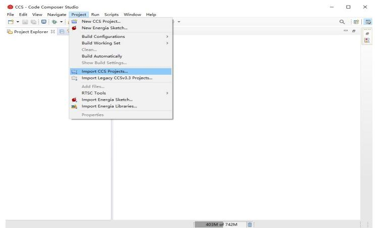

<details>
<summary>text_image</summary>

CCS - Code Composer Studio
File Edit View Navigate Project Run Scripts Window Help
New CCS Project...
New Energia Sketch...
Build Configurations >
Build Working Set >
Clean...
Build Automatically
Show Build Settings...
Import CCS Projects...
Import Legacy CCSv3.3 Projects...
Add Files...
RTSC Tools >
Import Energia Sketch...
Import Energia Libraries...
Properties
403M of 742M
</details>

图4-11 导入CCS已有项目的菜单


<details>
<summary>text_image</summary>

Import CCS Projects
Import CCS Projects
Import existing CCS Projects or example CCS Projects.
Select search-directory: C:\CCS\myProject1
Select archive file:
Browse...
Browse...
Discovered projects:
✓ myProject1
Select All
Deselect All
Refresh
Automatically import referenced projects found in same search-directory
✓ Copy projects into workspace
Open Resource Explorer to browse a wide selection of example projects...
Finish Cancel
</details>

图4-12 导入CCS高版本项目

## 4.4.3 导入项目和编译项目

## 2. 编译项目和特性设置

如果【Project Explorer】窗口没有打开，单击菜单命令【View】□【Project Explorer】弹出该窗口。单击项目名称将项目展开，可以看到项目中有很多文件，其中操作频率较高的是含有void LED\_Control(void)的文件app.c，双击【app.c】，打开该文件于代码编辑区，如图4-13所示。

CCS软件中有“关联跳转”功能，该功能非常有用。在代码编辑区，按住Ctrl+鼠标左键，可以单击跳转任意函数和外部变量的实际位置，以方便查看。单击工具栏中的按钮，可以回到原代码位置。

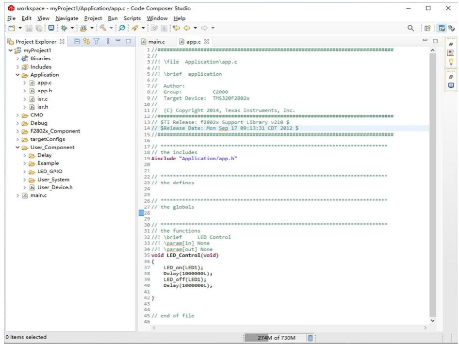

<details>
<summary>text_image</summary>

workspace - myProject1/Application/app.c - Code Composer Studio
File Edit View Navigate Project Run Scripts Window Help
Project Explorer
myProject1
Binaries
Includes
Application
app.c
app.h
isr.c
isr.h
CMD
Debug
F2802x_Component
targetConfigs
User_Component
Delay
Example
LED_GPIO
User_System
User_Device.h
main.c
main.c app.c
1/////\n\n\n\n\n\n\n\n\n\n\n\n\n\n\n\n\n\n\n\n\n\n\n\n\n\n\n\n\n\n\n\n\n\n\n\n\n\n\n\n\n\n\n\n\n\n\n\n\n\n\n\n\n\n\n\n\n\n\n\n\n\n\n\n\n\n\n\n\n\n\n\n\n\n\n\n\n\n\n\n\n\n\n\n\n\n\n\n\n\n\n\n\n\n\n\n\n\n\n\n\n\ntail.exe\ntail.exe\ntail.exe\ntail.exe\ntail.exe\ntail.exe\ntail.exe\ntail.exe\ntail.exe\ntail.exe\ntail.exe\ntail.exe\ntail.exe\ntail.exe\ntail.exe\ntail.exe\ntail.exe\ntail.exe\ntail.exe\ntail.exe\ntail.exe\ntail.exe\ntail.exe\ntail.exe\ntail.exe\ntail.\ntail.exe\ntail.exe\ntail.exe\ntail.exe\ntail.exe\ntail.exe\ntail.exe\ntail.exe\ntail.exe\ntail.exe\ntail.exe\ntail.exe\ntail.exe\ntail.exe\ntail.exe\ntail.exe\ntail.exe\ntail.exe\ntail.exe\ntail.exe\ntail.exe\ntail.exe\ntail.exe\ntail.exe\ntail.exe
1/////\n\n\n\n\n\n\n\n\n\n\n\n\n\n\n\n\n\n\n\n\n\n\n\n\n\n\n\n\n\n\n\n\n\n\n\n\n\n\n\n\n\n\n\n\n\n\n\n\n\n\n\n\n\n\n\n\n\n\n\n\n\n\n\n\n\n\n\n\n\n\n\n\n\n\n\n\n\n\n\n\n\n\n\n\n\n\n\n\n\n\n\n\n\n\n\rntail.exe\ntail.exe\ntail.exe\ntail.exe\ntail.exe\ntail.exe\ntail.exe\ntail.exe\ntail.exe\ntail.exe\ntail.exe\ntail.exe\ntail.exe\ntail.exe\ntail.exe\ntail.exe\ntail.exe\ntail.exe
1///\n//\\\n// \\file Application\\app.c
4///1
5///1 \brief application
6///1
7/// Author:
8/// Group: C2000
9/// Target Device: TMS320F2802x
10///11/// (C) Copyright 2014, Texas Instruments, Inc.
12/////\n//\\n//\\n//\\n//\\n//\\n//\\n//\\n//\\n//\\n//\\n//\\n//\\n//\\n//\\n//\\n//\\n//\\n//\\n//\\n//\\n//\\n//\\n//\\n//\\n//\\n//\\n//\\n//\\n//\\n//\\n//\\n//\\n//\\n//\\ n 13///$TI Release: f2802x Support Library v210 $
14///$Release Date: Mon Sep 17 09:13:31 CDT 2012 $
15/////\\n//\\n//\\n//\\n//\\n//\\n//\\n//\\n//\\n//\\n//\\n//\\n//\\n//\\n//\\n//\\n//\\n//\\n//\\n//\\n//\\n//\\n//\\n//\\n//\\n//\\n//\\n//\\n//\\n//\\n//\\n//\\n//\\n//}\\n/13///$TI Release: f2802x Support Library v210 $
14///$Release Date: Mon Sep 17 09:13:31 CDT 2012 $
15/////\\n//\\n//\\n//\\n//\\n//\\n//\\n//\\n//\\n//\\n//\\n//\\n//\\n//\\n//\\n//\\n/13///$TI Release: f2802x Support Library v210 $
14///$Release Date: Mon Sep 17 09:13:31 CDT 2012 $
15/////\\n//\\n//\\n//\\n//\\n//\\n//\\n/13///$TI Release: f2802x Support Library v210 $
14///$Release Date: Mon Sep 17 09:13:31 CDT 2012 $
15/////\\n//\\n//\\n//\\n/13///$TI Release: f2802x Support Library v210 $
14///$Release Date: Mon Sep 17 09:13:31 CDT 2012 $
15/////\\n//\\n/13///$TI Release: f2802x Support Library v210 $
14///$Release Date: Mon Sep 17 09:13:31 CDT 2012 $
16/////\\n/13///$TI Release: f2802x Support Library v210 $
14///$Release Date: Mon Sep 17 09:13:31 CDT 2012 $
15/////\\n/13///$TI Release: f2802x Support Library v210 $
14///$Release Date: Mon Sep 17 09:13:31 CDT 2012 $
16/////\\n/13///$TI Release: f2802x Support Library v210 $
14///$Release Date: Mon Sep 17 09:13:31 CDT 2012 $
15/////\\n/13///$TI Release: f2802x Support Library v210 $
14///$Release Date: Mon Sep 17 09:13:31 CDT 2012 $
16/////\\n/13///$TI Release: f2802x Support Library v210 $
14///$Release Date: Mon Sep 17 09:13:31 CDT 2012 $
15/////\\n/13///$TI Release: f2802x Support Library v210 $
14///$Release Date: Mon Sep 17-09:13:31 CDT 2012 $
16/////\\n/13///$TI Release: f2802x Support Library v210 $
14///$Release Date: Mon Sep 17-09:13:31 CDT 2012 $
16/////\\n/13///$TI Release: f2802x Support Library v210 $
14///$Release Date: Mon Sep 17-09:13:3<nl>
</details>

图4-13 代码编辑区

## 4.4.3 导入项目和编译项目

## 2. 编译项目和特性设置

## (1) 编译项目

在【Project Explorer】窗口中，右击项目名称，选择【Build Project】进行编译，或者单击菜单命令【Project】☐【Build Project】编译项目。如果项目较大，可能需要花费较长时间。

窗口底部的【Console】选项卡将显示编译中产生的信息。如果编译中没有发现错误，则会创建输出文件；如果编译中发现错误，则不会创建输出文件。窗口底部的【Problems】选项卡将显示若干条错误或警告提示，需按提示逐条修改后重新选择【Build Project】，如图4-14所示，涉及项目的特性修改和代码修改。

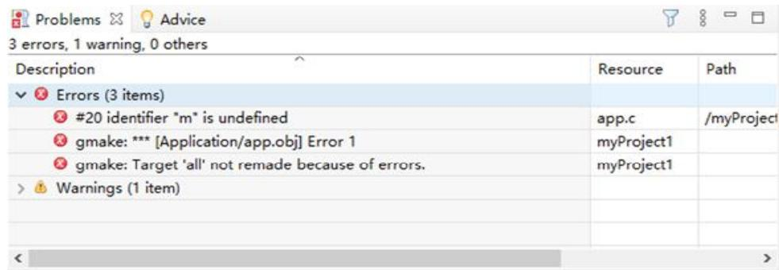

<details>
<summary>text_image</summary>

Problems
Advice
3 errors, 1 warning, 0 others
Description Resource Path
✓ Errors (3 items)
#20 identifier "m" is undefined app.c /myProject
gmake: *** [Application/app.obj] Error 1 myProject1
gmake: Target 'all' not remade because of errors. myProject1
Warnings (1 item)
</details>

图4-14 问题窗口

## 4.4.3 导入项目和编译项目

## 2. 编译项目和特性设置

## (2) 特性设置

如需查看或修改项目特性，在项目名上右击，选择【Properties】，具体操作如图4-15所示。

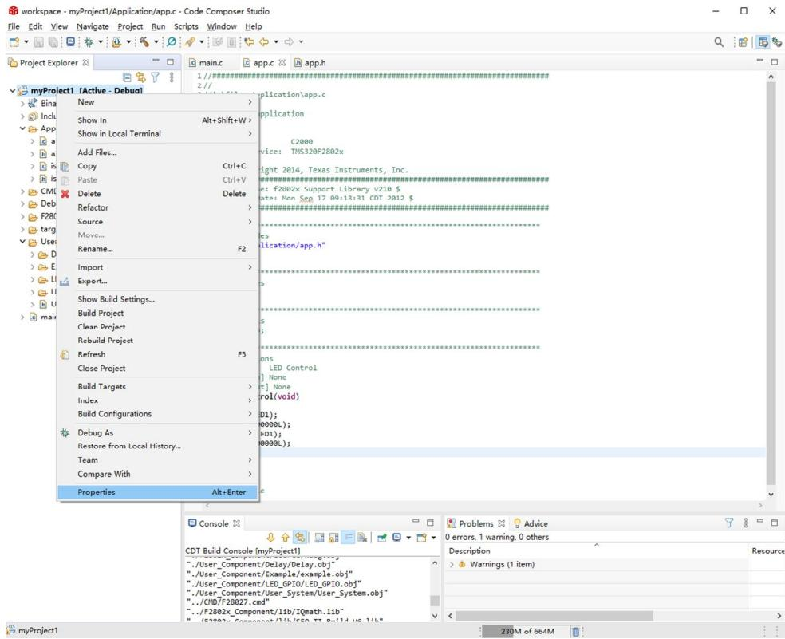

<details>
<summary>text_image</summary>

myProject1 [Active - Debut]
New
Show In
Show in Local Terminal
Add Files...
Copy	Ctrl+C
Paste	Ctrl+V
Delete	Delete
Refactor
Source
Move...
Rename...	F2
Import
Export...
Show Build Settings...
Build Project
Clean Project
Rebuild Project
Refresh	F5
Close Project
Build Targets >
Index >
Build Configurations >
Debug As >
Restore from Local History...
Team >
Compare With >
Properties	Alt+Enter
application\app.c
application
C2000
vice: TMS320F2802x
light 2014, Texas Instruments, Inc.
#################
e: F2802x Support Library v210 $
ate: Non Ssp 17 00:13:31 CDT 2012 $
#################
es
lication/app.h"
s
s
s
s
s
ions
LED Control
None
None
rol(void)
D1);
0000L);
ED1);
0000L);
Problems	Advice
CDT Build Console [myProject1]
../User_Component/Delay/Delay.obj"
../User_Component/Example/example.obj"
../User_Component/LED_GPIO/LED_GPIO.obj"
../User_Component/User_System/User_System.obj"
../CMD/F28027.cmd"
../F2802x_Component/lib/IQmath.lib"
(52002x_Component/lib/SEO_II_Build_MS_1lib"
230M of 664M
</details>

图4-15 项目特性的菜单

## 4.4.3 导入项目和编译项目

## 2. 编译项目和特性设置

## (2) 特性设置

## 1）常规特性

在弹出的窗口左侧选中【General】，其中【Project】选项卡按图4-16进行设置。

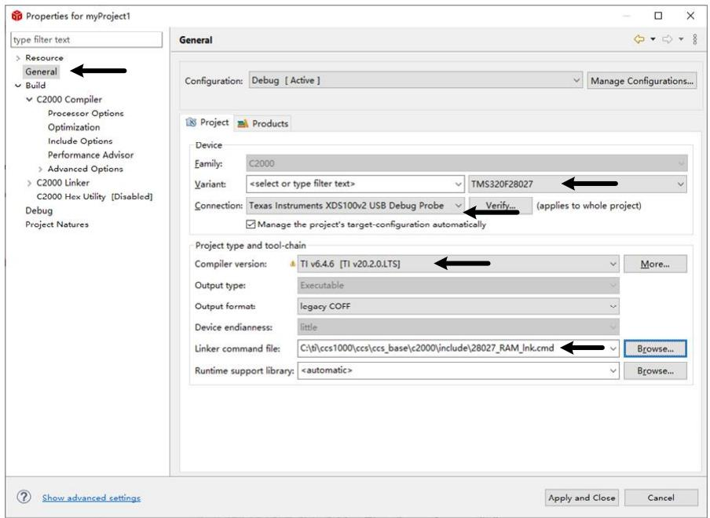

<details>
<summary>text_image</summary>

Properties for myProject1
type filter text
Resource
General
Build
C2000 Compiler
Processor Options
Optimization
Include Options
Performance Advisor
Advanced Options
C2000 Linker
C2000 Hex Utility [Disabled]
Debug
Project Natures
General
Configuration: Debug [ Active ]
Manage Configurations...
Project Products
Device
Family: C2000
Variant: <select or type filter text> TMS320F28027
Connection: Texas Instruments XDS100v2 USB Debug Probe Verify... (applies to whole project)
Manage the project's target-configuration automatically
Project type and tool-chain
Compiler version: TI v6.4.6 [TI v20.2.0.LTS] More...
Output type: Executable
Output format: legacy COFF
Device endianness: little
Linker command file: C:\tb\ccs1000\ccs\ccs_base\c2000\include\28027_RAM_lnk.cmd Browse...
Runtime support library: <automatic> Browse...
Show advanced settings Apply and Close Cancel
</details>

图4-16 常规特性

## 4.4.3 导入项目和编译项目

## 2. 编译项目和特性设置

## (2) 特性设置

## 2）包含选项

在窗口左侧选中【Include Options】添加头文件路径，在【Add dir to #include search path】框中，单击按钮，如图4-17所示。

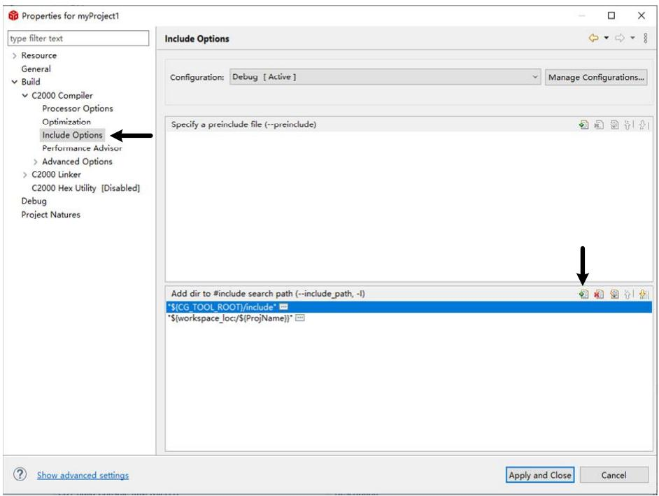

<details>
<summary>text_image</summary>

Properties for myProject1
type filter text
Resource
General
Build
C2000 Compiler
Processor Options
Optimization
Include Options
Performance Advisor
Advanced Options
C2000 Linker
C2000 Hex Utility [Disabled]
Debug
Project Natures
Include Options
Configuration: Debug [ Active ]
Manage Configurations...
Specify a preinclude file (--preinclude)
Add dir to #include search path (--include_path, -I)
${CG_TOOL_ROOT}/include*
${workspace_loc/${ProjName}*
Show advanced settings
Apply and Close
Cancel
</details>

图4-17 包含特性

## 4.4.4 仿真调试

## 1. 常用的调试方法

如果需要调试程序、排除问题，则通过CCS使程序在受控状态下运行，同时查看变量、寄存器或内存等信息，显示程序运行的结果和现象，与预期的结果和现象进行比较，从而顺利地调试程序。

常用的调试方法有单步、执行到光标，配合观测变量和运行现象使用。单步调试按钮 📄 ，用于单步执行程序。如需使用执行到光标功能，选择需要执行到的位置，右击选择菜单【Run to line】，或选择菜单命令【Run】□ 【Run to line】。在程序调试过程中，需要程序重新从头开始执行，不必单击退出调试按钮 □ 后再单击 ⚙️ 按钮，只需单击 ⚙️ 按钮就能定位到main()函数的开头。

观测变量有很多种方法，比如用【Expressions】、【Registers】和【Memory Browser】等窗口观测变量、寄存器和内存的数值，用图形工具观察变量随时间变化的曲线。

## 4.4.4 仿真调试

## 2. 在观察窗口观察变量

以前面导入的项目为例继续说明观测变量的操作，在CCS Debug模式下，单击按钮后，滚动鼠标滚轮，找到程序代码中的变量testvalue1，拖动光标将该变量全部选中后右击，选中【Add Watch Expression】，如图4-18所示。

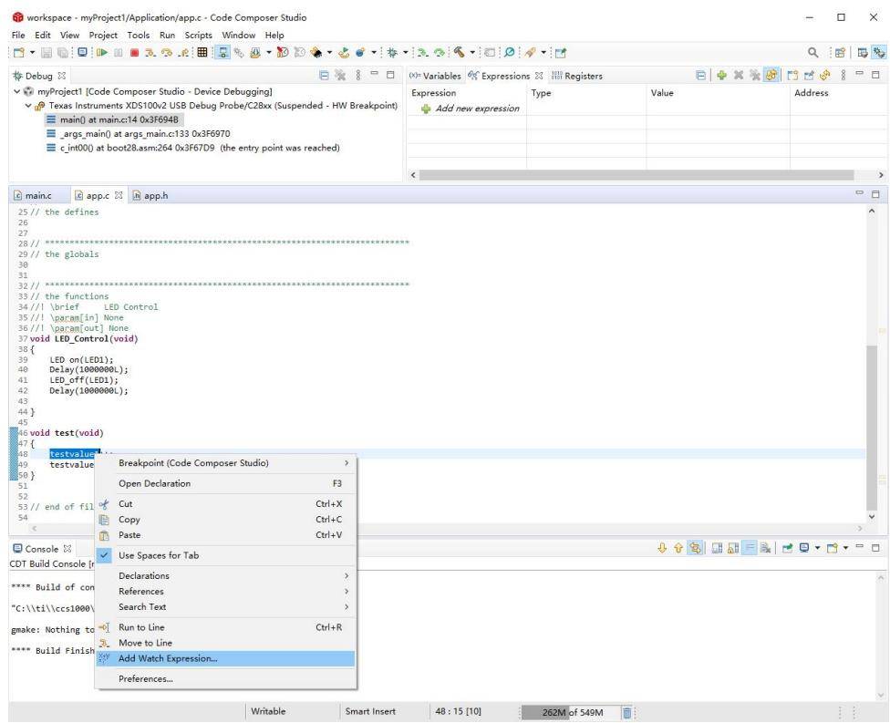

<details>
<summary>text_image</summary>

myProject1 [Code Composer Studio - Device Debugging]
Texas Instruments XDS100v2 USB Debug Probe/C28xx (Suspended - HW Breakpoint)
main() at main.c14 0x3F694B
_args_main() at args_main.c133 0x3F6970
c_int00() at boot28.asm:264 0x3F67D9 (the entry point was reached)
Variables	Expressions	Registers
Expressionipe	Add new expressionipe
Type	Valueidas
Address
main.c	app.c	app.h
25 // the defines
26
27
28 //*****
29 // the globals
30
31
32 //*****
33 // the functions
34 //! \brief	LED Control
35 //! \param[in] None
36 //! \param[out] None
37 void LED_Control(void)
38 {
39	LED on(LED1);
40	Delay(1000000L);
41	LED_off(LED1);
42	Delay(1000000L);
43
44 }
45
46 void test(void)
47 {
48/testvalue
49/testvalue
50}
51
52
53 // end of fil
54
Console XX
CDT Build Console [m
**** Build of com
*C:\ti\ccs1000\
gmake: Nothing to
**** Build Finish
Definitions	>
References	>
Search Text	>
Run to Line	Ctrl+R
Move to Line
Add Watch Expression...
Preferences...
Writable	Smart Insert	48 : 15 [10]	262M of 549M
</details>

图4-18 添加观测变量的菜单

弹出如图4-19所示对话框，单击【OK】按钮。

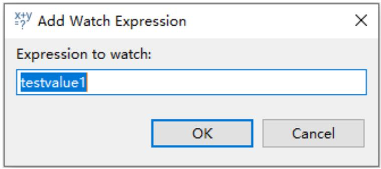

<details>
<summary>text_image</summary>

X+y
=? Add Watch Expression
Expression to watch:
testvalue1
OK Cancel
</details>

图4-19 添加观测变量

## 4.4.4 仿真调试

## 2. 在观察窗口观察变量

在【Expressions】窗口中出现了变量testvalue1，该变量的数据类型和地址也显示出来。按此方法，将与testvalue1关联的变量testvalue2也添加到【Expressions】窗口，单击按钮，修改变量testvalue2的值，可以动态观察到变量在程序运行过程中的变化情况，如图4-20所示。

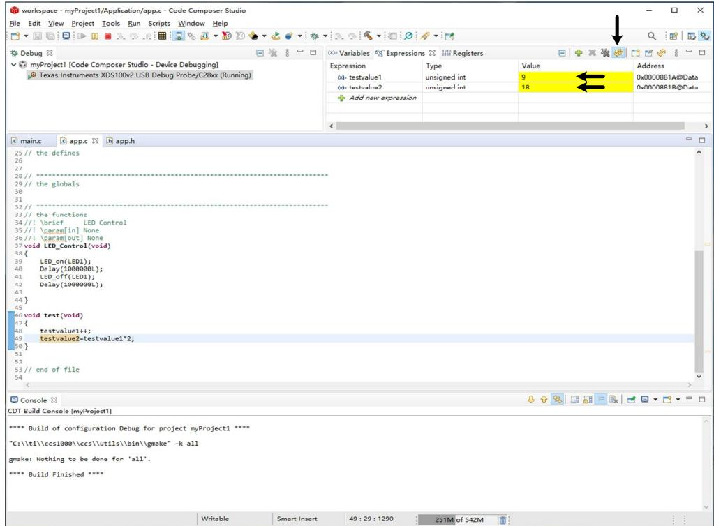

<details>
<summary>text_image</summary>

workspace - myProject1/Application/app.c - Code Composer Studio
File Edit View Project Tools Run Scripts Window Help
Debug
myProject1 [Code Composer Studio - Device Debugging]
Texas Instruments XDS100v2 USB Debug Probe/C28xx (Running)
Variables Expressions Registers
Expression Type Value Address
60- testvalue1 unsigned int 9 0x0000881A@Data
60- testvalue2 unsigned int 18 0x0000881B@Data
+ Add new expression
main.c app.c app.h
25 // the defines
26
27
28 // ******
29 // the globals
30
31
32 // ***-
33 // the functions
34 // ! \brief LED Control
35 // ! \param[in] None
36 // ! \param[out] None
37 void LCD_Control(void)
38 {
39 LED_on(LED1);
40 Delay(100000L);
41 Ltd_off(LED1);
42 Delay(100000L);
43
44 }
45
46 void test(void)
47 {
48 testvalue1++;
49 testvalue2=testvalue1*2;
50 }
51
52
53 // end of file
54
Console
CDT Build Console [myProject1]
**** Build of configuration Debug for project myProject1 *****
"C:\ti\ccs1000\ccs\utils\bin\gmake" -k all
gmake: Nothing to be done for 'all'.
**** Build Finished ****
Writable Smart Insert 40 : 29 : 1290 251M of 542M
</details>

图4-20【Expressions】窗口

单击工具栏中的按钮 ☐，或者单击菜单命令【Run】☐【Suspend】，程序暂停，【Expressions】窗口中的变量不再变化。

通过3.3节的学习，我们知道程序源代码经过编译后会生成COFF格式的文件，然后进行连接生成可执行文件，那么什么是COFF？这些文件如何连接？这节将对COFF和连接命令文件展开说明。

1 COFF格式和段的概念  
2 CMD文件简介  
3 F28027的CMD文件

通用目标文件格式（Common Object File Format，COFF）是一种二进制可执行文件格式。二进制可执行文件包括了库文件（\*.lib）、目标文件（\*.obj）、最终的可执行文件（\*.out）等。

采用COFF格式有利于程序的模块化编程，因为它支持用户在编写程序时使用代码块和数据块，这些块称之为段（section）。段是目标文件的最小单位，占据一段连续的存储器空间。每个目标文件都由若干个段组成，各个段是相互独立的。

所有的COFF段都可以在存储器空间进行重定位。用户可以将任意段放入分配过的任意目标存储器中。汇编器和连接器提供了多个伪指令用来创建和管理段。从应用的角度来讲，只需掌握两点就可以：一是通过伪指令定义段（SECTION），二是给段分配存储空间。

COFF目标文件的段分为两大类：已初始化的段和未初始化的段。已初始化的段包括指令和数据，存放在程序存储空间。未初始化段存放在数据存储空间，在程序初始化前，未初始化的段没有真实的内容，只是保留变量的地址空间。表4-5给出了各种段的具体说明。

表4-5 段名及其说明

<table><tr><td colspan="2">已初始化段</td></tr><tr><td>.text</td><td>可执行代码和常量</td></tr><tr><td>.cinit</td><td>存放用来对全局和静态变量初始化的常数</td></tr><tr><td>.const</td><td>包含字符串常量和初始化的全局变量和静态变量(由const声明)的初始化和说明</td></tr><tr><td>.econst</td><td>包含字符串常量和初始化的全局变量和静态变量(由far const声明)的初始化和说明。</td></tr><tr><td>.pinit</td><td>全局构造器(C++)程序列表</td></tr><tr><td>.switch:</td><td>存放switch语句产生的常数表格</td></tr><tr><td colspan="2">未初始化段</td></tr><tr><td>.bss</td><td>为全局和局部变量保留的空间,在程序上电时,.cinit空间中的数据被复制出来并存储在.bss空间中</td></tr><tr><td>.ebss</td><td>为使用大寄存器模式时的全局变量和静态变量预留的空间,在程序上电时,.cinit空间中的数据被复制出来并存储在.ebss空间中</td></tr><tr><td>.stack</td><td>为系统堆栈保留的空间,主要用于和函数传递变量或为局部变量分配空间</td></tr><tr><td>.system</td><td>为malloc函数(内存堆)保留存储器</td></tr><tr><td>.esystem</td><td>为far_malloc函数保留存储器</td></tr></table>

此外，汇编器和连接器允许用户创建、命名和连接其他类型的段，使用方法同.text、.ebss段类似。定义段的方法：

#pragma CODE\_SECTION(symbol,"section name");

#pragma DATA\_SECTION(symbol,"section name");

## 需要说明的是:

(1) #pragma是标准C语言中保留的预处理命令，通过#pragma来定义自己的段。  
(2) symbol是符号，可以是函数名也可以是全局变量名。  
(3) section name是用户自己定义的段名。  
(4) CODE\_SECTION用来定义代码段，DATA\_SECTION用来定义数据段。  
(5) 不能在函数体内声明#pragma，必须在符号被定义和使用前使用#pragma。

示例1:

//将PWM中断程序编译为一个代码段，保存在段名为“ramfuncs”的存储空间里。

#pragma

CODE\_SECTION(myPWM\_PWMINT\_isr,"ramfuncs"); interrupt void myPWM\_PWMINT\_isr(void)

{ PWM中断程序;

示例2:

//将全局数组变量ad[20]编译为一个数据段，保存在段名为“ADSECT”的存储空间里。

#pragma DATA\_SECTION(ad,"ADSECT");
unsigned int ad[20];

为了实现多个COFF目标文件能连接成一个可执行文件（\*.out），必须将目标文件的代码和数据按照COFF文件格式分别存放在代码段和数据段中。那么，C语言编译器自动生成的各种初始化段和未初始化段在物理存储器空间的地址是如何定位的？是依据什么把COFF段文件连接起来的？这就要用到连接命令文件（Linker Command Files），即CMD文件。

CMD文件是一种文本文件，为程序代码和数据分配存储空间，使用汇编指令系统的两条段定位伪指令MEMORY和SECTIONS来描述。MEMORY伪指令用来描述各种初始化段和未初始化段的组合段在存储器空间的起始地址和占用长度的信息。SECTIONS伪指令用来描述如何组合初始化段和未初始化段以及组合段在存储器何页（分程序存储器空间页和数据存储器空间页）。连接器的核心工作就是符号表解析和重定位，CMD文件则使得编程者可以给连接器提供必要的指导和辅助信息。下面分别进行介绍。

## 1. 通过MEMORY伪指令来指示存储空间

MEMORY伪指令语法如下：  
```awk
MEMORY
{
PAGE0: name0[(attr)]:origin=constant,length=constant
PAGEn: name0[(attr)]:origin=constant,length=constant
}
```

其中，

PAGE用来标识存储空间的关键字。PAGEn的最大值为PAGE255。F28027用的是PAGE0、PAGE1，其中PAGE0为程序空间，PAGE1为数据空间。

name代表某一属性或地址范围的存储空间名称。名称可以是1\~8个字符，在同一个页内名称不能相同，不同页内名称能相同。

attr用来规定存储空间的属性。共有4个属性，分别用4个字母来表示。只读R，只写W，该空间可包含可执行代码X，该空间可以被初始化I。实际使用时，为了简化起见，通常会忽略此选项，表示存储空间具有所有的属性。

origin：用来定义存储空间的起始地址。

length: 用来定义存储空间的长度。基于 TI C2000 实时微控制器》

## 2.通过SECTIONS伪指令来分配存储空间

SECTIONS伪指令语法如下：  
```textproto
SECTIONS
{
name: [property,property,property,...]
name: [property,property,property,...]
...
}
```

其中，name为输出段名称；property为输出段的属性。下面介绍一些常用的属性。

① load----定义输出段将被装载到哪里的关键字，其语法如下：

```html
load=allocation或者allocation或者>allocation
```

allocation是存储空间的名称，也可以是绝对地址。

## 2.通过SECTIONS伪指令来分配存储空间

SECTIONS伪指令语法如下：  
```textproto
SECTIONS
{
name: [property,property,property,...]
name: [property,property,property,...]
...
}
```

② run---定义输出段从哪里开始运行的关键字，其语法如下：

```txt
run=allocation或者run>allocation
```

CMD文件规定，当只出现一个关键字load或者run时，表示load地址和run地址是重叠的。在实际应用中，大部分的load地址和run地址都是重叠的。

③ PAGE---定义段分配到存储空间的类型。其语法如下：

```txt
PAGE=0或PAGE=1
```

当PAGE=0时，说明段分配到程序空间；当PAGE=1时，说明段分配到数据空间。

## 3.F28027的CMD文件

F28027有两种类型的CMD文件，分别是F28027.cmd和28027\_RAM\_lnk.cmd，见程序清单4-12、4-13。28027\_RAM\_lnk.cmd是把程序下载到MCU的RAM存储器，当MCU断电后，程序丢失，需要重新下载程序才能运行。F28027.cmd是把程序固化到Flash存储器，不受断电影响。在程序开发调试阶段，可以把程序下载到RAM空间运行，开发完成后，就需要将程序烧写到Flash空间。

程序清单4-12 28027\_RAM\_lnk.cmd  
```c
MEMORY
{
    PAGE 0:
    /* For this example, L0 is split between PAGE 0 and PAGE 1 */
    /* BEGIN is used for the "boot to SARAM" bootloader mode */
    BEGIN : origin = 0x000000, length = 0x000002
    RAMM0 : origin = 0x000050, length = 0x0003B0
    PRAML0 : origin = 0x008000, length = 0x000A00
    RESET : origin = 0x3FFFC0, length = 0x000002
    IQTABLES : origin = 0x3FE000, length = 0x000B50 /* IQ Math Tables in Boot ROM */
    IQTABLES2 : origin = 0x3FEB50, length = 0x00008C /* IQ Math Tables in Boot ROM */
    IQTABLES3 : origin = 0x3FEBDC, length = 0x0000AA/* IQ Math Tables in Boot ROM*/
    BOOTROM : origin = 0x3FF27C, length = 0x000D44
    PAGE 1:
    /* For this example, L0 is split between PAGE 0 and PAGE 1 */
    BOOT_RSVD : origin = 0x000002, length = 0x00004E    /* Part of M0, BOOT rom will use this for stack */
    RAMM1 : origin = 0x000400, length = 0x000400    /* on-chip RAM block M1 */
    DRAML0 : origin = 0x008A00, length = 0x000500
    }
    SECTIONS
    {
    /* Setup for "boot to SARAM" mode:
    The codestart section (found in DSP28_CodeStartBranch.asm)
    re-directs execution to the start of user code. */
    codestart   : >BEGIN,    PAGE = 0
    #ifdef__TI_COMPILER_VERSION__
    #if__TI_COMPILER_VERSION__ >= 15009000
    .TI.ramfunc : {} >RAMM0,    PAGE = 0
    #else
    ramfuncs   : >RAMM0    PAGE = 0
    #endif
```

```asm
.text : > PRAML0, PAGE = 0
.cinit : > RAMM0, PAGE = 0
.pinit : > RAMM0, PAGE = 0
.switch : > RAMM0, PAGE = 0
.reset : > RESET, PAGE = 0, TYPE = DSECT /* not used, */
.stack : > RAMM1, PAGE = 1
.ebss : > DRAML0, PAGE = 1
.econst : > DRAML0, PAGE = 1
.esysmem : > RAMM1, PAGE = 1
IQmath : > PRAML0, PAGE = 0
IQmathTables : > IQTABLES, PAGE = 0, TYPE = NOLOAD
}
```

程序清单4-13 F28027\_.cmd  
```txt
MEMORY
{
    PAGE 0: /* Program Memory */
    PRAML0 : origin = 0x008000, length = 0x000800    /* on-chip RAM block L0 */
    OTP : origin = 0x3D7800, length = 0x000400    /* on-chip OTP */
    FLASHD : origin = 0x3F0000, length = 0x002000    /* on-chip FLASH */
    FLASHC : origin = 0x3F2000, length = 0x002000    /* on-chip FLASH */
    FLASHA : origin = 0x3F6000, length = 0x001F80    /* on-chip FLASH */
    CSM_RSVD : origin = 0x3F7F80, length = 0x000076    /* Part of FLASHA.
    Program with all 0x0000 when CSM is in use.
    */
    BEGIN : origin = 0x3F7FF6, length = 0x000002    /* Part of FLASHA. Used for "boot to Flash" bootloader mode. */
    CSM_PWL_P0 : origin = 0x3F7FF8, length = 0x000008    /* Part of FLASHA. CSM password locations in FLASHA */
    IQTABLES : origin = 0x3FE000, length = 0x000B50    /* IQ Math Tables in Boot ROM */
    IQTABLES2 : origin = 0x3FEB50, length = 0x00008C    /* IQ Math Tables in Boot ROM */
    IQTABLES3 : origin = 0x3FEBDC, length = 0x0000AA    /* IQ Math Tables in Boot ROM */
    ROM : origin = 0x3FF27C, length = 0x000D44    /* Boot ROM */
    RESET : origin = 0x3FFFC0, length = 0x000002    /* part of boot ROM */
    VECTORS : origin = 0x3FFFC2, length = 0x00003E    /* part of boot ROM */
PAGE 1: /* Data Memory */
    BOOT_RSVD : origin = 0x000000, length = 0x000050    /* Part of M0, BOOT rom will use this for stack */
    RAMM0 : origin = 0x00050, length = 0x003B0    /* on-chip RAM block M0 */
    RAMM1 : origin = 0x00440, length = 0x00440    /* on-chip RAM block M1 */
    DRAML0 : origin = 0x8888, length = 0x88888    /* on-chip RAM block L1 */
    FLASHB : origin = 3F4999, length = 3F49999    /* on-chip FLASH */
}
```

```asm
SECTIONS
{
.cinit : > FLASHA | FLASHC | FLASHD, PAGE = 0
.pinit : > FLASHA | FLASHC | FLASHD, PAGE = 0
.text : >> FLASHA | FLASHC | FLASHD, PAGE = 0
codestart : > BEGIN PAGE = 0
ramfuncs : LOAD = FLASHA,
RUN = PRAML0,
LOAD_START(_RamfuncsLoadStart),
LOAD_SIZE(_RamfuncsLoadSize),
RUN_START(_RamfuncsRunStart),
PAGE = 0
csmpasswds : > CSM_PWL_P0 PAGE = 0
csm_rsvd : > CSM_RSVD PAGE = 0
/* Allocate uninitialized data sections: */
.stack : > RAMM0 PAGE = 1
.ebss : > DRAML0 PAGE = 1
.esysmem : > DRAML0 PAGE = 1
.sysmem : > DRAML0 PAGE = 1
.cio : >> RAMM0 | RAMM1 | DRAML0 PAGE = 1
/* Initialized sections go in Flash */
```

```txt
.econst : > FLASHA PAGE = 0
.switch : > FLASHA PAGE = 0
/* Allocate IQ math areas: */
IQmath : > FLASHA PAGE = 0 /* Math Code */
IQmathTables : > IQTABLES, PAGE = 0, TYPE = NOLOAD
.reset : > RESET, PAGE = 0, TYPE = DSECT
vectors : > VECTORS PAGE = 0, TYPE = DSECT
}
```

## 3.F28027的CMD文件

CMD文件的第1部分就是MEMORY伪指令，在PAGE0和PAGE1内分别定义不同的存储空间，各个存储空间的名字是可以任意取的。定义时需要注意以下几点：

(1) 同一页内空间的名称不能相同，不同页内空间名称可以相同。  
(2) 如果将一个较大的存储器划分成若干个存储空间，则地址范围不能有重叠。分开的存储空间的总和不能超过这个存储器的容量。  
(3) 存储空间的地址需要根据F28027存储器映像来定义，定义的空间范围一定要满足F28027的存储器映像。

CMD文件的第2部分就是SECTIONS伪指令，在连接时，连接器将编译器编译后产生的各个段分配到前面定义好的存储空间去。

多数情况下，由于CCS集成开发环境的存在，开发者无须了解CMD文件的编写，使用默认配置即可。但若需要对存储空间实行更精细化的管理，读懂CMD文件并能修改就显得很有必要。

F28027单片机上电复位后要进行初始化和程序引导，如图4-21所示为引导过程框图。

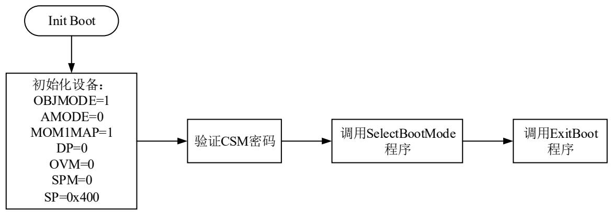

<details>
<summary>flowchart</summary>

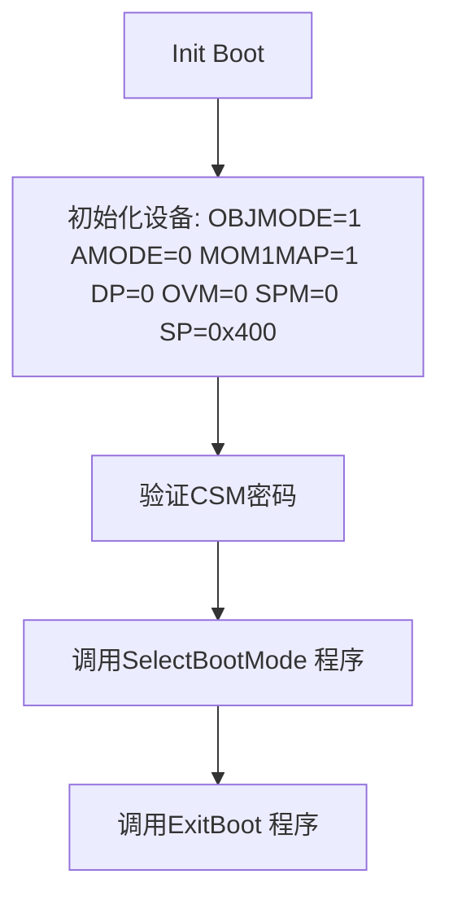
</details>

图4-21 F28027芯片引导过程框图

## 具体步骤

(1) 第一步: MCU上电或硬件复位, 处于复位状态。  
(2) 第二步: 从Boot ROM的地址0x3FFFC0处调用复位向量, 复位向量处存放着InitBoot程序的入口地址, 之后跳转到存储在Boot ROM中的InitBoot函数,开始引导过程。  
(3) 第三步: 初始化设备。  
(4) 第四步:

1）调用Device\_Cal()程序，Device\_Cal()程序在出厂时被固化在存储器中，用来校准芯片内部振荡器以及ADC模块。  
2）操作PLL状态寄存器（PLLSTS）的DIVSEL位，设置DIVSEL=3，设置CPU的时钟的分频系数为1。  
3）读取CSM密码，进行验证解锁。当CSM密码全部为0xFFFF则自动解锁。

(5) 第五步：调用SelectBootMode程序，根据、GPIO37和GPIO34三个引脚的电平来选择引导模式，引导模式与引脚关系如表4-5所示。在使用过程中，可以利用F28027 LaunchPad上面的拨码开关S1来选择三个引脚的电平。

## 具体步骤

表4-5 引导模式

<table><tr><td>TRST</td><td>GPIO37/TDO</td><td>GPIO34</td><td></td><td>引导模式</td></tr><tr><td>Mode EMU</td><td>×</td><td>×</td><td>1</td><td>Emulation Boot(仿真模式)</td></tr><tr><td>Mode 0</td><td>0</td><td>0</td><td>0</td><td>Parallel I/O</td></tr><tr><td>Mode 1</td><td>0</td><td>1</td><td>0</td><td>SCI</td></tr><tr><td>Mode 2</td><td>1</td><td>0</td><td>0</td><td>Wait</td></tr><tr><td>Mode 3</td><td>1</td><td>1</td><td>0</td><td>GetMode(获取模式)</td></tr></table>

在引导模式为仿真模式时，需要根据EMU\_KEY、EMU\_BMODE、OTP\_KEY、OTP\_BMODE的值来选择对应的引导模式，如表4-6所示。

表4-6 仿真引导模式

<table><tr><td>EMU_KEY读取地址:0x0D01</td><td>EMU_BMODE读取地址:0x0D01</td><td>OTP_KEY读取地址:0x3D 7BFE</td><td>OTP_BMODE读取地址:0x3D 7BFF</td><td>引导模式</td></tr><tr><td>!=0x55AA</td><td>×</td><td>×</td><td>×</td><td>Wait</td></tr><tr><td rowspan="16">0x55AA</td><td>0x0000</td><td>×</td><td>×</td><td>Parallel I/O</td></tr><tr><td>0x0001</td><td>×</td><td>×</td><td>SCI</td></tr><tr><td>0x0002</td><td>×</td><td>×</td><td>Wait</td></tr><tr><td></td><td>!=0x55AA</td><td>×</td><td>GetMode:Flash</td></tr><tr><td rowspan="6">0x0003</td><td rowspan="6">0x55AA</td><td>0x0001</td><td>GetMode:SCI</td></tr><tr><td>0x0003</td><td>GetMode:Flash</td></tr><tr><td>0x0004</td><td>GetMode:SPI</td></tr><tr><td>0x0005</td><td>GetMode:I2C</td></tr><tr><td>0x0006</td><td>GetMode:OTP</td></tr><tr><td>Other</td><td>GetMode:Flash</td></tr><tr><td>0x0004</td><td>×</td><td>×</td><td>SPI</td></tr><tr><td>0x0005</td><td>×</td><td>×</td><td>I2C</td></tr><tr><td>0x0006</td><td>×</td><td>×</td><td>OTP</td></tr><tr><td>0x000A</td><td>×</td><td>×</td><td>Boot to RAM</td></tr><tr><td>0x000B</td><td>×</td><td>×</td><td>Boot to FLASH</td></tr><tr><td>Other</td><td>×</td><td>×</td><td>Wait</td></tr></table>

## 具体步骤

在引导模式为GetMode模式时，需要根据OTP\_KEY、OTP\_BMODE的值来选择对应的引导模式，并在EMU\_KEY、EMU\_BMODE写入对应的值，如表4-7所示。

表4-7 GetMode引导模式

<table><tr><td>OTP_KEY读取地址:0x3D 7BFE</td><td>OTP_BMODE读取地址:0x3D 7BFF</td><td>引导模式</td><td>EMU_KEY写入地址:0x0D00</td><td>EMU_BMODE写入地址:0x0D01</td></tr><tr><td>×</td><td>×</td><td>Parallel I/O</td><td>0x55AA</td><td>0x0000</td></tr><tr><td>×</td><td>×</td><td>SCI</td><td>0x55AA</td><td>0x0001</td></tr><tr><td>×</td><td>×</td><td>Wait</td><td>0x55AA</td><td>0x0002</td></tr><tr><td>!=0x55AA</td><td>×</td><td>GetMode:Flash</td><td></td><td></td></tr><tr><td rowspan="6">0x55AA</td><td>0x0001</td><td>GetMode:SCI</td><td rowspan="6">0x55AA</td><td rowspan="6">0x0003</td></tr><tr><td>0x0003</td><td>GetMode:Flash</td></tr><tr><td>0x0004</td><td>GetMode:SPI</td></tr><tr><td>0x0005</td><td>GetMode:I2C</td></tr><tr><td>0x0006</td><td>GetMode:OTP</td></tr><tr><td>Other</td><td>GetMode:Flash</td></tr></table>

## 具体步骤

(6) 第六步：调用ExitBoot程序，退出引导模式，根据选择的引导模式跳转到对应的程序入口点地址，开始执行程序，在默认状态下进入Flash引导模式，入口点地址为0x3F7FF6。

由于0x3F7FF6地址在128位安全密码空间（CSM）的前面，所以在0x3F7FF6处必须有个转移指令，转去执行用户程序。DSP280x\_CodeStartBranch.asm函数就是执行代码重定位的功能。具体代码见程序清单4-13。执行完转移指令代码后，引导过程结束，程序进入用户main主程序，开始执行用户程序。

## 具体步骤

程序清单4-13 0x3F7FF6处转移指令代码  
```asm
**********************************************************************
.sect "codestart"    //在CMD配置中，codestart地址配置为0x3F7FF6
code_start:
    .if WD_DISABLE == 1
    LB wd_disable    ;//转向禁用“看门狗”程序
    .else
    LB _c_int00    ;/*_c_int00是运行支持库RTS.lib包含的一个重要库函数boot.asm的起始地址。
    boot.asm对C运行环境进行初始化，完成后库代码会自动跳到main函数，开始执行用户程序。*/
    .endif
    .if WD_DISABLE == 1
    .text
wd_disable:    ;//禁用“看门狗”功能
SETC OBJMODE    ;//Set OBJMODE for 28x object code
EALLOW    ;//Enable EALLOW protected register access
MOVZ DP, #7029h>>6    ;//Set data page for WDCR register
MOV @7029h, #0068h    ;//Set WDDIS bit in WDCR to disable WD
EDIS    ;//Disable EALLOW protected register access
LB _c_int00    ;//Branch to start of boot.asm in RTS library
.endif
.end
```

在工程调试阶段，可用把程序下载到F28027的RAM中运行，如果DSP掉电，则RAM中的代码就会失去，所以当调试完成后，工程就需要固化到Flash中，使其能够脱离CCS开发环境和仿真器而独立运行。

程序固化到Flash中后，其运行速度比在RAM里慢了，原因是F28027在访问内部Flash的时候需要等待状态。对于大多数应用而言，影响不大。但是对于一些实时性要求比较高的场合，比如电力电子变换器的PWM实时控制，需要获得最高的运行速度而要求无等待状态。解决方法之一就是把这些函数复制到RAM里面运行。

比如将PWM中断函数interrupt void myPWM\_PWMINT\_isr(void)复制到RAM里面运行。首先，需要声明3个变量：

```c
extern uint16_t RamfuncsLoadStart;
extern uint16_t RamfuncsLoadEnd;
extern uint16_t RamfuncsRunStart;
```

然后，用#pragma预处理命令来创建段RamFuncs（注意：必须在符号被定义和使用前使用#pragma）。工程编译后，函数myPWM\_PWMINT\_isr的代码就放在段RamFuncs中。

```cmake
#pragma CODE_SECTION(myPWM_PWMINT_isr, "ramfuncs")
```

在CMD文件中，段RamFuncs的存储空间为：

```txt
ramfuncs : LOAD = FLASHA,
RUN = PRAML0,
LOAD_START(_RamfuncsLoadStart),
LOAD_END(_RamfuncsLoadEnd),
RUN_START(_RamfuncsRunStart),
PAGE = 0
```

其中，LOAD = FLASHA表示代码装载到FLASHA存储空间，RUN = PRAML0表示程序在PRAML0空间执行，LOAD\_START(\_RamfuncsLoadStart)表示代码复制的起始地址，LOAD\_END(\_RamfuncsLoadEnd)表示代码复制的结束地址，RUN\_START(\_RamfuncsRunStart)表示代码在RAM里面运行的起始地址。这些地址由编译器自动生成。

最后，用Memcopy函数将段RamFuncs从Flash复制到RAM。

```javascript
MemCopy(&RamfuncsLoadStart, &RamfuncsLoadEnd, &RamfuncsRunStart);
```

通过上述的操作，就可以实现将PWM中断函数interrupt void myPWM\_PWMINT\_isr(void)从Flash复制到RAM运行了。

## 思考题:

4-1 如何通过结构体指针对寄存器进行操作？  
4-2 理解软件架构的特点，在CCS平台上构建一个新的工程，实现LED灯的控制。  
4-3 简述F28027的上电启动过程。  
4-4 阅读数据手册（参考文献1），了解F28027各种类型的引导方法。  
4-5 编写程序，以3种方式实现LED1的闪烁控制：1、程序在RAM中运行；2、程序在Flash中运行；3、将闪烁控制函数从Flash复制到RAM中运行。比较三种方式函数执行时间的区别。  
（注：执行时间可以通过CCS的clock功能来计算运行所需的时间，方法：RUN=>Clock=>enable，在函数开始的地方和结束的地方分别设置一个断点，两个断点处的时间差就是函数运行所花的时间。）