## 单片机原理及应用

## Principle And Application Of Microcontroller

福州大学电气学院

教材：《微控制器原理及应用--基于TI C2000实时微控制器》，蔡逢煌、王武、江加辉，机械工业出版社

参考资料：

¯TMS320F2802x, TMS320F2802xx Piccolo Technical Reference Manual.

¯TMS320F2802x Microcontrollers datasheet.

1 GPIO的基础知识  
2 C2000的GPIO模块  
3 GPIO的软件架构  
4 应用实例

5.1.1 GPIO输出驱动器  
5.1.2 GPIO输入驱动器  
5.1.3 GPIO引脚管理

GPIO是微控制器的数字输入输出模块，可以实现微控制器与外部设备的数字交换。数字输入功能主要是将外部设备的开关量信号转换成CPU可读取的数字信号“1”、“0”从而获知外部设备的运行状态，如按键状态检测；数字输出功能则是将CPU的数字控制信号“1”、“0”转换成引脚高、低电平信号，从而实现对外部设备运行状态控制，如LED、数码管、继电器控制等。

GPIO的典型内部结构如图所示，主要由保护二级管、输入驱动器、输出驱动器、输入数据寄存器、输出数据寄存器等组成。其中输入和输出驱动器是GPIO结构的核心部分，决定了

输入和输出的不同模

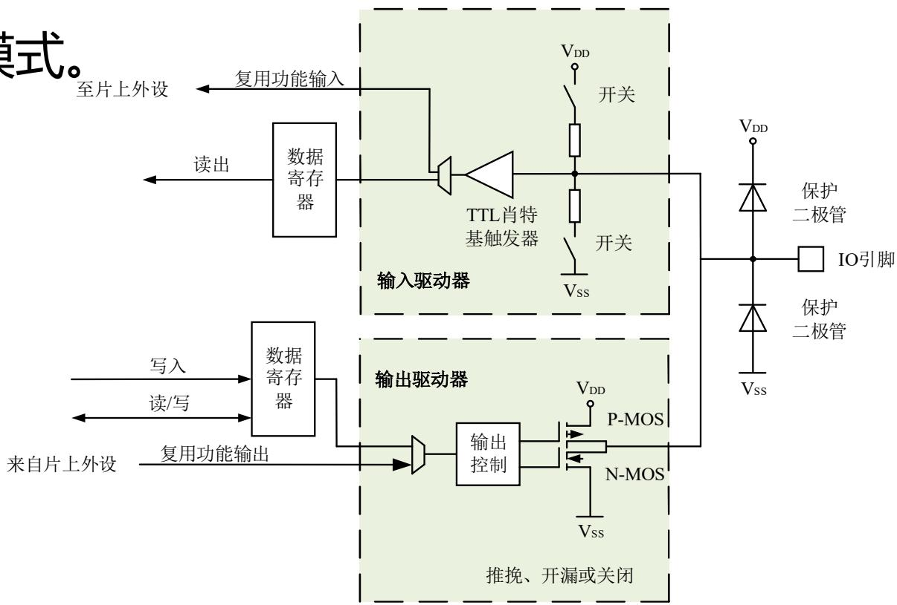

<details>
<summary>flowchart</summary>

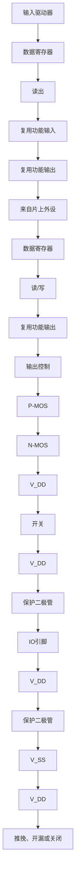
</details>

## GPIO输出驱动器主要由多路选择器、输出控制和MOS管组成。

1.多路选择器: 多路选择器根据用户配置决定该引脚是用于通用GPIO还是复用功能输出。通用输出时，该引脚的输出信号来自于GPIO输出数据寄存器。复用功能输出时，该引脚输出信号来自于片上外设，并且一个引脚输出可能来自多个不同外设。同一时刻，一个引脚只能使用一种输出功能。  
2.输出控制: 根据数字电路输出电平的“强弱”，可将IO输出分为图腾柱输出、开漏输出、下拉电阻输出3种。

（1）图腾柱输出：图腾柱、推挽/推拉、Push-Pull指的是同一种电路。下图是图腾柱输出电路简图，图中的开关是受控电子开关，可以由三级管或场效应管构成。此电路输出为强1，强0，或高阻态。推挽输出既提高电路的负载能力，又提高开关速度，适用于输出0V和VDD的场合。

a）输出强1：上管导通，下管截止，OUTPUT输出高电平；  
b）输出强0：上管截止，下管导通，OUTPUT输出低电平；  
c）高阻状态：上管截止，下管截止，OUTPUT输出，对后级电路没有影响。

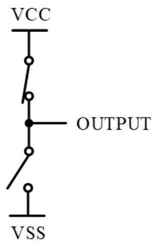

<details>
<summary>text_image</summary>

VCC
OUTPUT
VSS
</details>

（a）强1输出

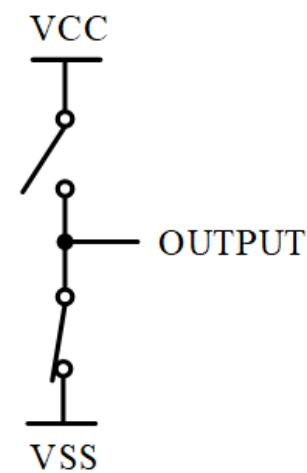

<details>
<summary>text_image</summary>

VCC
OUTPUT
VSS
</details>

（b）强0输出

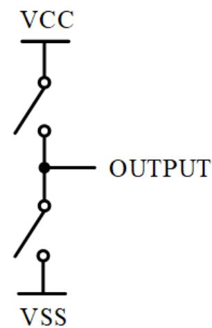

<details>
<summary>text_image</summary>

VCC
OUTPUT
VSS
</details>

（c）高阻输出

（2）开漏输出：与图腾柱方式相比，只有下管受控，上管断开或没有上管。对于与Vss相连的MOS管来说，其漏级是开路的。当内部输出“0”时，下管导通，引脚相当于接地，外部输出低电平；当内部输出“1”时，下管截止，由于上管也截止，外部输出既不是高电平，也不是低电平，而是高阻态。如果想要外部输出高电平，必须接有上拉电阻。下图所示为上拉电阻输出，该电路为强0弱1电路。

a）强0输出：下管导通时，无论OUTPUT接什么负载，均输出低电平；  
b）弱1输出：下管截止时，如果OUTPUT接的是高阻负载，输出为高电平。对于其他负载，则需要根据负载和上拉电阻的分压关系来计算。

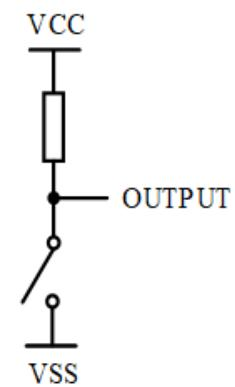

<details>
<summary>text_image</summary>

VCC
OUTPUT
VSS
</details>

（a）弱1输出

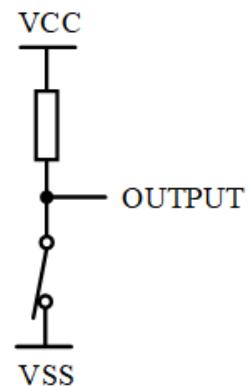

<details>
<summary>text_image</summary>

VCC
OUTPUT
VSS
</details>

（b）强0输出

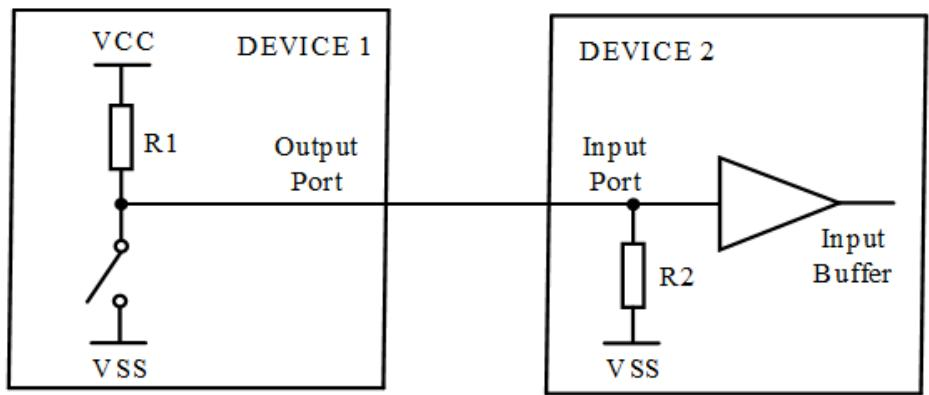

<details>
<summary>text_image</summary>

VCC
R1
DEVICE 1
Output Port
VSS
DEVICE 2
Input Port
R2
VSS
Input Buffer
</details>

（c）上拉电阻对弱1输出的影响

（3）下拉输出：下图为下拉电阻输出，该电路为强1弱0电路。与图腾柱方式相比，只有上管受控，没有下管。

a）弱0输出：上管导通时，无论OUTPUT接什么负载，均输出高电平；b）强1输出：上管截止时，OUTPUT输出电平取决于负载。如图（c）所示，器件2能否正确识别输入为0电平，取决于R1和R2的比值，以及器件2的1/0识别门限值。

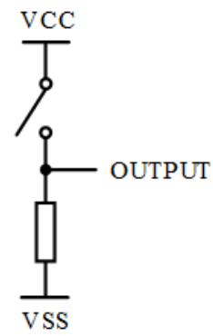

<details>
<summary>text_image</summary>

VCC
OUTPUT
VSS
</details>

（a）弱0输出

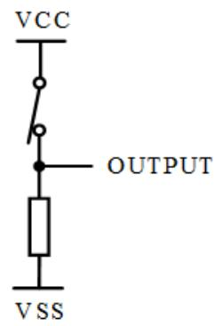

<details>
<summary>text_image</summary>

VCC
OUTPUT
VSS
</details>

（b）强1输出  
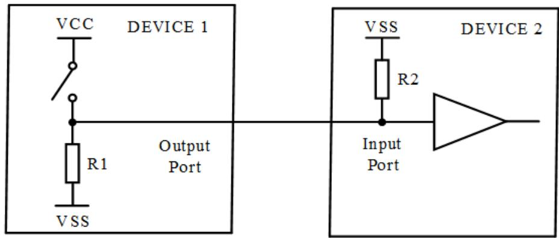

<details>
<summary>text_image</summary>

VCC
DEVICE 1
R1
Output Port
VSS
VSS
R2
Input Port
DEVICE 2
</details>

（c）下拉电阻对"弱0"输出的影响

GPIO的输入驱动器主要由多路选择器、TTL肖特基触发器、带开关的上拉电阻和带开关的下拉电阻电路组成。

多路选择器根据用户配置决定该引脚是用于通用GPIO还是用于复用功能输入。通用输入时，该引脚的输入信号保存到GPIO输入数据寄存器。复用功能输入时，该引脚输入信号传给片上外设。

根据TTL肖特基触发器、上拉电阻和下拉电阻的开关状态，GPIO的输入方式有：（1）上拉输入，（2）下拉输入，（1）浮空输入

（1）上拉输入：上拉电阻开关闭合，下拉电阻开关断开。当引脚外接高电平或不接外部电平时，输入为高电平；当引脚外接低电平时，输入为低电平。上拉就是将不确定的信号通过一个电阻钳位在高电平，电阻同时起到限流的作用。  
（2）下拉输入：上拉电阻开关断开，下拉电阻开关闭合。当引脚外部低电平或不接外部电平时，输入被拉到GND；当引脚外接高电平时，输入为高电平。  
（3）浮空输入：GPIO内部既无上拉电阻也无下拉电阻，处于浮空状态。引脚在默认情况下为高阻态，其电平状态完全由外部电路决定。这种设置在数据传输时用得比较多。

## GPIO引脚管理包括引脚的初始化配置和引脚的读写操作。

## 1. 引脚初始化配置

（1）引脚功能选择：对于高性能的MCU，IO口是高度复用的，除了当作通用IO口外，还可以当作其他外设引脚。所以，在使用前需要进行引脚功能的选择。  
（2）引脚输入输出确定：对集成电路来说，输入和输出需要两套电路来实现。有些芯片无需设置方向，由指令自动识别，如MCS-51单片机。目前主流控制器都需要预先设定引脚方向。

（3）使能上拉/下拉电阻：很多MCU具有内部上拉电阻或内部下拉电阻功能，根据需要可以允许或禁止该功能。  
（4）输入信号滤波功能：有些MCU的IO口还具有输入信号的滤波功能，对外部引脚信号进行滤波，过滤有害的噪声信号。  
（5）中断触发功能：IO口输入信号可以作为触发外部中断的信号源。  
（6）其他功能。

## 2. 引脚读写操作

（1）读操作：IO口作为输入口时，CPU如何知道当前IO口的电平？当前IO口的电平通过输入驱动电路将“IO口数据寄存器”置位或复位，这样CPU就能随时读取“IO口数据寄存器”的值。  
（2）写操作：CPU如何输出某一电平到IO口？CPU把数据写入“IO口数据寄存器”，然后会有相应的输出驱动电路将“IO口数据寄存器”的值传递到MCU的外部引脚处，使得引脚输出高电平或低电平。  
（3）由于引脚数量众多，一般都对引脚进行分组管理，读写操作可以按组进行，也可以单个引脚独立操作。

5.2.1 GPIO概述  
5.2.2 GPIO内部结构  
5.2.3 GPIO功能描述  
5.2.4 GPIO输入滤波

## GPIO概述

F28027有22个GPIO（DIO）、6个AIO（与AD采样通道共用引脚）；GPIO引脚分组管理，分为端口A（由GPIO0-GPIO31组成）、端口B（由GPIO32-GPIO38组成）。  
§ GPIO引脚与最多3种外设功能引脚共用，使用前需要先进行模式选择。  
§ GPIO引脚可工作在上拉模式或推挽模式。  
§ GPIO引脚的电气特性：输入时，低电平电压范围为：（Vss-0.3）V\~0.8V，高电平电压范围为：2V\~（VDD+0.3）V。只有在该电压范围内，寄存器位才能被内部逻辑电路设置为逻辑“0”或逻辑“1”；输出时，逻辑“1”输出的电压最低为2.4V，逻辑“0”输出的电压最高为0.4V。

GPIO内部结构如右图所示 （以端口A进行说明）。包括引脚功能选择、方向设置、上拉电阻使能、输入滤波、数据寄存器、外部中断信号源、低功耗模式唤醒源等。

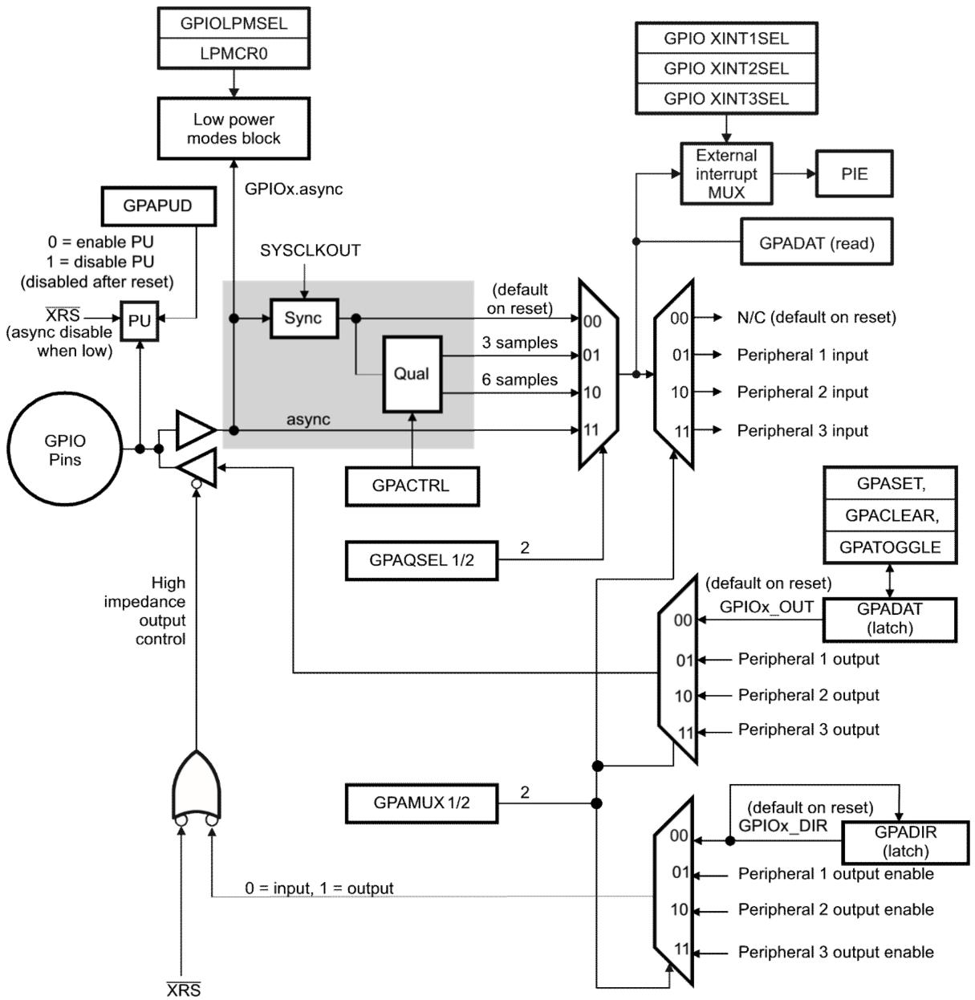

<details>
<summary>flowchart</summary>

```mermaid
graph TD
  A["GPIO Pins"] --> B["PU"]
  B --> C["GPAPUD"]
  C --> D["Low power modes block"]
  D --> E["GPIOx.async"]
  E --> F["Sync"]
  F --> G["Qual"]
  G --> H["(default on reset)"]
  H --> I["00"]
  I --> J["01"]
  J --> K["10"]
  K --> L["11"]
  L --> M["External interrupt MUX"]
  M --> N["PIE"]
  N --> O["GPADAT (read)"]
  O --> P["N/C (default on reset)"]
  P --> Q["Peripheral 1 input"]
  Q --> R["Peripheral 2 input"]
  R --> S["Peripheral 3 input"]
  S --> T["GPASET, GPACLEAR, GPATOGGLE"]
  T --> U["GPADAT (latch)"]
  U --> V["(default on reset)"]
  V --> W["GPIOx_OUT"]
  W --> X["00"]
  X --> Y["01"]
  Y --> Z["10"]
  Z --> AA["11"]
  AA --> AB["(default on reset)"]
  AB --> AC["GPIOx_DIR"]
  AC --> AD["GPADIR (latch)"]
  AD --> AE["Peripheral 1 output enable"]
  AE --> AF["Peripheral 2 output enable"]
  AF --> AG["Peripheral 3 output enable"]
  AG --> AH["(default on reset)"]
  AH --> AI["GPIOx_DIR"]
  AI --> AJ["GPADIR (latch)"]
  AJ --> AK["Peripheral 1 output enable"]
  AK --> AL["Peripheral 2 output enable"]
  AL --> AM["Peripheral 3 output enable"]
  AM --> AN["(default on reset)"]
  AN --> AO["GPIOx_DIR"]
  AO --> AP["GPADIR (latch)"]
  AP --> AQ["Peripheral 1 output enable"]
  AQ --> AR["Peripheral 2 output enable"]
  AR --> AS["Peripheral 3 output enable"]
  AS --> AT["(default on reset)"]
  AT --> AU["GPIOx_DIR"]
  AU --> AV["GPADIR (latch)"]
  AV --> AW["Peripheral 1 output enable"]
  AW --> AX["Peripheral 2 output enable"]
  AX --> AY["Peripheral 3 output enable"]
  AY --> AZ["(default on reset)"]
  AZ --> BA["GPIOx_DIR"]
  BA --> BB["GPADIR (latch)"]
  BB --> BC["Peripheral 1 output enable"]
  BC --> BD["Peripheral 2 output enable"]
  BD --> BE["Peripheral 3 output enable"]
  BE --> BF["(default on reset)"]
  BF --> BG["GPIOx_DIR"]
  BG --> BH["GPADIR (latch)"]
  BH --> BI["Peripheral 1 output enable"]
  BI --> BJ["Peripheral 2 output enable"]
  BJ --> BK["Peripheral 3 output enable"]
  BK --> BL["(default on reset)"]
  BL --> BM["GPIOx_DIR"]
```
</details>

（1）引脚功能选择：配置GPAMUX1/2寄存器，将引脚配置为GPIO，或者3个可用外设功能的一种。复位后所有GPIO引脚都配置为通用输入引脚，也就是输出为高阻状态。  
（2）GPIO方向选择：配置GPADIR寄存器，将引脚配置为输入或输出。  
（3）使能/禁止内部上拉电阻：配置GPAPUD寄存器使能或禁止内部上拉电阻。MCU上电复位后，对于可以作为ePWM输出的引脚（GPIO0\~GPIO7，共8个引脚），内部上拉电阻默认被禁止。所有其他功能的GPIO引脚的上拉电阻默认使能。

（4）选择低功耗模式唤醒源：通过GPIOLPMSEL寄存器进行配置。可指定端口A的引脚用来把MCU从暂停或待机的低功耗模式唤醒。  
（5）外部输入中断源设置。选择外部中断的信号源：通过GPIOXINTnSEL寄存器进行配置。指定端口A一个引脚（GPIO0-GPIO31）作为外部中断XINT1，XINT2或XINT3的信号源。

（6）GPIO输出：可以通过GPASET、GPACLEAR、

GPATOGGLE三种寄存器加载输出锁存器GPADAT(latch)，或直接修改GPADAT(latch)的值，输出驱动电路将“GPADAT(latch)”的值传递到MCU的外部引脚处，引脚输出高电平或低电平。

（7）GPIO输入：可以对外部引脚信号进行滤波，过滤有害的噪声毛刺脉冲（由GPACTRL、GPAQSEL1/2设置输入的采样周期和限定周期的数量），确认后的信号送到“IO口数据寄存器”GPADAT(read)，CPU就能随时读取“GPADAT(read)”的值了。5.2.4节对输入滤波进行详细说明。

CPU对输入引脚的信号确认有3种方式。非同步（异步输入）方式、同步时钟方式、采样窗方式。默认情况下，所有输入引脚信号被设置为同步于系统时钟SYSCLKOUT。

## （1）非同步 （异步输入）

这种模式用于外设输入不要求同步或者外设本身自己完成同步的情况。这类外设有SCI、SPI和I2C。另外，ePWM模块的触发区信号也与SYSCLKOUT无关。异步模式在引脚配置为GPIO输入时无效，此时默认同步于SYSCLKOUT。

## （2） 同步于SYSCLKOUT

引脚复位后，缺省的输入限定模式。该模式下，输入信号同步于系统时钟SYSCLKOUT。由于输入信号是异步的，因此它需要一个SYSCLKOUT周期的时间来确认输入信号的状态变化，不需要更多的时间来限定输入信号。

## （3） 使用采样窗来限定

这种模式下，输入信号首先被同步到系统时钟SYSCLKOUT，然后输入信号状态持续时间达到指定数量周期数时，输入状态才允许改变。下图给出了采用采样窗的输入限定结构框图。这种模式需要用户指定两个参数：1）采样周期，2）采样次数。

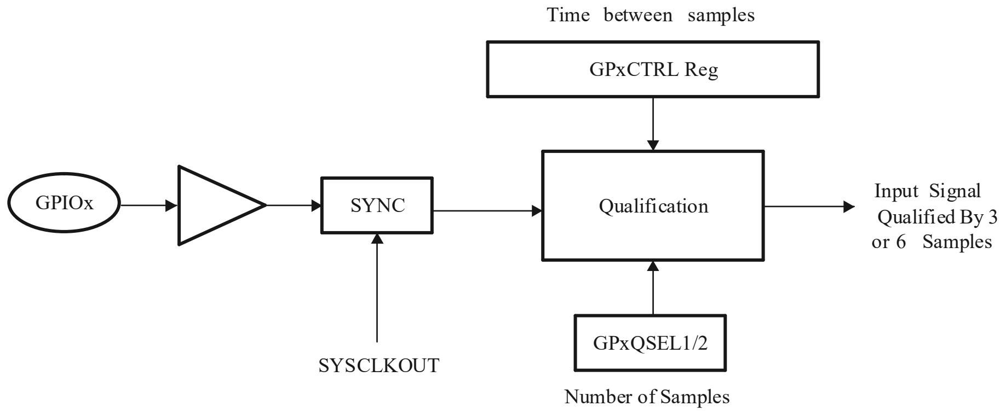

<details>
<summary>flowchart</summary>

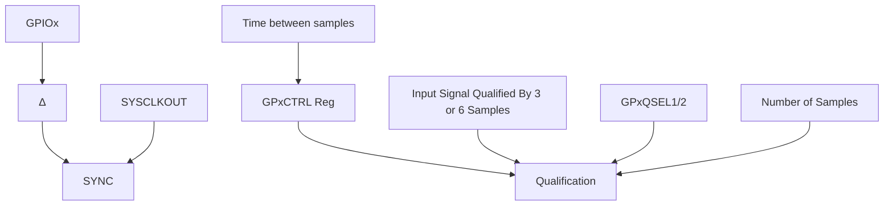
</details>

## 1）采样周期 （Time between samples）

为了限定信号，在固定的周期进行输入信号采样。用户指定采样周期（也称采样间隔时间）是相对于系统时钟（SYSCLKOUT）而言的。采样周期由寄存器GPxCTRL中的8位QUALPRDn来指定。采样周期配置是针对一组（8个）输入信号进行的。

## 2） 采样次数(Number of Samples)

采样的次数可以选择为3次采样或者6次采样，通过寄存器GPAQSEL1、GPAQSEL2、GPBQSEL1和 GPBQSEL2来设置。当连续3次或6次信号状态一样，输入状态的改变才会被确认，相应的寄存器值改变。

## 3） 总采样窗口宽度

采样窗口就是输入信号被确认的时间长度。为了让输入限定能够检测到输入的变化，信号电平必须在采样窗口或者更长的时间内保持稳定。

下图说明了输入限定的工作过程，其中限定器的采样次数设定为6次，采样周期设定为2个系统时钟周期2×TSYSCLKOUT 。也就是每2个系统时钟周期对外部引脚采样一次，必须连续采样到6次相同的信号，也就是最少10个时钟周期，电平才被确认下来。GPIO引脚的输入信号经过限定器后输出信号就对小毛刺A进行了滤波。

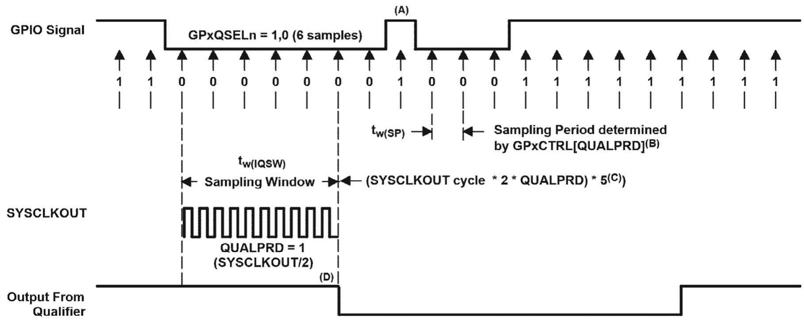

<details>
<summary>timing diagram</summary>

| Signal Type | Description |
| --- | --- |
| GPIO Signal | GPxQSELn = 1,0 (6 samples) |
| SYSCLKOUT | Sampling Window (SYSCLKOUT cycle * 2 * QUALPRD) * 5(C)) |
| Output From Qualifier | QualPRD = 1 (SYSCLKOUT/2) |
| Sampling Period (B) | Sampling Period determined by GPxCTRL[QUALPRD](B) |
| Timepoint (t_w(SP)) | Sampling Period (SYSCLKOUT cycle * 2 * QUALPRD) * 5(C)) |
| Timepoint (t_w(IQSW)) | Sampling Window (SYSCLKOUT cycle * 2 * QUALPRD) * 5(C) |
| Timepoint (t_w(SP)) | Sampling Period (GPxCTRL[QUALPRD](B)) |
| Timepoint (t_w(SP)) | Sampling Period (GPxCTRL[QUALPRD](B)) |
| Timepoint (t_w(SP)) | Sampling Period (GPxCTRL[QUALPRD](B)) |
| Timepoint (t_w(SP)) | Sampling Period (GPxCTRL[QUALPRD](B)) |
| Timepoint (t_w(SP)) | Sampling Period (GPxCTRL[QUALPRD](B)) |
| Timepoints (A/D) | GPxQSELn = 1,0 (6 samples) |
| Output From Qualifier | QualPRD = 1 (SYSCLKOUT/2) |
</details>

5.3.1 寄存器及驱动函数  
5.3.2 驱动函数描述  
5.3.3 软件思维导图

## GPIO的硬件初始化配置都需要通过GPIO的寄存器实现：

包括GPIO控制寄存器（GPIO Control Registers）和GPIO中断和低功耗唤醒选择寄存器（GPIO Interrupt and Low PowerMode Select Registers）。GPIO的读写操作通过GPIO数据寄存器操作（GPIO Data Registers）。下面3个表为寄存器及对应的驱动函数说明。

寄存器的详细信息参见数据手册。这里直接给出对应的驱动函数。

GPIO 控制寄存器及驱动函数

<table><tr><td>寄存器</td><td>地址</td><td>功能</td><td>驱动函数</td></tr><tr><td>GPACTRL</td><td>0x6F80</td><td>A 端口引脚采样周期配置</td><td>GPIO_setQualificationPeriod</td></tr><tr><td>GPAQSEL1</td><td>0x6F82</td><td>A 端口引脚采样次数配置</td><td>GPIO_setQualification</td></tr><tr><td>GPAQSEL2</td><td>0x6F84</td><td>A 端口引脚采样次数配置</td><td>GPIO_setQualification</td></tr><tr><td>GPAMUX1</td><td>0x6F86</td><td>A 端口引脚功能选择</td><td>GPIO_setMode</td></tr><tr><td>GPAMUX2</td><td>0x6F88</td><td>A 端口引脚功能选择</td><td>GPIO_setMode</td></tr><tr><td>GPADIR</td><td>0x6F8A</td><td>A 端口引脚方向配置</td><td>GPIO_setDirection</td></tr><tr><td>GPAPUD</td><td>0x6F8C</td><td>A 端口引脚上拉电阻使能</td><td>GPIO_setPullUp</td></tr><tr><td>GPBCTRL</td><td>0x6F90</td><td>B 端口引脚采样周期配置</td><td>GPIO_setQualificationPeriod</td></tr><tr><td>GPBQSEL1</td><td>0x6F92</td><td>B 端口引脚采样次数配置</td><td>GPIO_setQualification</td></tr><tr><td>GPBMUX1</td><td>0x6F96</td><td>B 端口引脚功能选择</td><td>GPIO_setMode</td></tr><tr><td>GPBDIR</td><td>0x6F9A</td><td>B 端口引脚方向配置</td><td>GPIO_setDirection</td></tr><tr><td>GPBPUD</td><td>0x6F9C</td><td>B 端口引脚上拉电阻使能</td><td>GPIO_setPullUp</td></tr><tr><td>AIOMUX1</td><td>0x6FB6</td><td>AIO 引脚功能选择</td><td></td></tr><tr><td>AIODIR</td><td>0x6FBA</td><td>AIO 引脚方向</td><td></td></tr></table>

GPIO中断和低功耗寄存器及驱动函数

<table><tr><td>寄存器</td><td>地址</td><td>功能</td><td>驱动函数</td></tr><tr><td>GPIOXINT1SEL</td><td>0x6FE0</td><td>外部中断 1 的引脚选择(GPIO0-GPIO31)</td><td rowspan="3">GPIO_setExtInt</td></tr><tr><td>GPIOXINT2SEL</td><td>0x6FE1</td><td>外部中断 2 的引脚选择(GPIO0-GPIO31)</td></tr><tr><td>GPIOXINT3SEL</td><td>0x6FE2</td><td>外部中断 3 的引脚选择(GPIO0-GPIO31)</td></tr><tr><td>GPIOLPMSEL</td><td>0x6FE8</td><td>用于低功耗模式唤醒的引脚选择(GPIO0-GPIO31)</td><td>GPIO_lpmSelect</td></tr></table>

GPIO数据寄存器及驱动函数

<table><tr><td>寄存器</td><td>地址</td><td>功能</td><td>驱动函数</td></tr><tr><td>GPADAT</td><td>0x6FC0</td><td>GPIO 端口 A 数据寄存器</td><td>GPIO_getPortDataGPIO_setPortDataGPIO_getData</td></tr><tr><td>GPASET</td><td>0x6FC2</td><td>GPIO 端口 A 引脚置位寄存器---输出高电平</td><td>GPIO_setHigh</td></tr><tr><td>GPACLEAR</td><td>0x6FC4</td><td>GPIO 端口 A 引脚清零寄存器---输出低电平</td><td>GPIO_setLow</td></tr><tr><td>GPATOGGLE</td><td>0x6FC6</td><td>GPIO 端口 A 引脚翻转寄存器---输出电平翻转</td><td>GPIO_toggle</td></tr><tr><td>GPBDAT</td><td>0x6FC8</td><td>GPIO 端口 B 数据寄存器</td><td rowspan="4">同 A 端口函数</td></tr><tr><td>GPBSET</td><td>0x6FCA</td><td>GPIO 端口 B 引脚置位寄存器---输出高电平</td></tr><tr><td>GPBCLEAR</td><td>0x6FCC</td><td>GPIO 端口 B 引脚清零寄存器---输出低电平</td></tr><tr><td>GPBTOGGLE</td><td>0x6FCE</td><td>GPIO 端口 B 引脚清零寄存器---输出翻转电平</td></tr><tr><td>AIODAT</td><td>0x6FD8</td><td>AIO 数据寄存器</td><td></td></tr><tr><td>AIOSET</td><td>0x6FDA</td><td>AIO 引脚置位寄存器---输出高电平</td><td></td></tr><tr><td>AIOCLEAR</td><td>0x6FDC</td><td>AIO 引脚清零寄存器---输出低电平</td><td></td></tr><tr><td>AIOTOGGLE</td><td>0x6FDE</td><td>AIO 引脚翻转寄存器---输出翻转电平</td><td></td></tr></table>

驱动函数通过结构体指针myGpio对寄存器进行读写操作。结构体指针使用方法参见第3章。GPIO模块的驱动函数由两个文件组成，分别是：F2802x\_Component/source/gpio.c和F2802x\_Component/include/gpio.h。下面给出了GPIO模块驱动函数的原型、功能描述、形参、返回值等说明，并给出了相应示例。

函数 GPIO\_init

<table><tr><td>函数名</td><td>GPIO_init</td></tr><tr><td>函数原型</td><td>GPIO_Handle GPIO_init(void *pMemory, const size_t numBytes)</td></tr><tr><td>功能描述</td><td>初始化 GPIO 模块的结构体指针</td></tr><tr><td>输入参数 1</td><td>GPIO 寄存器的首地址</td></tr><tr><td>输入参数 2</td><td>GPIO 寄存器的大小</td></tr><tr><td>返回值</td><td>地址指针值</td></tr></table>

示例：

```javascript
//GPIO_BASE_ADDR: 宏定义值，为 GPIO 模块所有寄存器的首地址 myGpio = GPIO_init((void *)GPIO_BASE_ADDR, sizeof(GPIO_Obj));
```

函数 GPIO\_setMode

<table><tr><td>函数名</td><td>GPIO_setMode</td></tr><tr><td>函数原型</td><td>void GPIO_setMode(GPIO_Handle gpioHandle, const GPIO_Number_e gpioNumber, const GPIO_Mode_e mode)</td></tr><tr><td>功能描述</td><td>设置 GPIO 引脚功能</td></tr><tr><td>输入参数1</td><td>GPIO的结构体指针myGpio</td></tr><tr><td>输入参数2</td><td>引脚号,为库函数定义的枚举变量</td></tr><tr><td>输入参数3</td><td>功能模式,为库函数定义的枚举变量</td></tr><tr><td>返回值</td><td>无</td></tr></table>

示例：

//设置GPIO2引脚为通用IO口

```txt
GPIO_setMode(myGpio, GPIO_Number_2, GPIO_2_Mode_GeneralPurpose);
```

函数 GPIO\_setPulIUP

<table><tr><td>函数名</td><td>GPIO_setPullUp</td></tr><tr><td>函数原型</td><td>void GPIO_setPullUp(GPIO_Handle gpioHandle, const GPIO_Number_e gpioNumber, const GPIO_PullUp_e pullUp)</td></tr><tr><td>功能描述</td><td>设置 GPIO 引脚上拉</td></tr><tr><td>输入参数1</td><td>GPIO的结构体指针myGpio</td></tr><tr><td>输入参数2</td><td>引脚号,为库函数定义的枚举变量</td></tr><tr><td>输入参数3</td><td>上拉使能/禁止,为库函数定义的枚举变量</td></tr><tr><td>返回值</td><td>无</td></tr></table>

示例：

//禁止GPIO2内部上拉电阻

GPIO\_setPullUp(myGpio,GPIO\_Number\_2, GPIO\_PullUp\_Disable);

函数 GPIO\_setDirection

<table><tr><td>函数名</td><td>GPIO_setDirection</td></tr><tr><td>函数原型</td><td>void GPIO_setDirection(GPIO_Handle gpioHandle, const GPIO_Number_e gpioNumber, const GPIO_Direction_e direction)</td></tr><tr><td>功能描述</td><td>设置 GPIO 引脚方向</td></tr><tr><td>输入参数1</td><td>GPIO的结构体指针myGpio</td></tr><tr><td>输入参数2</td><td>引脚号,为库函数定义的枚举变量</td></tr><tr><td>输入参数3</td><td>输入或输出,为库函数定义的枚举变量</td></tr><tr><td>返回值</td><td>无</td></tr></table>

示例：

//设置GPIO2方向为输出

GPIO setDirection(myGpio, GPIO Number 2. GPIO Direction Output);

函数 GPIO\_setQualification

<table><tr><td>函数名</td><td>GPIO_setQualification</td></tr><tr><td>函数原型</td><td>void GPIO_setQualification(GPIO_Handle gpioHandle, const GPIO_Number_e gpioNumber, const GPIO_Qual_e qualification)</td></tr><tr><td>功能描述</td><td>设置 GPIO 引脚输入的信号与时钟关系</td></tr><tr><td>输入参数1</td><td>GPIO的结构体指针myGpio</td></tr><tr><td>输入参数2</td><td>引脚号,为库函数定义的枚举变量</td></tr><tr><td>输入参数3</td><td>输入限定,为库函数定义的枚举变量,包括同步于时钟,异步,3次采样、6次采样</td></tr><tr><td>返回值</td><td>无</td></tr></table>

示例：

//设置GPIO2输入信号同步于系统时钟

PIO\_setOualification(myGpio, GPIO\_Number\_2, GPIO\_Oual\_Sync);

GPIO\_setQualificationPeriod

<table><tr><td>函数名</td><td>GPIO_setQualificationPeriod</td></tr><tr><td>函数原型</td><td>void GPIO_setQualification(GPIO_Handle gpioHandle, const GPIO_Number_e gpioNumber, const uint16_t period)</td></tr><tr><td>功能描述</td><td>当采样次数配置为3次或6次时,设置GPIO输入引脚每次的采样周期</td></tr><tr><td>输入参数1</td><td>GPIO的结构体指针myGpio</td></tr><tr><td>输入参数2</td><td>引脚号,为库函数定义的枚举变量</td></tr><tr><td>输入参数3</td><td>采样周期配置值。0:一个时钟周期;其他值:2*设置值个时钟周期。范围0x00-0xFF</td></tr><tr><td>返回值</td><td>无</td></tr></table>

示例：

//设置GPIO2采样周期为2\*3个系统时钟周期

GPIO\_setOualificationPeriod(myGpio. GPIO\_Number\_2,3);

函数 GPIO\_lpmSelect

<table><tr><td>函数名</td><td>GPIO_lpmSelect</td></tr><tr><td>函数原型</td><td>void GPIO_lpmSelect(GPIO_Handle gpioHandle,const GPIO_Number_e gpioNumber)</td></tr><tr><td>功能描述</td><td>选择低功耗唤醒的信号源</td></tr><tr><td>输入参数1</td><td>GPIO的结构体指针myGpio</td></tr><tr><td>输入参数2</td><td>引脚号,为库函数定义的枚举变量</td></tr><tr><td>返回值</td><td>无</td></tr></table>

示例：

//选择GPIO2作为低功耗唤醒的信号源

GPIO\_lpmSelect(myGpio. GPIO\_Number\_2):

函数 GPIO setExtInt

<table><tr><td>函数名</td><td>GPIO_setExtInt</td></tr><tr><td>函数原型</td><td>void GPIO_setExtInt(GPIO_Handle gpioHandle, const GPIO_Number_e gpioNumber, const CPU_ExtIntNumber_e intNumber)</td></tr><tr><td>功能描述</td><td>选择外部中断的信号源</td></tr><tr><td>输入参数1</td><td>GPIO的结构体指针myGpio</td></tr><tr><td>输入参数2</td><td>引脚号,为库函数定义的枚举变量</td></tr><tr><td>返回值</td><td>无</td></tr></table>

示例：

//设置外部中断1的信号源为GPIO2

GPIO setExtInt(myGpio, GPIO Number 2, CPU ExtIntNumber 1);

函数 GPIO getData

<table><tr><td>函数名</td><td>GPIO_getData</td></tr><tr><td>函数原型</td><td>uint16_t GPIO_getData(GPIO_Handle gpioHandle, const GPIO_Number_e gpioNumber)</td></tr><tr><td>功能描述</td><td>读取某个引脚的值</td></tr><tr><td>输入参数1</td><td>GPIO的结构体指针myGpio</td></tr><tr><td>输入参数2</td><td>引脚号,为库函数定义的枚举变量</td></tr><tr><td>返回值</td><td>GPIO引脚数据,0或者1</td></tr></table>

示例：

//获取GPIO0的值

uint16\_t Getvalue:

Getvalue = GPIO\_getData(myGpio GPIO\_Number\_0);

函数 GPIO\_getPortData

<table><tr><td>函数名</td><td>GPIO_getPortData</td></tr><tr><td>函数原型</td><td>uint32_t GPIO_getPortData(GPIO_Handle gpioHandle, const GPIO_Port_e gpioPort)</td></tr><tr><td>功能描述</td><td>读取端口数据</td></tr><tr><td>输入参数1</td><td>GPIO的结构体指针myGpio</td></tr><tr><td>输入参数2</td><td>端口号,端口A或端口B,为库函数定义的枚举变量</td></tr><tr><td>返回值</td><td>GPIO端口数据</td></tr></table>

示例：

//获取PortA的值

uint32 \_t Getvalue;

Getvalue = GPIO\_getPortData(myGpio. GPIO\_Port\_A):

函数GPIO\_setPortData

<table><tr><td>函数名</td><td>GPIO_setPortData</td></tr><tr><td>函数原型</td><td>void GPIO_setPortData(GPIO_Handle gpioHandle, const GPIO_Port_e gpioPort, const uint32_t data)</td></tr><tr><td>功能描述</td><td>输出端口数据</td></tr><tr><td>输入参数1</td><td>GPIO的结构体指针myGpio</td></tr><tr><td>输入参数2</td><td>端口号,端口A或端口B,为库函数定义的枚举变量</td></tr><tr><td>输入参数3</td><td>输出数据</td></tr><tr><td>返回值</td><td>无</td></tr></table>

示例：

//设置GPIO PortA所有引脚输出0，即输出低电平

GPIO\_setPortData(myGpio, GPIO\_Port\_A.0):

函数 GPIO setHigh

<table><tr><td>函数名</td><td>GPIO_setHigh</td></tr><tr><td>函数原型</td><td>void GPIO_setHigh(GPIO_Handle gpioHandle, const GPIO_Number_e gpioNumber)</td></tr><tr><td>功能描述</td><td>引脚输出高电平</td></tr><tr><td>输入参数1</td><td>GPIO的结构体指针myGpio</td></tr><tr><td>输入参数2</td><td>引脚号,为库函数定义的枚举变量</td></tr><tr><td>返回值</td><td>无</td></tr></table>

示例：

//设置引脚GPIO2输出高电平

GPIO\_setHigh(myGpio, GPIO\_Number\_2);

函数 GPIO\_setLow

<table><tr><td>函数名</td><td>GPIO_setLow</td></tr><tr><td>函数原型</td><td>void GPIO_setLow(GPIO_Handle gpioHandle, const GPIO_Number_e gpioNumber)</td></tr><tr><td>功能描述</td><td>引脚输出低电平</td></tr><tr><td>输入参数1</td><td>GPIO的结构体指针myGpio</td></tr><tr><td>输入参数2</td><td>引脚号,为库函数定义的枚举变量</td></tr><tr><td>返回值</td><td>无</td></tr></table>

示例：

//设置引脚GPIO2输出低电平

GPIO\_setLow(myGpio, GPIO\_Number\_2);

函数 GPIO\_toggle

<table><tr><td>函数名</td><td>GPIO_toggle</td></tr><tr><td>函数原型</td><td>void GPIO_toggle(GPIO_Handle_gpioHandle, const GPIO_Number_e gpioNumber)</td></tr><tr><td>功能描述</td><td>引脚输出电平翻转</td></tr><tr><td>输入参数1</td><td>GPIO的结构体指针myGpio</td></tr><tr><td>输入参数2</td><td>引脚号,为库函数定义的枚举变量</td></tr><tr><td>返回值</td><td>无</td></tr></table>

示例：

//GPIO2输出电平翻转

GPIO\_toggle(myGpio. GPIO\_Number\_2);

GPIO模块的软件思维导图包括GPIO模块的时钟使能、引脚配置、功能配置、中断事件配置等。推荐按照以下步骤进行，可根据实际情况灵活使用。

## （1） 引脚配置

由于引脚功能的复用性，使用前需要根据硬件系统的资源需求，统筹考虑把引脚当作GPIO或其他外设功能。优先考虑并预留外设功能的需求。

步骤1：配置引脚功能(GPIO\_setMode)。

步骤2：使能/禁止内部上拉电阻(GPIO\_setPullUp)。

步骤3：配置输入限定(GPIO\_setQualification、

GPIO\_setQualificationPeriod)。

步骤4：配置引脚方向(GPIO\_setDirection)。

## （2） 事件配置 （可选项）

步骤5：低功耗唤醒模式唤醒源(GPIO\_lpmSelect)。

步骤6：选择外部中断源（GPIO\_setExtInt）。

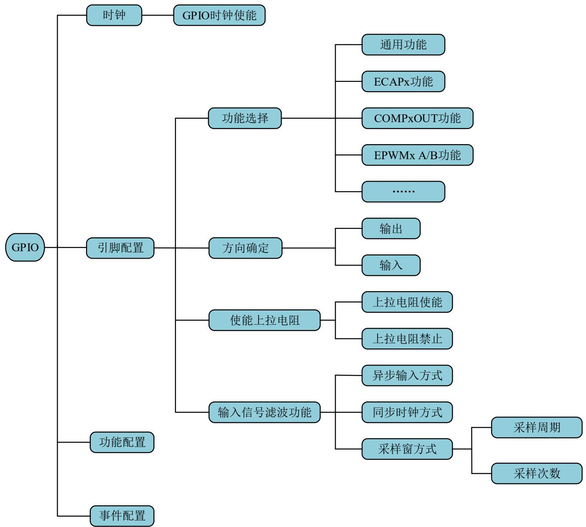

<details>
<summary>flowchart</summary>

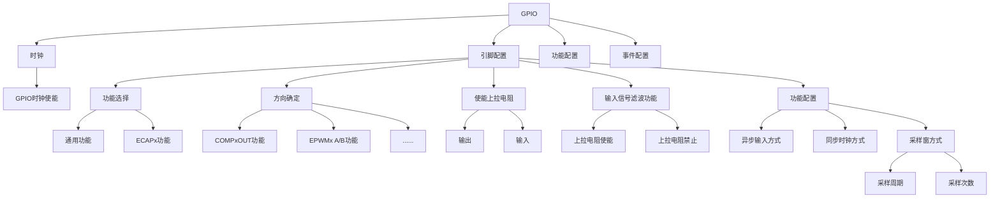
</details>

## 1. 项目任务

利用按键控制LED1灯的亮暗。要求按键按住时LED1亮，按键放开时LED1暗。在F28027 LaunchPad实验板上完成实例验证。

## 2. 项目分析

本实例在LaunchPad XL-TMS320F28027F实验板上实施。下图为按键和LED接口原理图，由图可知，按键对应引脚GPIO12，LED1对应引脚GPIO0。GPIO0为低电平时，LED1亮，GPIO0为高电平时，LED1暗。按键按下时，引脚GPIO12输入电平为高电平，按键放开时，引脚GPIO12输入电平为低电平。

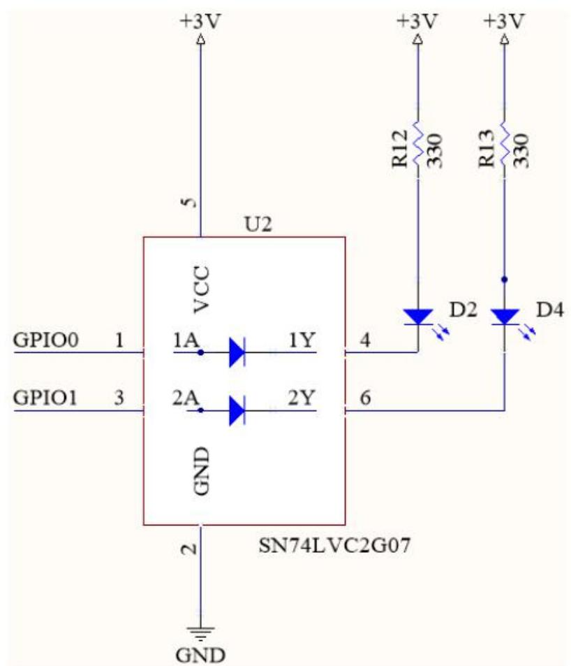

<details>
<summary>text_image</summary>

+3V
5
U2
VCC
1A 1Y
GPIO0 1
GPIO1 3
2A 2Y
GND
SN74LVC2G07
+3V
R12 330
D2 D4
+3V
R13 330
GND
</details>

（a)LED显示接口

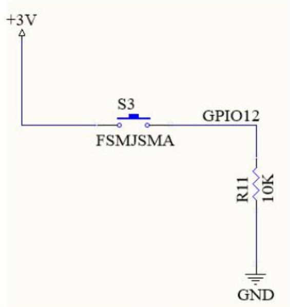

<details>
<summary>text_image</summary>

+3V
S3
FSMJSMA
GPIO12
R11 10K
GND
</details>

(b）按键接口  
LED和按键接口电路

## 3.部分程序代码

软件工程包括引脚的初始化配置、按键识别程序、LED显示程序和主程序等。部分代码如下。

程序清单1 LED1引脚初始化配置  
```txt
/**********************************************************************
* 名称：LED_GPIO_pinConfigure()
* 功能：LED 接口引脚初始化配置。
* 路径：..\chap5_GPIO_1\User_Component\LED_GPIO\LED_GPIO.c
**********************************************************************/
void LED_GPIO_pinConfigure(void)
{
    // 1. set mode
    GPIO_setMode(LED_Gpio_obj, LED1, GPIO_0_Mode_GeneralPurpose); //通用 IO 口
    // 2. set pullup
    GPIO_setPullUp(LED_Gpio_obj, LED1, GPIO_PullUp_Disable);    //禁止上拉
    // 3. set direction
    GPIO_setDirection(LED_Gpio_obj, LED1, GPIO_Direction_Output);    //输出
}
```

程序清单2按键引脚初始化配置  
```txt
/******************************************************************************************
```

\*名称：KEY\_pinConfigure(  
\*功能：按键输入引脚初始化配置

\*路径：Nchap5\_GPIO\_1YUser\_ComponentKEY\KEY.c

```txt
******************************************************************************************/
```

```txt
void KEY_pinConfigure(void)
{
```

```rust
// 1. set mode
GPIO_setMode(KEY_obj, KEY1, GPIO_12_Mode_GeneralPurpose); //通用 IO 口
// 2. set pullup
```

```c
GPIO_setPullUp(KEY_obj, KEY1, GPIO_PullUp_Disable); //禁止上拉
//3. set direction
```

```txt
GPIO_setDirection(KEY_obj, KEY1, GPIO_Direction_Input); //输入
//4. set Qualification
```

```txt
GPIO_setQualification(KEY_obj, KEY1, GPIO_Qual_Sync); //同步时钟
}
```

程序清单3按键识别  
```c
/**********************************************************************
* 名称：TARGET_EXT uint16_t inline GetKeyStatus(GPIO_Number_e key)
* 功能：按键识别函数。查询方式，按键按下返回值为 1，否则返回值为 0
* 路径：..\chap5_GPIO_1\User_Component\KEY\KEY.h
**********************************************************************
TARGET_EXT uint16_t inline GetKeyStatus(GPIO_Number_e key)
{
    return GPIO_getData(KEY_obj, key); // 返回按键值，0 或者 1
}
```

程序清单4按键控制LED 显示  
```c
/******************************************************************
* 名称：KEY_Control_LED
* 功能：按键按下 LED 亮。按键释放，LED 暗
* 路径：..\chap5_GPIO_1\Application\app.c
******************************************************************/
void KEY_Control_LED(void)    //按键控制简易程序
{
    if(KEYPRESSED == GetKeyStatus(KEY1))    //按键按下。KEYPRESSED 宏定义为 1
    {
    LED_on(LED1);    //LED1 亮
    }
    else    //按键释放
    {
    LED_off(LED1);    //LED1 暗
    }
}
```

程序清单5主程序main.c  
```txt
#define TARGET_GLOBAL 1
#include "Application\app.h"
void main(void)
{
    //1. System runtime environment
    User_System_pinConfigure();
    User_System_functionConfigure();
    User_System_eventConfigure();
    User_System_initial();
    //2. Module
    //2.1 LED_Gpio
    LED_GPIO_pinConfigure();
    LED_GPIO_functionConfigure();
    LED_GPIO_eventConfigure();
    LED_GPIO_initial();
    //2.2 LED_Gpio
    KEY_pinConfigure();
    KEY_functionConfigure();
    KEY_eventConfigure();
    KEY_initial();
    //3. PIE runtime environment(if use interrupt)
    //4. the global interrupt start (if use interrupt)
    //5. main LOOP
    for( ; ; )
    {
    KEY_Control_LED();
    }
}
```

、m

## 4. 文件管理

工程的文件管理方式参见第4章。在第4章软件工程架构的基础上，在用户层增加了KEY文件，包括KEY.c和KEY.h。在User\_Device.h文件中包含新增的库文件KEY.h。按键控制LED显示函数 KEY\_Control\_LED在用户层，需要在app.h文件里添加该函数的声明。

## 5.项目实施

项目实施步骤如下。

第一步：导入工程chap5\_GPIO\_1。

第二步：编译工程，如果没有错误，则会生成

chap5\_GPIO\_1.out文件。如有错误则修改程序直至没有错误为止。

第三步：将生成的目标文件下载到MCU的Flash存储器中。

第四步：运行程序，检查实验结果。

## 思考题：

§5-1 理解GPIO引脚的推挽输出和开漏输出的特点和区别。  
§5-2 F28027的GPIO有哪些寄存器？功能是什么？  
§5-3 理解寄存器的操作方法，尝试独立编写寄存器配置函数。  
§5-4 按键输入时如何进行消抖处理？  
§5-5 在第4章的基础上，进一步理解软件架构的特点。  
§5-6 在书本实例的基础上，编写程序实现以下功能：

按键3次为一个循环。

第1次按键对应的显示方式：LED1亮暗显示。

第2次按键对应的显示方式：四个LED按流水灯方式显示。

第3次按键对应的显示方式：LED1，LED4一组，LED2，LED3一组，交替点亮。