## 单片机原理及应用

## Principle And Application Of Microcontroller

福州大学电气学院

教材：《微控制器原理及应用--基于TI C2000实时微控制器》，蔡逢煌、王武、江加辉，机械工业出版社

参考资料：

\* TMS320F2802x, TMS320F2802xx Piccolo Technical Reference Manual.

\* TMS320F2802x Microcontrollers datasheet.

1 中断的基础知识  
2 C2000的中断系统  
3 中断系统的软件架构  
4 应用实例

6.1.1 什么是中断  
6.1.2 中断的名词术语  
6.1.3 中断处理过程

中断是嵌入式系统必备的重要功能，在任一款事件驱动型CPU里面都有。中断是指CPU在执行程序时，某中断源产生了一个中断事件，CPU响应该中断事件，暂时中止其正在执行的程序，转去执行请求中断的那个外设或事件的服务程序，待处理完毕后再返回执行原来被中止的程序。中断具有CPU工作效率高，在实时处理场合中得到了广泛应用。

根据来源不同，中断可分为硬件中断（Hardware Interrupt）和软件中断（Software Interrupt）；根据中断请求能否被屏蔽，中断可分为可屏蔽中断（Maskable Interrupt）和非可屏蔽中断（Non-Maskable Interrupt，NMI）。在微控制系统中，程序设计人员可以通过设置相应的中断屏蔽位，禁止CPU响应某个中断，从而实现中断屏蔽。但值得注意的是，尽管某个中断源可以被屏蔽，但一旦该中断发生，不管该中断屏蔽与否，它的中断标志位都会被置位，而且只要该中断标志位不被清除，它就一直有效。当该中断重新被使能时，它即允许被CPU响应。

## 6.1.2 中断的名词术语

<table><tr><td>名词术语</td><td>解释</td></tr><tr><td>中断系统</td><td>实现中断处理功能的软件、硬件系统称为中断系统</td></tr><tr><td>中断源</td><td>可以引起中断的事件称为中断源</td></tr><tr><td>中断优先级</td><td>中断的优先级主要用来描述不同事件的重要程度,用户可以根据自己的需求对不同的事件即不同的中断源设定重要级别</td></tr><tr><td>中断服务程序</td><td>为了处理中断而编写的程序称为中断服务程序</td></tr><tr><td>中断向量</td><td>中断服务程序的入口地址称为中断向量</td></tr><tr><td>中断向量地址</td><td>存储中断向量的存储单元地址称为中断向量地址</td></tr><tr><td>中断请求</td><td>中断源对CPU提出中断当前执行程序的要求称为中断请求</td></tr><tr><td>中断响应</td><td>CPU接受中断请求,保护现场(断点地址、相关的寄存器或变量入栈),转到中断服务程序的过程称为中断响应</td></tr><tr><td>中断服务</td><td>执行中断服务程序的过程称为中断服务</td></tr><tr><td>中断返回</td><td>中断服务程序执行完毕后,恢复现场(断点地址、相关的寄存器或变量出栈),返回到原程序的过程称为中断返回</td></tr><tr><td>中断嵌套</td><td>如果在执行一个中断时又被另一个更重要的事件打断,暂停该中断处理过程转而去处理这个更重要的事件,处理完毕后再继续处理本中断的过程称为中断的嵌套</td></tr></table>

《微控制器原理及应用 -- 基于 TI C2000 实时微控制器》

MCU的中断处理过程包括中断请求、中断响应、中断服务、中断返回四个步骤。当外设发出中断请求时，如果从外设到CPU的中断使能被允许，那么进入中断响应阶段。由于CPU执行完中断处理程序之后要返回被中断的地方继续执行原来程序，因此在执行中断服务程序之前，要把断点处地址和现场进行保护。中断响应时的现场保护和中断返回时的现场恢复是由MCU内部硬件自动实现的，无需用户操心，用户只需编写中断服务程序。

单一中断请求、多个中断同时请求且不允许中断嵌套、多个中断请求且允许中断嵌套三种情况下的中断处理过程分别如图6-1（a）、图6-1（b）、图6-1（c）所示。单一中断请求时，CPU暂停正在运行的主程序转而运行中断服务程序，中断处理完毕后运行原程序。当多个中断请求同时挂起且不允许中断嵌套时，CPU首先处理高优先级中断事件，然后再处理低优先级中断事件，最后返回执行主程序。允许中断嵌套时，大多数MCU高优先级中断可以中断低优先级中断服务程序，低优先级中断不能中断高优先级中断服务程序，但也有一些MCU的中断嵌套只分先后，不分等级，C2000 MCU的中断嵌套就是这种情况。

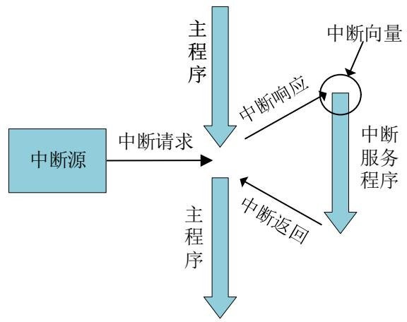

<details>
<summary>flowchart</summary>

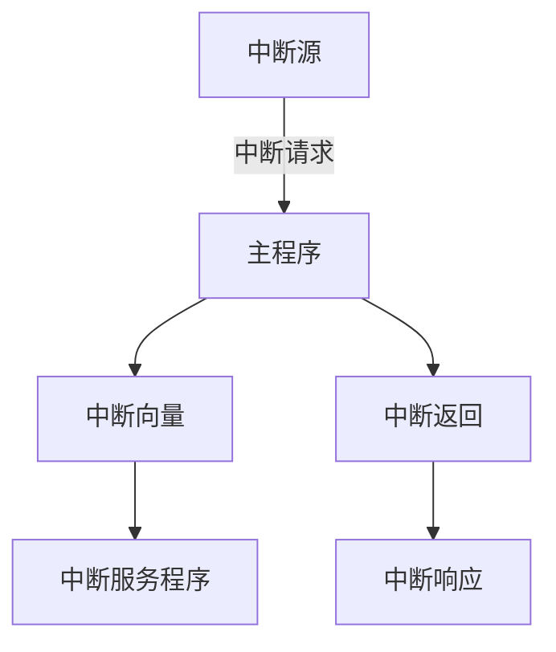
</details>

(a) 单一中断请求

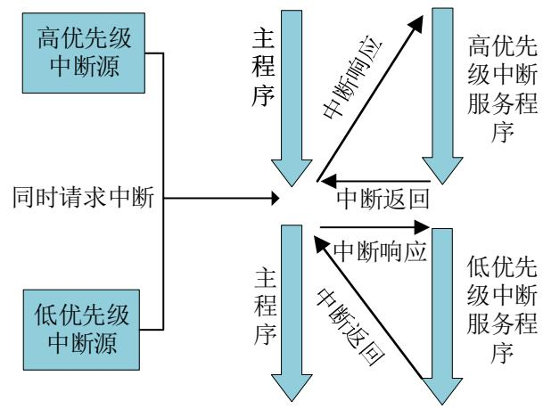

<details>
<summary>flowchart</summary>

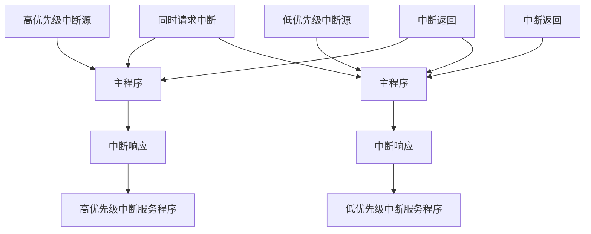
</details>

(b) 多个中断同时请求且不允许中断嵌套

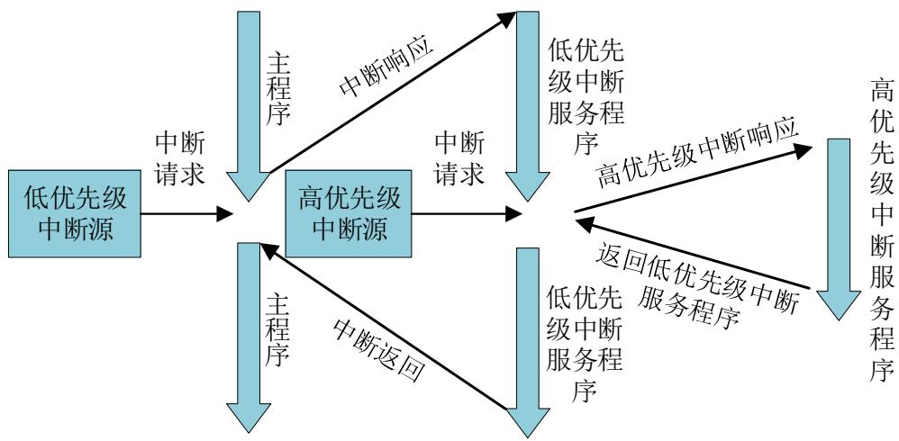

<details>
<summary>flowchart</summary>

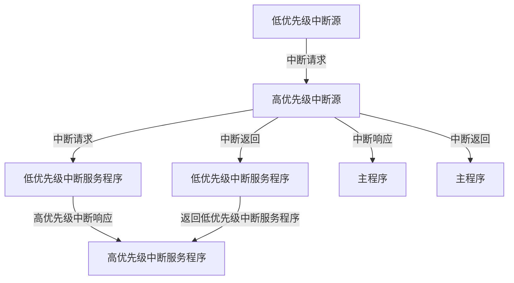
</details>

(c) 多个中断请求且允许中断嵌套  
图6-1 三种不同情况中断处理过程

6.2.1 中断系统概述  
6.2.2 PIE内部结构

C28x CPU支持1个非可屏蔽中断NMI和16个可屏蔽中断（INT1～INT14、RTOSINT和DLOGINT）。然而，C2000系列MCU具有丰富的外设模块，且每个外设模块至少能产生1个中断事件，CPU没有足够的资源来管理这么多的外设中断请求。因此，C2000 MCU采用图6-2所示的中断系统框图，可屏蔽中断（INT1～INT12）采用外设中断扩展（Peripheral Interrupt Expansion，PIE）来进行协助管理，定时器1、2对应的INT13、INT14中断和NMI不经过PIE，直接与CPU相连。

PIE模块参与管理的中断有以下四类：

TINT0：定时器0中断，可屏蔽中断；  
外部中断：XINT1、XINT2、XINT3；  
唤醒中断：WAKEINT，包括看门狗和低功耗唤醒；  
外设中断：SPI、SCI、I2C、EPWM、HRPWM、ECAP、ADC等。

PIE最多可管理96个独立中断源，这96个中断源分成12组、每组8个，分别对应CPU级12个可屏蔽中断（INT1～INT12）。96个中断源具有独立的中断向量，均存储在专用RAM中，用户可以修改这些中断向量。通过这样的PIE中断管理机制，CPU在处理中断时，从RAM中的PIE中断向量地址获取中断服务程序入口地址，并进行关键CPU寄存器的入栈仅需9个CPU时钟周期，可实现中断事件的快速响应，提高控制系统的实时性。

## 6.2.1 中断系统概述

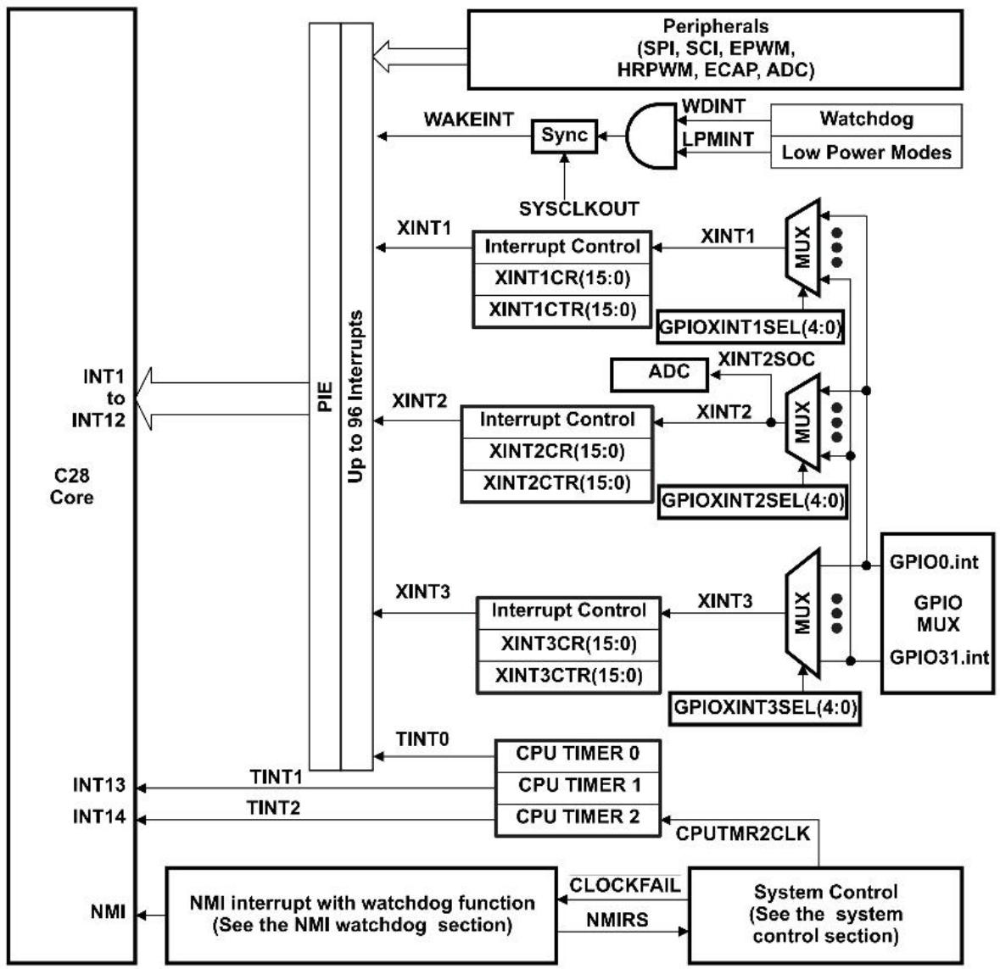

<details>
<summary>flowchart</summary>

```mermaid
graph TD
    subgraph C28_Core["\"C28 Core\""]
        direction TB
  A["INT1 to INT12"] --> B["PIE"]
  B --> C["Up to 96 Interrupts"]
  C --> D["XINT1"]
  C --> E["XINT2"]
  C --> F["XINT3"]
  C --> G["XINT0"]
  D --> H["Interrupt Control XINT1CR(15:0) XINT1CTR(15:0)"]
  E --> I["Interrupt Control XINT2CR(15:0) XINT2CTR(15:0)"]
  F --> J["Interrupt Control XINT3CR(15:0) XINT3CTR(15:0)"]
  G --> K["CPU TIMER 0 CPU TIMER 1 CPU TIMER 2"]
    end

  L["Peripherals (SPI, SCI, EPWM, HRPWM, ECAP, ADC)"] --> M["Sync"]
  M --> N["WDINT LPMINT"]
  N --> O["Watchdog Low Power Modes"]

  P["NGI"] --> Q["NMI interrupt with watchdog function (See the NMI watchdog section)"]
  Q --> R["CLOCKFAIL NMIRS"]
  R --> S["System Control (See the system control section)"]
  T["ADC"] --> U["XINT2SOC"]
  U --> V["MUX"]
  V --> W["GPIOXINT1SEL(4:0)"]
  W --> X["GPIOXINT2SEL(4:0)"]
  X --> Y["GPIOXINT3SEL(4:0)"]
  Y --> Z["GPIOXINT3"]
  Z --> AA["GPIOMUX GPIO31.int"]
  AB["Int1"] --> AC["TINT1"]
  AC --> AD["TINT2"]
  AD --> AE["TINT3"]
  AE --> AF["INT3"]
  AF --> AG["INT13"]
  AG --> AH["INT14"]
  AI["CPUTMR2CLK"] --> AJ["CPUTMR2CLK"]
  AJ --> AK["CPU TIMER 0 CPU TIMER 1 CPU TIMER 2"]
  AL["XINT1"] --> AM["XINT2"]
  AM --> AN["XINT3"]
  AN --> AO["XINT3CR(15:0) XINT3CTR(15:0)"]
  AP["XINT2"] --> AQ["XINT2SOC"]
  AQ --> AR["XINT3"]
  AR --> AS["XINT3CR(15:0)"]
  AT["XINT3"] --> AU["XINT3"]
  AV["XINT3CR(15:0)"] --> AW["XINT3CR(15:0)"]
  AX["XINT3CR(15:0)"] --> AY["XINT3CR(15:0)"]
  AZ["XINT3CR(15:0)"] --> BA["XINT3CR(15:0)"]
  BB["XINT3CR(15:0)"] --> BC["XINT3CR(15:0)"]
  BD["XINT3CR(15:0)"] --> BE["XINT3CR(15:0)"]
  BF["XINT3CR(15:0)"] --> BG["XINT3CR(15:0)"]
  BH["XINT3CR(15:0)"] --> BI["XINT3CR(15:0)"]
  BJ["XINT3CR(15:0)"] --> BK["XINT3CR(15:0)"]
  BL["XINT3CR(15:0)"] --> BM["XINT3CR(15:0)"]
  BN["XINT3CR(15:0)"] --> BO["XINT3CR(15:0)"]
  BP["XINT3CR(15:0)"] --> BQ["XINT3CR(15:0)"]
  BR["XINT3CR(15:0)"] --> BS["XINT3CR(15:0)"]
  BT["XINT3CR(15:0)"] --> BU["XINT3CR(15:0)"]
  BV["XINT3CR(15:0)"] --> BW["XINT3CR(15:0)"]
  BX["XINT3CR(15:0)"] --> BY["XINT3CR(15:0)"]
  BZ["XINT3CR(15:0)"] --> BQ
  CA["XINT3CR(15:0)"] --> BQ
  CB["XINT3CR(15:0)"] --> CC["XINT3CR(15:0)"]
  DD["XINT3CR(15:0)"] --> DE["XINT3CR(15:0)"]
  BEX["XINT3CR(15:0)"] --> BEX
  BFX["XINT3CR(15:0)"] --> BFX
  BGX["XINT3CR(15:0)"] --> BGX
  BHX["XINT3CR(15:0)"] --> BHX
  BIY["XINT3CR(15:0)"] --> BIY
  BJY["XINT3CR(15:0)"] --> BJY
  BKX["XINT3CR(15:0)"] --> BKX
  BLX["XINT3CR(15:0)"] --> BLX
  BMX["XINT3CR(15:0)"] --> BMX
  BNX["XINT3CR(15:0)"] --> BNX
  BOX["XINT3CR(15:0)"] --> BOX
  BPX["XINT3CR(15:0)"] --> BPX
  RYX["XINT3CR(15:0)"] --> RYX
  SCX["XINT3CR(15:0)"] --> SCX
  BTX["XINT3CR(15:0)"] --> BTX
```
</details>

图6-2 C2000中断系统功能框图

## 1. 三级中断管理机制

F28027的中断采用的是3级中断管理机制，分别是外设级、PIE级和CPU级。对于某一个具体的外设中断请求，任意一级的不许可，CPU最终都不会响应该外设中断。图6-3为PIE模块的结构示意图，图6-4为典型的中断响应流程图。

## (1) 外设模块级

外设模块产生中断事件时，相应外设模块寄存器的中断标志位IF被置位，如果对应的外设中断允许位IE被使能，则外设就向PIE发送一个中断请求，如图6-3中的INTx.1\~INTx.8；如果外设中断允许位IE未被使能，则该中断被屏蔽，不会向PIE发送中断请求。外设模块的中断标志位有的会在中断响应后自动清除，有的需要通过软件来清除，不同模块中断标志的清除操作参见相关模块寄存器。其中，外部中断比较特殊，没有中断标志位，如果中断使能允许，外部中断请求信号直接送达PIE。

## (2) PIE级

PIE控制器将每8个外设或外部中断汇集成1个CPU级中断。这样对于96个外设中断源，就被分成12组，分别是PIE1～PIE12，每一组对应一个CPU级中断，即PIE1对应INT1，PIE12对应INT12。对于复用的中断源，PIE模块中每一组有一个中断标志寄存器PIEIFRx和中断允许寄存器PIEIERx（x指PIE1～PIE12），寄存器的每一位对应复用这组PIE的某一个中断，用字母y表示。这样PIEIFRx.y和PIEIERx.y就表示第x组（x=1\~12）第y个中断源（y=1\~8）对应的寄存器位。

一旦中断请求被送到PIE模块，相应的PIE中断标志位PIEIFRx.y被置位。如果对应的中断使能位PIEIERx.y=1，那么PIE模块将检查相应的PIE应答位PIEACKx，确认CPU是否准备好响应这个组的中断。如果这个组的PIE应答位PIEACKx=0，则PIE将该中断请求送至CPU。如果PIE应答位PIEACKx=1，中断请求不会被PIE发送给CPU，直到PIEACKx=0且该中断请求还存在时，PIE才会将挂起的中断请求发送给CPU。因此，每个外设中断被响应后，用户需要在中断服务程序里面软件清除该组的中断应答位PIEACKx，以便PIE控制器能够响应同组内其他中断请求。

CPU响应PIE级中断后，自动清除相应的中断标志位PIEIFRx.y，该中断标志位不可通过软件进行清除，否则会引起中断系统不可预料的错误。

## (3) CPU级

当中断请求从PIE发送到CPU时，CPU级的中断标志寄存器IFRx被置位，中断应答位PIEACKx被置位，同组的其他中断请求被挂起。如果中断允许寄存器IERx=1且中断总开关INTM=0，那么CPU将响应这个中断请求并自动清零对应的IFRx标志位，CPU级的中断标志位的置位和清除都是自动完成的。

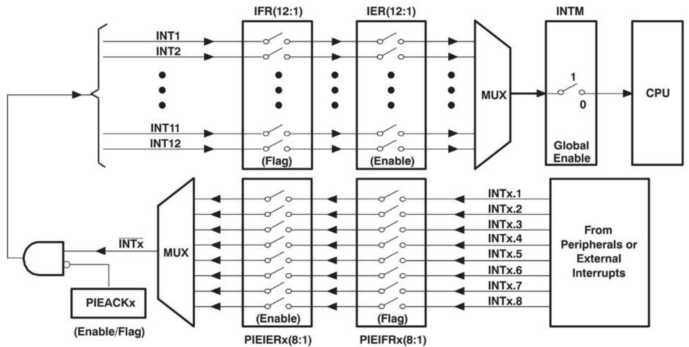

<details>
<summary>flowchart</summary>

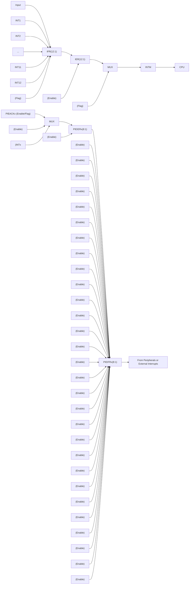
</details>

图6-3 PIE结构示意图

## 6.2.2 PIE内部结构

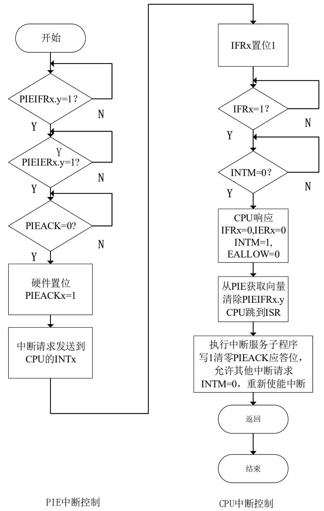

<details>
<summary>flowchart</summary>

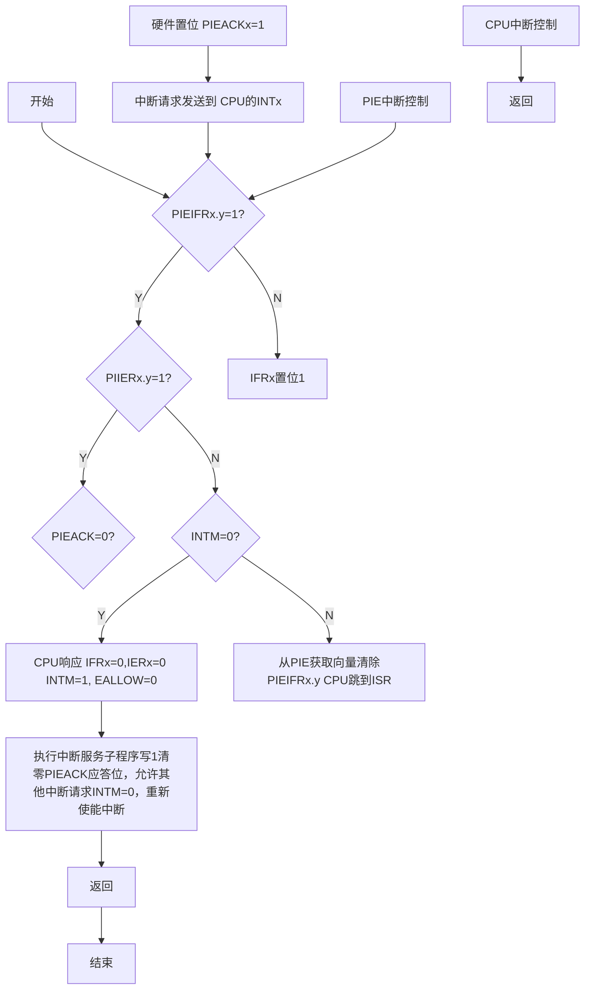
</details>

图6-4 典型的PIE CPU中断响应流程

## 2. 中断入口地址管理机制

CPU响应中断请求后，要去处理中断服务程序，这个中断响应过程包括现场保护（中断返回地址、相关寄存器等入栈）和中断服务子程序地址的获取。其中，中断服务子程序地址保存在MCU内存单元，这部分内存单元也称为中断向量表。

F28027的中断向量表可以映射到内存中的四个不同位置，如表6-2所示。

表6-2 中断向量表映射配置表

<table><tr><td>向量表映射</td><td>向量获取位置</td><td>地址范围</td><td>VMAP</td><td>M0M1MAP</td><td>ENPIE</td></tr><tr><td>M1向量</td><td>M1 SARAM</td><td>0x000000-0x00003F</td><td>0</td><td>0</td><td>x</td></tr><tr><td>M0向量</td><td>M0 SARAM</td><td>0x000000-0x00003F</td><td>0</td><td>1</td><td>x</td></tr><tr><td>BROM向量</td><td>BOOT ROM</td><td>0x3FFFC0-0x3FFFFFF</td><td>1</td><td>x</td><td>0</td></tr><tr><td>PIE向量</td><td>PIE</td><td>0x000D00-0x000DFF</td><td>1</td><td>x</td><td>1</td></tr></table>

获向量表映射方式由VMAP（ST1状态寄存器第3位，复位后值为1）、M0M1VAP（ST1状态寄存器第11位，复位后值为1）和ENPIE（PIECONTROL寄存器第0位，复位后值为0）三个位决定。四种映射方式的简要分析如下：

M1、M0向量映射：是TI保留用于测试的，用户使用时这两个映射对应的向量表单元可以自由操作，不受限制。

BROM向量映射：在MCU复位后，中断向量表映射到BOOT ROM区（地址：0x3FFFC0-0x3FFFFFF），这个区是Flash空间，可以永久保存32个系统级中断向量。复位后的中断向量为0x3FFFC0，该内存中的中断程序入口地址定位到初始化引导函数（InitBoot），执行该函数后，根据三个引脚（GPIO37、GPIO34、TRST）电平高低进行相应的引导。如果引导模式是仿真模式（Emulation Mode）或获取模式（Get Mode），CPU将转向0x3F7FF6地址执行。由于0x3F7FF6地址在128位安全密码空间（CSM）之前，所以在0x3F7FF6处须有个转移指令，转去执行用户程序。具体分析参见4.6节。

PIE向量映射：通过设置ENPIE=1，可将中断向量映射到PIE区。

不管中断向量表位于哪个区，系统复位后，中断向量默认都是从BOOT ROM区取。在实际应用中，设计者要将中断向量区映射到PIE区（地址：0x000D00 - 0x000DFF），这个区在RAM中，用户方便修改，但是在MCU复位后需要对这个区域进行中断入口地址的装载，也就是把相应的中断向量写入PIE向量映射区。

PIE 向量映射区是由一个256\*16存储单元的SARAM块构成，如果该区域未被用作中断向量使用，可将其用作存储数据的普通RAM；当用作中断向量映射区时，总共可以存放128个中断向量地址，包含32个系统级中断向量地址和96个PIE复用外设中断向量地址，每个中断向量地址占用2\*16个存储单元。PIE复用外设中断向量表和PIE向量映射区总表，如表6-3所示，详细的中断向量表可以参考数据手册。以外部中断XINT1为例：说明PIE向量映射区作用，XINT1的中断向量地址为0xD46，当CPU响应外部中断1的中断请求后，CPU到中断向量地址0xD46内存单元获取中断向量（即中断服务程序的入口地址），然后根据中断服务程序的入口地址跳转到相应的中断服务程序块去执行中断服务程序。

96个PIE复用外设中断优先级是由CPU和PIE模块共同决定的。其中，12组中断INT1\~INT12的优先级依次从高到低，是由CPU决定；PIE控制每组8个中断的优先级。例如：如果INT1.1与INT8.1同时发生中断请求，则两个中断请求都由PIE模块同时发送给CPU，CPU首先服务中断INT1.1，其次再服务中断INT8.1；如果INT1.1与INT1.8同时发生中断请求，那么INT1.1的中断请求优先被发送到CPU，紧接着才发送INT1.8的中断请求。其中，中断优先级的排序是在中断处理期间获取中断向量时就已经完成了。

表6-3的中断向量表，目前使用了31个，剩余的是保留给未来的器件使用。如果在PIEIFRx级使能了这些保留中断，则可将它们作为软件中断使用，但前提是该组中没有中断被外设使用，否则，在修改PIEIFR时，来自外设的中断可能会因意外清除其标志而丢失。以下两种情况可安全使用保留中断：（1）组内没有外设发出中断；（2）没有外设中断被分配给该组，例如，PIE组11和12没有连接任何外部设备。

表6-3 PIE复用外设中断向量表

<table><tr><td></td><td>INTx.8</td><td>INTx.7</td><td>INTx.6</td><td>INTx.5</td><td>INTx.4</td><td>INTx.3</td><td>INTx.2</td><td>INTx.1</td></tr><tr><td>INT1.y</td><td>WAKEINT(LPM/WD)0xD4E</td><td>TINT0(TIMER 0)0xD4C</td><td>ADCINT9(ADC)0xD4A</td><td>XINT2(Ext.int.2)0xD48</td><td>XINT1(Ext.int.1)0xD46</td><td>保留-0xD44</td><td>ADCINT2(ADC)0xD42</td><td>ADCINT1(ADC)0xD40</td></tr><tr><td>INT2.y</td><td>保留-0xD5E</td><td>保留-0xD5C</td><td>保留-0xD5A</td><td>保留-0xD58</td><td>EPWM4_TZINT(ePWM4)0xD56</td><td>EPWM3_TZINT(ePWM3)0xD54</td><td>EPWM2_TZINT(ePWM2)0xD52</td><td>EPWM1_TZINT(ePWM1)0xD50</td></tr><tr><td>INT3.y</td><td>保留-0xD6E</td><td>保留-0xD6C</td><td>保留-0xD6A</td><td>保留-0xD68</td><td>EPWM4_INT(ePWM 4)0xD66</td><td>EPWM3_INT(ePWM 3)0xD64</td><td>EPWM2_INT(ePWM 2)0xD62</td><td>EPWM1_INT(ePWM 1)0xD60</td></tr><tr><td>INT4.y</td><td>保留-0xD7E</td><td>保留-0xD7C</td><td>保留-0xD7A</td><td>保留-0xD78</td><td>保留-0xD76</td><td>保留-0xD74</td><td>保留-0xD72</td><td>ECAP1_INT(eCAP1)0xD70</td></tr><tr><td>INT5.y</td><td>保留-0xD8E</td><td>保留-0xD8C</td><td>保留-0xD8A</td><td>保留-0xD88</td><td>保留-0xD86</td><td>保留-0xD84</td><td>保留-0xD82</td><td>保留-0xD80</td></tr><tr><td>INT6.y</td><td>保留-0xD9E</td><td>保留-0xD9C</td><td>保留-0xD9A</td><td>保留-0xD98</td><td>保留-0xD96</td><td>保留-0xD94</td><td>SPITXINTA(SPI-A)0xD92</td><td>SPIRXINTA(SPI-A)0xD90</td></tr><tr><td>INT7.y</td><td>保留-0xDAE</td><td>保留-0xDAC</td><td>保留-0xDAA</td><td>保留-0xD8</td><td>保留-0xD6</td><td>保留-0xD4</td><td>保留-0xDA2</td><td>保留-0xDA0</td></tr><tr><td>INT8.y</td><td>保留-0xDBE</td><td>保留-0xDBC</td><td>保留-0xDBA</td><td>保留-0xDB8</td><td>保留-0xDB6</td><td>保留-0xDB4</td><td>I2CINT2A(I2C-A)0xDB2</td><td>I2CINT1A(I2C-A)0xDB0</td></tr><tr><td>INT9.y</td><td>保留-0xDCE</td><td>保留-0xDCC</td><td>保留-0.DCA</td><td>保留-0.DC8</td><td>保留-0.DC6</td><td>保留-0.DC4</td><td>SCITXINTA(SCI-A)0.xDC2</td><td>SCIRXINTA(SCI-A)0.xDC0</td></tr><tr><td>INT10.y</td><td>ADCINT8(ADC)0xDDE</td><td>ADCINT7(ADC)0xDDC</td><td>ADCINT6(ADC)0xDDA</td><td>ADCINT5(ADC)0xDD8</td><td>ADCINT4(ADC)0xDD6</td><td>ADCINT3(ADC)0xDD4</td><td>ADCINT(ADC)0xDD2</td><td>ADCINT1(ADC)0xDD0</td></tr><tr><td>INT11.y</td><td>保留-0xDEE</td><td>保留-0xDEC</td><td>保留-0xDEA</td><td>保留-0xDE8</td><td>保留-0xDE6</td><td>保留-0xDE4</td><td>保留-0xDE2</td><td>保留-0xDE0</td></tr><tr><td>INT12.y</td><td>保留-0xDFE</td><td>保留-0xDFC</td><td>保留-0xFDA</td><td>保留-0xDF8</td><td>保留-0xDF6</td><td>保留-0xDF4</td><td>保留-0xDF2</td><td>XINT3Ext.Int.30xDF0</td></tr></table>

《碳化制品原理及应用 壁于 HCE000 天的碳化制品》

## 3. 处理复用中断的注意事项

PIE模块的12组中断中，每个组都有PIEIER和标志PIEIFR寄存器，这些寄存器用于控制进入CPU的中断请求。同时，PIE模块也使用PIEIER和PIEIFR寄存器来进行解码，以确定CPU需要响应的中断服务程序位置。通常情况，在清除PIEIFR和PIEIER寄存器中的位时，应遵循以下3个主要规则：

## 规则1：不要用软件清除PIEIFR位

当对PIEIFR寄存器进行写或读-修改-写操作时，输入中断可能会丢失。要清除PIEIFR位，必须服务挂起的中断。如果用户想在不执行正常服务程序的情况下清除PIEIFR位，需使用以下步骤：

☐ 设置EALLOW位，允许修改PIE向量表；  
☐ 启用中断，以便临时ISR为中断提供服务；  
□ 服务临时中断程序后，PIEIFR位将被清除；  
□ 修改PIE向量表，将外设中断服务程序重新映射到正确的服务程序；  
□ 清除EALLOW位。

□ 修改PIE向量表，使外设中断服务程序的向量指向临时ISR，该临时ISR将仅执行中断返回(IRET)操作；

## 规则2：软件优先级中断流程

☐ 使用CPU IER寄存器作为全局优先级，各个PIEIER寄存器作为组优先级。在这种情况下，PIEIER寄存器只在中断中被修改；此外，只修改与所服务的中断同一组的PIEIER。  
□ 不要在组内禁用其他组的PIEIER位。

规则3：使用PIEIER禁用中断 如果PIEIER寄存器处于使能状态，要将其禁止必须遵循启用和禁用多路复用外设中断的程序。

## 4. 使能和禁止多路复用外设中断的流程

使能或禁止外设中断的正确方法是使用外设中断使能/禁止控制位。PIEIER和CPU IER寄存器的主要用途是对同一PIE中断组内的中断进行中断优先级排序。如果要清除PIEIER寄存器中的位，应采用以下一种操作方法：方法1保留相关的PIE标志寄存器，这样中断就不会丢失；方法2清除相关的PIE标志寄存器。

方法1：使用PIEIERx寄存器禁止中断并保留相关的PIEIFRx标志。

要清除PIEIERx寄存器中的位，同时保留PIEIFRx寄存器中的标志位，应遵循以下步骤：

步骤1：禁用全局中断（INTM = 1）。

步骤2：清除PIEIERx.y位以禁止指定的外设中断，可为同组中的多个外设执行此操作。

步骤3：等待5个周期以确保进入CPU的任一中断都置位了CPU IFR寄存器的相关位。

步骤4：清除外设组的CPU IFRx位。

步骤5：清除外设组的PIEACKx位。

步骤6：使能全局中断（INTM = 0）。

方法 2：使用PIEIERx寄存器禁止中断并清除相关的PIEIFRx标志。

要对外设中断执行软件复位并清除PIEIFRx寄存器和CPU IFR寄存器中的相关标志，应遵循以下步骤：

步骤 1：禁用全局中断（INTM = 1）。

步骤 2：设置EALLOW位。

步骤3：修改PIE向量表，将特定外设中断的向量临时映射到一个空的中断服务程序（ISR）。这个空的ISR将只执行中断返回（IRET）指令，这是清除单个PIEIFRx.y位的安全方法，不会丢失来自组内其他外设的任何中断。

步骤4：禁用外设寄存器的外设中断。

步骤5：启用全局中断（INTM = 0）。

步骤6：等待任何来自外设的挂起中断被预先设置的ISR服务。

步骤7：禁用全局中断（INTM = 1）。

步骤8：修改PIE向量表，将外设的服务程序重新映射到正确的服务程序。

步骤9：清除EALLOW位。

步骤10：禁用指定外设的PIEIER位。

步骤11：清除指定外设组的IFR位。

步骤12：清除PIE组的PIEACK位。

步骤13：启用全局中断。

## 5. 外设到CPU的多路复用中断请求流程

外设到CPU的多路复用中断请求流程，共包括9个步骤，如图6-4所示。

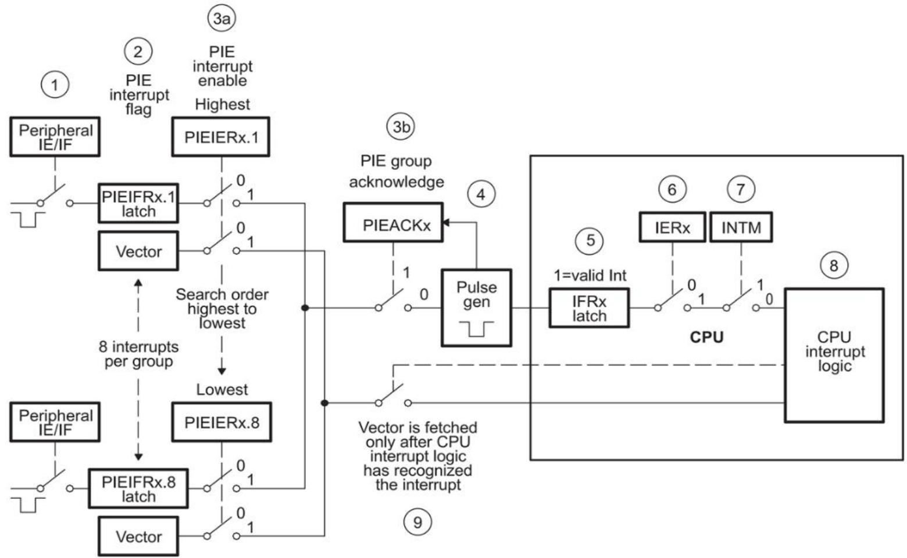

<details>
<summary>flowchart</summary>

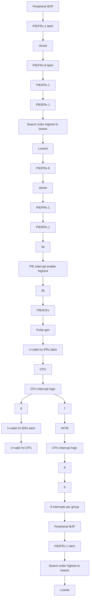
</details>

图6-4 多路复用的中断请求流程图

步骤1：PIE组内的任何外设或外部中断发出中断请求。如果外设中断被使能，则中断请求将被发送到PIE模块；

步骤2：PIE模块识别出第x组的中断y (INTx.y)已经产生了一个中断，则置位相应的PIE中断标志位，即PIEIFRx.y = 1;

步骤3：中断请求要从PIE发送到CPU必须同时满足两个条件：

步骤3a：使能对应PIEIER，即PIEIERx.y=1

步骤3b：应答位PIEACKx=0。

步骤4：如果步骤3两个条件同时满足，则PIE向CPU发送中断请求，并置位PIEACKx，PIEACKx位将保持为1，直到用户将其清除，以允许该组其他中断可以从PIE发送到CPU。

步骤5：CPU中断标志位被置位(CPU IFRx = 1)，标志CPU级中断正在处理。

步骤6：如果CPU中断被使能(CPUIERx = 1或DBGIER位x = 1)，并且全局中断屏蔽被清除(INTM = 0)，则CPU响应INTx的中断请求。

步骤7：CPU识别中断并进行现场保护、清除IER、置位INTM、清除EALLOW。

步骤8：CPU从PIE向量表获取中断程序入口地址。

步骤9：对于多路复用中断，PIE模块使用PIEIRx和PIEIFRx寄存器中的当前值来解码以获得正确的中断向量地址。有两种可能的情况：

a.如果在步骤7后有更高优先级的中断，则优先处理该高优先级中断。

b.如果组内已被使能的中断其中断标志位未被置位，则PIE用组内最高优先级的中断向量响应，即中断入口地址采用INTx.1。此操作相当于响应28x的TRAP或INT指令。 $^{24}$

经过上述9个步骤之后，PIEIFRx.y位自动被清零并且CPU跳转到中断程序入口地址。

需要注意的是：因为PIEIERx寄存器用来确定哪一个向量作为转移地址，因此对PIEIERx寄存器位进行清除时需要小心。清除PIEIERx位的正确步骤在使能和禁止多路复用外设中断的步骤中已有叙述。在一个中断已经传送到CPU（如图6-4步骤5）之后，若不遵循后续步骤将导致PIEIERx寄存器的变化。这一情况下，除非有其它挂起的和被使能的中断，否则PIE响应类似执行TRAP或INT指令。

6.3.1 寄存器及驱动函数  
6.3.2 驱动函数描述  
6.3.3 软件思维导图

表6-5为PIE的相关寄存器及其对应的驱动函数名。表6-6为CPU寄存器中与中断功能相关的寄存器及其对应的驱动函数名。寄存器的详细信息参见芯片的技术参考手册。

表6-5 PIE寄存器及其驱动函数

<table><tr><td>寄存器</td><td>描述</td><td>地址</td><td>驱动函数</td><td>功能</td></tr><tr><td>PIECTRL</td><td>PIE控制寄存器</td><td>0x0CE0</td><td>PIE_enablePIE_disable</td><td>PIE向量映射使能PIE向量映射禁止</td></tr><tr><td>PIEACK</td><td>PIE应答寄存器</td><td>0x0CE1</td><td>PIE_clearInt</td><td>清除PIE中断应答位PIEACKx</td></tr><tr><td>PIEIER1</td><td>PIE, INT1组中断使能寄存器</td><td>0x0CE2</td><td>PIE_enableInt</td><td>使能PIE级中断</td></tr><tr><td>PIEIFR1</td><td>PIE, INT1组中断标志寄存器</td><td>0x0CE3</td><td>PIE_enableInt</td><td>使能PIE级中断</td></tr><tr><td>PIEIER2</td><td>PIE, INT2组中断使能寄存器</td><td>0x0CE4</td><td>PIE_enableInt</td><td>使能PIE级中断</td></tr><tr><td>PIEIFR2</td><td>PIE, INT2组中断标志寄存器</td><td>0x0CE5</td><td>PIE_enableInt</td><td>使能PIE级中断</td></tr></table>

## 6.3.1 寄存器及驱动函数

<table><tr><td>PIEIER3</td><td>PIE, INT3组中断使能寄存器</td><td>0x0CE6</td><td>PIE_enableInt</td><td>使能PIE级中断</td></tr><tr><td>PIEIFR3</td><td>PIE, INT3组中断标志寄存器</td><td>0x0CE7</td><td>PIE_enableInt</td><td>使能PIE级中断</td></tr><tr><td>PIEIER4</td><td>PIE, INT4组中断使能寄存器</td><td>0x0CE8</td><td>PIE_enableInt</td><td>使能PIE级中断</td></tr><tr><td>PIEIFR4</td><td>PIE, INT4组中断标志寄存器</td><td>0x0CE9</td><td>PIE_enableInt</td><td>使能PIE级中断</td></tr><tr><td>PIEIER5</td><td>PIE, INT5组中断使能寄存器</td><td>0x0CEA</td><td>PIE_enableInt</td><td>使能PIE级中断</td></tr><tr><td>PIEIFR5</td><td>PIE, INT5组中断标志寄存器</td><td>0x0CEB</td><td>PIE_enableInt</td><td>使能PIE级中断</td></tr><tr><td>PIEIER6</td><td>PIE, INT6组中断使能寄存器</td><td>0x0CEC</td><td>PIE_enableInt</td><td>使能PIE级中断</td></tr><tr><td>PIEIFR6</td><td>PIE, INT6组中断标志寄存器</td><td>0x0CED</td><td>PIE_enableInt</td><td>使能PIE级中断</td></tr></table>

## 6.3.1 寄存器及驱动函数

<table><tr><td>PIEIER7</td><td>PIE, INT7组中断使能寄存器</td><td>0x0CEE</td><td>PIE_enableInt</td><td>使能PIE级中断</td></tr><tr><td>PIEIFR7</td><td>PIE, INT7组中断标志寄存器</td><td>0x0CEF</td><td>PIE_enableInt</td><td>使能PIE级中断</td></tr><tr><td>PIEIER8</td><td>PIE, INT8组中断使能寄存器</td><td>0x0CF0</td><td>PIE_enableInt</td><td>使能PIE级中断</td></tr><tr><td>PIEIFR8</td><td>PIE, INT8组中断标志寄存器</td><td>0x0CF1</td><td>PIE_enableInt</td><td>使能PIE级中断</td></tr><tr><td>PIEIER9</td><td>PIE, INT9组中断使能寄存器</td><td>0x0CF2</td><td>PIE_enableInt</td><td>使能PIE级中断</td></tr><tr><td>PIEIFR9</td><td>PIE, INT9组中断标志寄存器</td><td>0x0CF3</td><td>PIE_enableInt</td><td>使能PIE级中断</td></tr><tr><td>PIEIER10</td><td>PIE, INT10组中断使能寄存器</td><td>0x0CF4</td><td>PIE_enableInt</td><td>使能PIE级中断</td></tr><tr><td>PIEIFR10</td><td>PIE, INT10组中断标志寄存器</td><td>0x0CF5</td><td>PIE_enableInt</td><td>使能PIE级中断</td></tr></table>

## 6.3.1 寄存器及驱动函数

<table><tr><td>PIEIER11</td><td>PIE, INT11组中断使能寄存器</td><td>0x0CF6</td><td>PIE_enableInt</td><td>使能PIE级中断</td></tr><tr><td>PIEIFR11</td><td>PIE, INT11组中断标志寄存器</td><td>0x0CF7</td><td>PIE_enableInt</td><td>使能PIE级中断</td></tr><tr><td>PIEIER12</td><td>PIE, INT12组中断使能寄存器</td><td>0x0CF8</td><td>PIE_enableInt</td><td>使能PIE级中断</td></tr><tr><td>PIEIFR12</td><td>PIE, INT12组中断标志寄存器</td><td>0x0CF9</td><td>PIE_enableInt</td><td>使能PIE级中断</td></tr><tr><td>PIE vector</td><td>PIE中断向量表</td><td>0x0D00~0x0DFF</td><td>PIE_registerPieIntHandler</td><td>PIE中断向量表注册</td></tr><tr><td>XINT1CR</td><td>XINT1配置寄存器</td><td>0x7070</td><td>PIE_setExtIntPolarity</td><td>设置外部中断的极性</td></tr><tr><td>XINT2CR</td><td>XINT2配置寄存器</td><td>0x7071</td><td>PIE_setExtIntPolarity</td><td>设置外部中断的极性</td></tr><tr><td>XINT3CR</td><td>XINT3配置寄存器</td><td>0x7072</td><td>PIE_setExtIntPolarity</td><td>设置外部中断的极性</td></tr><tr><td>XINT1CTR</td><td>XINT1计数寄存器</td><td>0x7078</td><td>PIE_getExtIntCount</td><td>获取外部中断对应计数器的计数值</td></tr><tr><td>XINT2CTR</td><td>XINT2计数寄存器</td><td>0x7079</td><td>PIE_getExtIntCount</td><td>获取外部中断对应计数器的计数值</td></tr><tr><td>XINT3CTR</td><td>XINT3计数寄存器</td><td>0x707A</td><td>PIE_getExtIntCount</td><td>获取外部中断对应计数器的计数值 30</td></tr></table>

## 6.3.1 寄存器及驱动函数

表6-6 CPU寄存器及驱动函数

<table><tr><td>寄存器</td><td>描述</td><td>地址</td><td>驱动函数名</td><td>功能</td></tr><tr><td>IFR</td><td>CPU级中断标志寄存器</td><td>-</td><td>CPU_clearIntFlags</td><td>CPU级中断标志位清0</td></tr><tr><td>IER</td><td>CPU级中断使能寄存器</td><td>-</td><td>CPU_enableInt</td><td>使能CPU级中断</td></tr><tr><td>INTM</td><td>CPU全局中断屏蔽位</td><td>-</td><td>CPU_enableGlobalIntsCPU_disableGlobalInts</td><td>CPU全局中断允许CPU全局中断禁止</td></tr></table>

驱动函数通过结构体指针myPie对寄存器进行读写操作。结构体指针的初始化和使用方法参见第4章。PIE模块的驱动函数由两个文件组成，分别是：F2802x\_Component/source/pie.c和F2802x\_Component/include/pie.h。表6-7\~表6-17给出了中断系统驱动函数的描述和示例。

表6-7 函数PIE\_enable

<table><tr><td>函数名</td><td>PIE_enable</td></tr><tr><td>函数原型</td><td>void PIE_enable(PIE_Handle pieHandle)</td></tr><tr><td>功能描述</td><td>PIE向量映射使能。设置ENPIE=1,将中断向量映射到PIE区。</td></tr><tr><td>输入参数</td><td>PIE的结构体指针myPie</td></tr><tr><td>返回值</td><td>无</td></tr><tr><td colspan="2">示例://中断向量映射到PIE区PIE_enable(myPie);</td></tr></table>

表6-8函数PIE disable

<table><tr><td>函数名</td><td>PIE_disable</td></tr><tr><td>函数原型</td><td>void PIE_disable(PIE_Handle pieHandle)</td></tr><tr><td>功能描述</td><td>PIE向量映射禁止</td></tr><tr><td>输入参数</td><td>PIE的结构体指针myPie</td></tr><tr><td>返回值</td><td>无</td></tr></table>

示例:

//PIE向量禁止映射

PIE\_disable(myPie);

表6-9 函数PIE\_clearInt

<table><tr><td>函数名</td><td>PIE_clearInt</td></tr><tr><td>函数原型</td><td>inline void PIE_clearInt(PIE_Handle pieHandle,const PIE_GroupNumber_e groupNumber)</td></tr><tr><td>功能描述</td><td>清除PIE中断应答位PIEACKx</td></tr><tr><td>输入参数1</td><td>PIE的结构体指针myPie</td></tr><tr><td>输入参数2</td><td>对应的中断向量组</td></tr><tr><td>返回值</td><td>无</td></tr></table>

示例：

//清除第3组PIE的中断应答位

PIE\_clearInt(myPie, PIE\_GroupNumber\_3);

表6-10 函数PIE\_enableInt

<table><tr><td>函数名</td><td>PIE_enableInt</td></tr><tr><td>函数原型</td><td>void PIE_enableInt(PIE_Handle pieHandle, const PIE_GroupNumber_e group, const PIE_InterruptSource_e intSource)</td></tr><tr><td>功能描述</td><td>使能PIE级中断,PIEIER对应的位置1</td></tr><tr><td>输入参数1</td><td>PIE的结构体指针myPie</td></tr><tr><td>输入参数2</td><td>对应的中断向量组</td></tr><tr><td>输入参数3</td><td>对应的中断向量组的某个外设</td></tr><tr><td>返回值</td><td>无</td></tr></table>

示例:

//外部中断1的PIE级使能，对应PIE第1组的XINT1中断

PIE\_enableInt(myPie, PIE\_GroupNumber\_1, PIE\_InterruptSource\_XINT\_1);

表6-11 函数PIE\_registerPieIntHandler

<table><tr><td>函数名</td><td>PIE_registerPieIntHandler</td></tr><tr><td>函数原型</td><td>void PIE_registerPieIntHandler(PIE_Handle pieHandle,const PIE_GroupNumber_e groupNumber,const PIE_SubGroupNumber_e subGroupNumber,const intVec_t vector)</td></tr><tr><td>功能描述</td><td>中断向量表注册</td></tr><tr><td>输入参数1</td><td>PIE的结构体指针myPie</td></tr><tr><td>输入参数2</td><td>对应的中断向量组</td></tr><tr><td>输入参数3</td><td>对应中断向量组中的向量号数</td></tr><tr><td>输入参数4</td><td>把中断程序入口地址写入中断向量表内存单元</td></tr><tr><td>返回值</td><td>无</td></tr></table>

示例:

//中断向量表注册，把中断入口地址写入相应的中断向量内存单元。示例将外部中断1的中断程序入口地址写入PIE第1组第4个中断向量内存单元

PIE\_registerPieIntHandler(myPie, PIE\_GroupNumber\_1, PIE\_SubGroupNumber\_4, (intVec\_t)KEY\_XINT1\_isr);

表6-12 函数PIE\_setExtIntPolarity

<table><tr><td>函数名</td><td>PIE_setExtIntPolarity</td></tr><tr><td>函数原型</td><td>void PIE_setExtIntPolarity(PIE_Handle pieHandle, const CPU_ExtIntNumber_e intNumber,const PIE_ExtIntPolarity_e polarity)</td></tr><tr><td>功能描述</td><td>设置外部中断的极性(上升沿、下降沿、或上升下降沿)</td></tr><tr><td>输入参数1</td><td>PIE的结构体指针myPie</td></tr><tr><td>输入参数2</td><td>外部中断号</td></tr><tr><td>输入参数3</td><td>外部中断极性(上升沿、下降沿、或上升下降沿)</td></tr><tr><td>返回值</td><td>无</td></tr></table>

示例:

//选择外部中断1，设置外部中断1的极性为下降沿

PIE\_setExtIntPolarity(myPie, CPU\_ExtIntNumber\_1, PIE\_ExtIntPolarity\_FallingEdge);

表6-13 函数PIE\_getExtIntCount

<table><tr><td>函数名</td><td>PIE_getExtIntCount</td></tr><tr><td>函数原型</td><td>uint16_t PIE_getExtIntCount(PIE_Handle pieHandle, const CPU_ExtIntNumber_e intNumber)</td></tr><tr><td>功能描述</td><td>获取外部中断对应计数器的计数值</td></tr><tr><td>输入参数1</td><td>PIE的结构体指针myPie</td></tr><tr><td>输入参数2</td><td>外部中断号</td></tr><tr><td>返回值</td><td>16位无符号整数</td></tr></table>

示例:

//获取外部中断1计数器的值，保存到变量count中

count = PIE\_getExtIntCount(myPie, CPU\_ExtIntNumber\_1);

表6-14 函数CPU\_clearIntFlags

<table><tr><td>函数名</td><td>CPU_clearIntFlags</td></tr><tr><td>函数原型</td><td>void CPU_clearIntFlags(CPU_Handle cpuHandle)</td></tr><tr><td>功能描述</td><td>CPU级中断标志位清0,IFR=0</td></tr><tr><td>输入参数</td><td>PIE的结构体指针myPie</td></tr><tr><td>返回值</td><td>无</td></tr></table>

示例：

//IFR=0

CPU\_clearIntFlags(myPie);

表6-15 函数CPU\_enableInt

<table><tr><td>函数名</td><td>CPU_enableInt</td></tr><tr><td>函数原型</td><td>void CPU_enableInt(CPU_Handle cpuHandle, const CPU_IntNumber_e intNumber)</td></tr><tr><td>功能描述</td><td>使能CPU级中断,IER对应的位置1</td></tr><tr><td>输入参数1</td><td>CPU的结构体指针myCpu</td></tr><tr><td>输入参数2</td><td>对应的中断向量组</td></tr><tr><td>返回值</td><td>无</td></tr></table>

示例:

//使能第3组的CPU级中断

CPU\_enableInt(myCpu, CPU\_IntNumber\_3);

表6-16 函数CPU\_enableGlobalInts

<table><tr><td>函数名</td><td>CPU_enableGlobalInts</td></tr><tr><td>函数原型</td><td>void CPU_enableGlobalInts(CPU_Handle cpuHandle)</td></tr><tr><td>功能描述</td><td>CPU全局中断开关使能,INTM=0</td></tr><tr><td>输入参数</td><td>CPU的结构体指针myCpu</td></tr><tr><td>返回值</td><td>无</td></tr></table>

示例：

//CPU全局中断开关使能

CPU\_enableGlobalInts(mycpu);

表6-17 函数CPU\_disableGlobalInts

<table><tr><td>函数名</td><td>CPU_disableGlobalInts</td></tr><tr><td>函数原型</td><td>void CPU_disableGlobalInts(CPU_Handle cpuHandle)</td></tr><tr><td>功能描述</td><td>CPU全局中断禁止,INTM=1</td></tr><tr><td>输入参数</td><td>CPU的结构体指针myCpu</td></tr><tr><td>返回值</td><td>无</td></tr></table>

示例：

//设置CPU级全局中断禁止

void CPU\_disableGlobalInts(myCpu);

图6-5为中断系统的软件思维导图。包括启用PIE向量表、中断事件配置、中断服务程序等。

使用中断系统时，参考以下步骤进行操作，可根据实际情况灵活使用。

## (1) 中断系统的配置

中断系统的配置分为以下八步：

步骤1：关闭总开关INTM（CPU\_disableGlobalInts）。  
步骤2：启用PIE\_Vector RAM区（PIE\_enable）。  
步骤3：注册PIE中断向量（PIE\_registerPieIntHandler）。  
步骤4：外设模块中断设置（参见具体的外设模块）。  
步骤5：外设模块级中断使能（参加具体的外设模块）。  
步骤6：PIE级中断使能（PIE\_enableInt）。  
步骤7：CPU级中断使能（CPU\_enableInt）。  
步骤8：使能总开关INTM（CPU\_enableGlobalInts）。

## (2) 中断服务程序

中断服务程序的格式为：

```txt
interrupt void ISR(void) //ISR为中断服务程序的函数名
{
    中断服务程序;
    清除中断标志位; //不同模块有不同的清除方式
    清除PIE中断应答位(PIEACKx);
}
```

例如：外部中断XINT1中断服务程序xint1\_isr

```c
interrupt void xint1_isr(void)
{
    /*中断服务程序*/
    //清除中断应答位，PIE可以响应本组的其他中断
    PIE_clearInt(myPie, PIE_GroupNumber_1);
}
```

## 6.3.3 软件思维导图

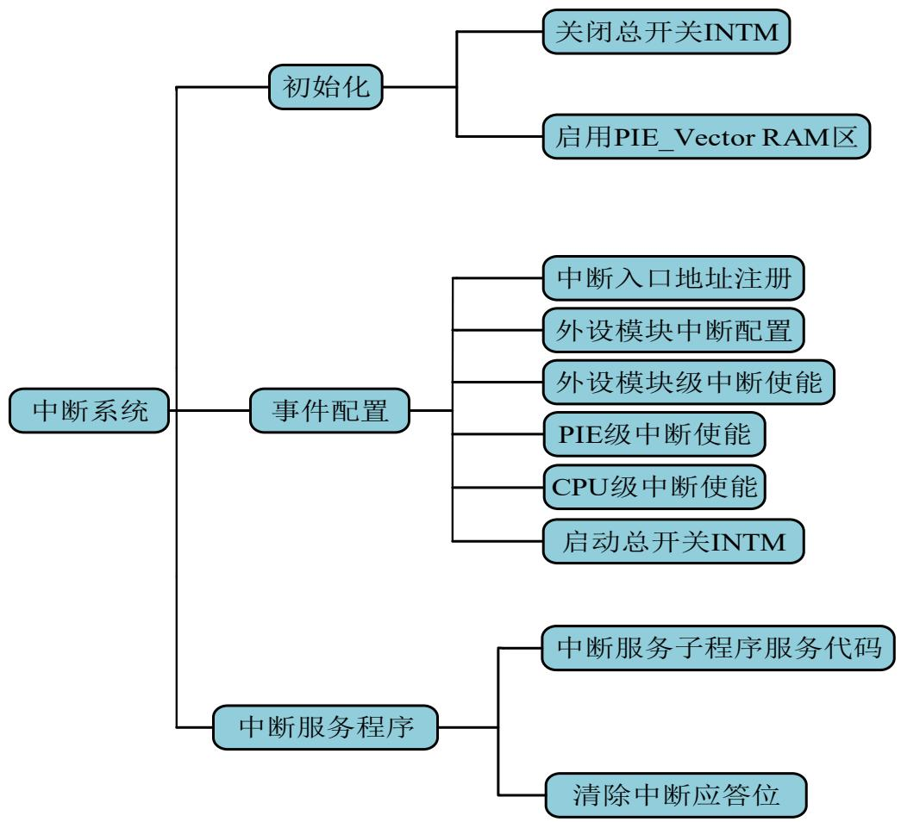

<details>
<summary>flowchart</summary>

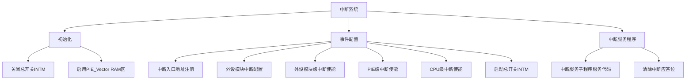
</details>

图6-5 中断系统软件思维导图

## 1. 项目任务

利用外部中断进行按键识别，控制LED灯的显示。在F28027 LaunchPad实验板上完成实例验证，实现以下功能：

按键3次为一个循环。  
第1次按键对应的显示方式：LED1亮暗显示。  
第2次按键对应的显示方式：四个LED按流水灯方式显示。  
第3次按键对应的显示方式：LED1，LED4一组，LED2，LED3一组，交替点亮。

## 2. 任务分析

按键的硬件接口见第5章的图5-9，按键断开时，GPIO12输入为低电平，按键按下时，GPIO为高电平。因此，设置外部中断为上升沿触发。

## 3.部分程序代码

软件工程包括中断功能的系统配置、外部中断事件配置、外部中断使能配置、中断入口地址注册、外部中断函数、显示切换函数和主程序等。参考程序见程序清单5-1\~程序清单5-7。

程序清单5-1 中断功能的系统配置  
```c
/******************************************************************************************
* 名称：USER_System_functionConfigure()
* 功能：系统配置---中断部分
* 路径：..\chap6_PIE_1\User_System\User_System.c
******************************************************************************************/
void User_System_functionConfigure(void)
{
    PIE_disable(myPie); //禁止PIE
    PIE_disableAllInts(myPie); //禁止PIE中断
    CPU_disableGlobalInts(myCpu); //CPU全局中断禁止CPU_clearIntFlags(myCpu);
    //CPU中断标志位清零
    PIE_setDefaultIntVectorTable(myPie); //中断入口地址赋予默认值
    PIE_enable(myPie); //使能PIE
}
```

程序清单5-2 外部中断时间配置  
```c
/******************************************************************************************
* 名称：KEY_GPIO_eventConfigure()
* 功能：外部中断配置。
* 路径：..\chap6_PIE_1\User_Component\KEY_GPIO\KEY_GPIO.c
****************************************************************************************/
void KEY_GPIO_eventConfigure(void)
{
PIE_setExtIntPolarity(myPie, CPU_ExtIntNumber_1, PIE_ExtIntPolarity_RisingEdge); //上升沿触发外部中断
GPIO_setExtInt(KEY_Gpio_obj, KEY1, CPU_ExtIntNumber_1); //KEY1按键输入映射到外部中断1
}
```

程序清单5-3 中断使能配置  
```c
/******************************************************************************************
* 名称：User_Pie_eventConfigure()
* 功能：外部中断的中断使能配置。
* 路径：..\chap6_PIE_1\User_Component\User_PIE\User_PIE.c
******************************************************************************************/
void User_Pie_eventConfigure(void)
{
PIE_enableExtInt(myPie, CPU_ExtIntNumber_1);    //外部中断使能
PIE_enableInt(myPie, PIE_GroupNumber_1, PIE_InterruptSource_XINT_1); //PIE级中断使能
CPU_enableInt(myCpu, CPU_IntNumber_1);    //CPU级中断使能
}
```

程序清单5-4 中断入口地址注册  
```c
/******************************************************************************************
* 名称：User_Pie_functionConfigure()
* 功能：中断入口地址注册。KEY_XINT1_isr为外部中断的函数名
* 路径：..\chap6_PIE_1\User_Component\User_PIE\User_PIE.c
******************************************************************************************/
void User_Pie_functionConfigure(void)
{
PIE_registerPieIntHandler(myPie, PIE_GroupNumber_1, PIE_SubGroupNumber_4, (intVec_t) KEY_XINT1_isr);
}
```

程序清单5-5 外部中断函数  
```c
/******************************************************************************************
* 名称：interrupt void KEY_XINT1_isr(void)
* 功能：中断服务子程序。按键控制key_status值在0,1,2间变化。
* 路径：..\chap6_PIE_1\Application\Isr.c
****************************************************************************************/
interrupt void KEY_XINT1_isr(void)
{
    if(key_counter>=3) key_counter=0;
    key_counter++;
    key_status=key_counter; //按键状态保存到变量key_status，显示模式切换用
    PIE_clearInt(myPie, PIE_GroupNumber_1); //中断应答位清0
}
```

程序清单5-6 显示切换函数  
```c
/******************************************************************************************
* 名称：KEY_Control_LED(void)
* 功能：显示切换子程序。根据key_status的值切换到不同的显示。
* 路径：..\chap6_PIE_1\Application\app.c
******************************************************************************************/
void KEY_Control_LED(void)
{
    switch(key_status)
    {
    case 1: LED_DISPLAY11();break;    //LED1亮暗显示
    case 2: LED_DISPLAY22();break;    //流水灯显示
    case 3: LED_DISPLAY22();break;    //分组显示
    default: break;
    }
}
```

程序清单5-7 主程序main.c  
```cpp
#define TARGET_GLOBAL 1
#include "Application\app.h"
void main(void)
{
    //1. System runtime environment
    User_System_pinConfigure();
    User_System_functionConfigure();
    User_System_eventConfigure();
    User_System_initial();
    //2. Module
    //2.1 LED_Gpio
    LED_GPIO_pinConfigure();
    LED_GPIO_functionConfigure();
    LED_GPIO_eventConfigure();
    LED_GPIO_initial();
```

//2.2 KEY  
```txt
KEY_pinConfigure();
KEY_functionConfigure();
KEY_eventConfigure();
KEY_initial();
//3. PIE runtime environment(if use interrupt)
User_Pie_initial();
User_Pie_pinConfigure();
User_Pie_functionConfigure();
User_Pie_eventConfigure();
//4. the global interrupt start (if use interrupt)
User_Pie_start(); //INTM=0
//5. main LOOP
for( ; ; )
{
    KEY_Control_LED();
}
}
```

## 4. 文件管理

工程的文件管理方式参见第4章。在第5章软件工程的基础上，在用户层增加了USE\_PIE文件，包括USE\_PIE.c和USE\_PIE.h。在User\_Device.h文件中包含新增的库文件USE\_PIE.h。在中断文件isr.c里增加外部中断函数。

## 5.项目实施

项目实施步骤如下。

第一步：导入工程chap6\_PIE\_1。

第二步：编译工程，如没有错误，则会生成chap6\_PIE\_1.out文件。如有错误则修改程序直至没有错误为止。

第三步：将生成的目标文件下载到MCU的Flash存储器中。

第四步：运行程序，检查实验结果。如果程序正确，按键按下时可以切换显示模式。

通过以上实例的操作，读者可以第5章的按键识别进行比较，理解查询方式和中断方式

实现按键识别的区别。

## 思考题

6- 1 什么是中断？为什么要使用中断？  
6-2 什么是中断源？F28027有哪些中断源？  
6- 3 什么是中断屏蔽？为什么要进行中断屏蔽？如何进行中断屏蔽？  
6-4 什么叫断点？什么叫中断现场？断点和中断现场保护和恢复有什么意义？  
6-5 中断的处理过程是什么？包含哪几个步骤？  
6-6 简述F28027的中断请求和响应的过程？  
6-7 什么是中断优先级？什么是中断嵌套？  
6-8 什么是中断入口地址？CPU如何获取中断入口地址？  
6-9 中断服务函数与普通的函数相比有何异同？  
6-10 设计并完成项目，按键2次为一个循环，第一次按键LED流水灯左移显示，第二次按键LED流水灯右移显示。