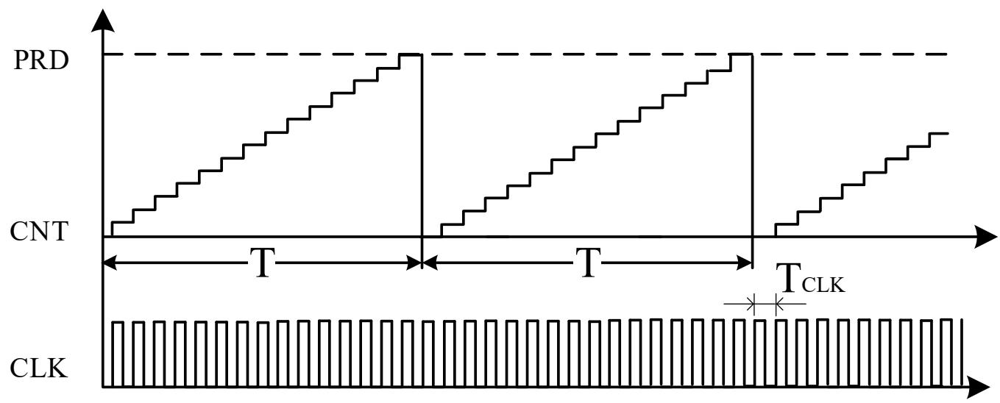
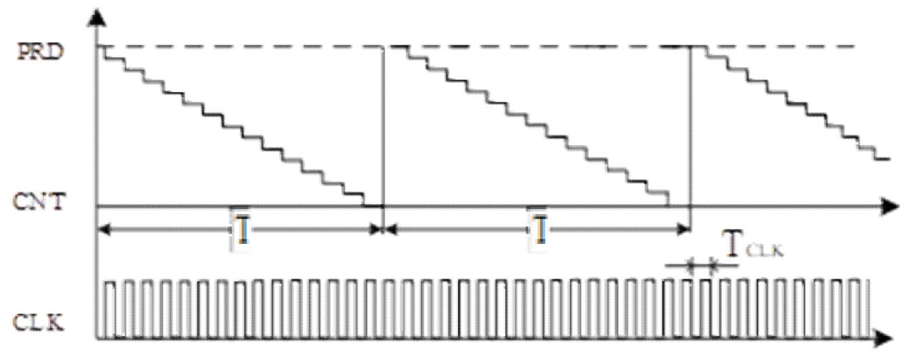
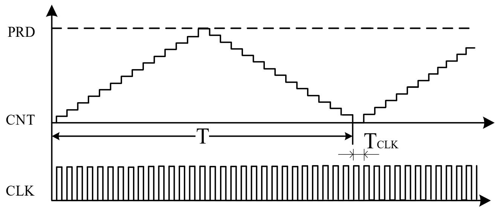
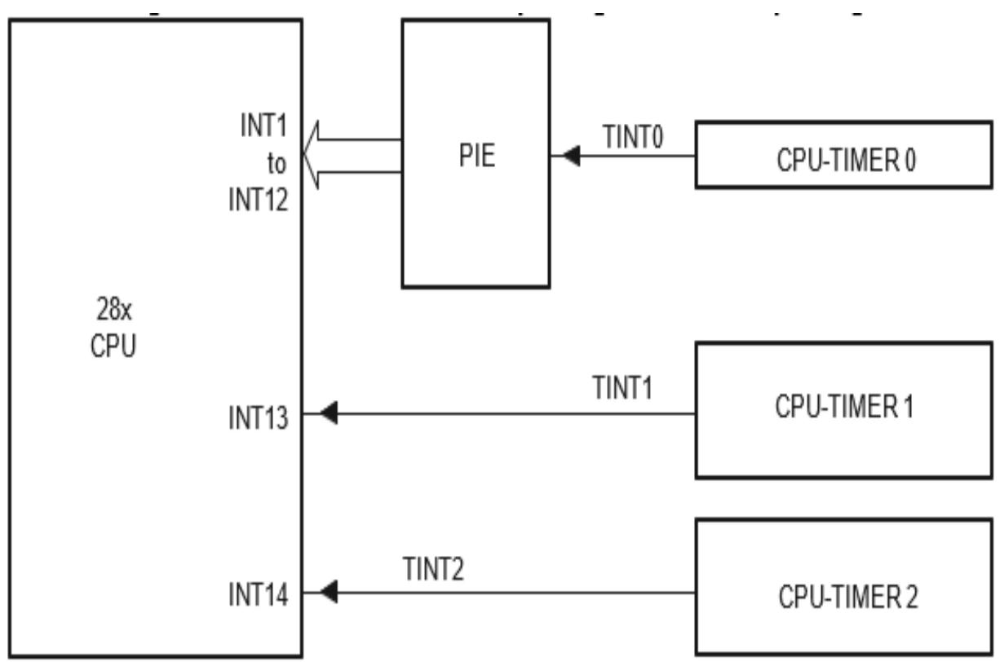
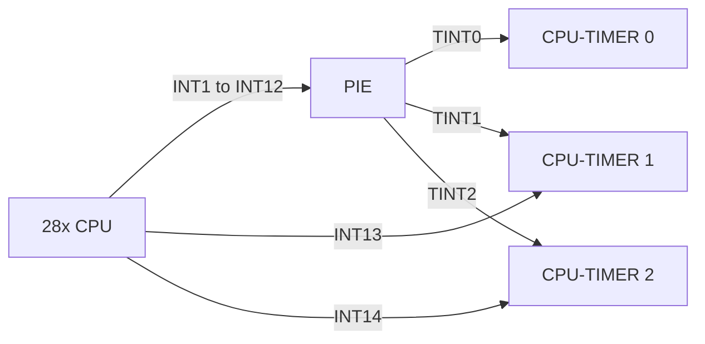
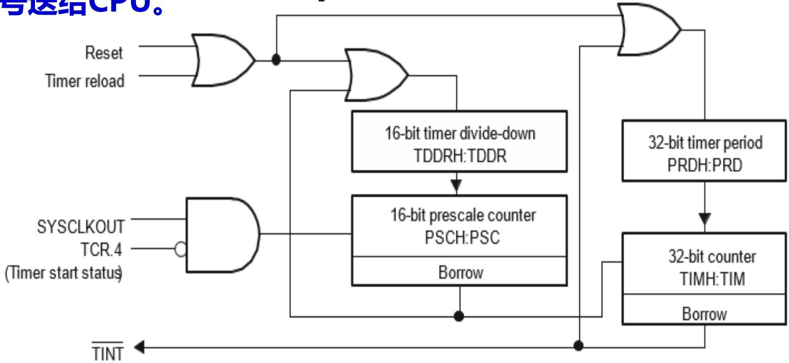
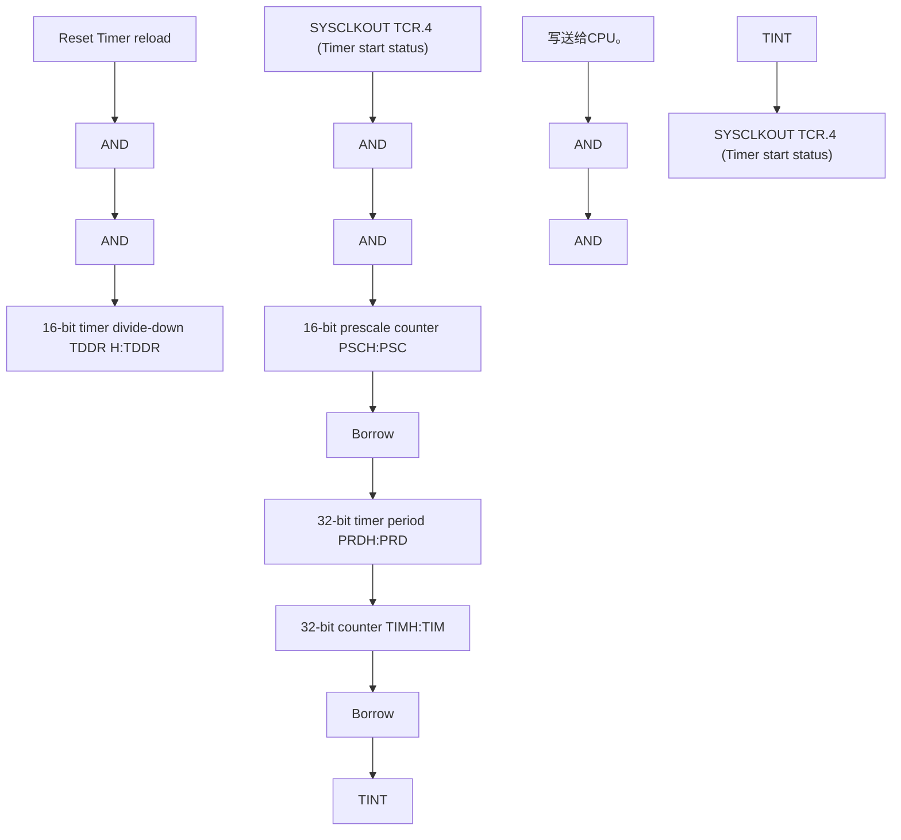
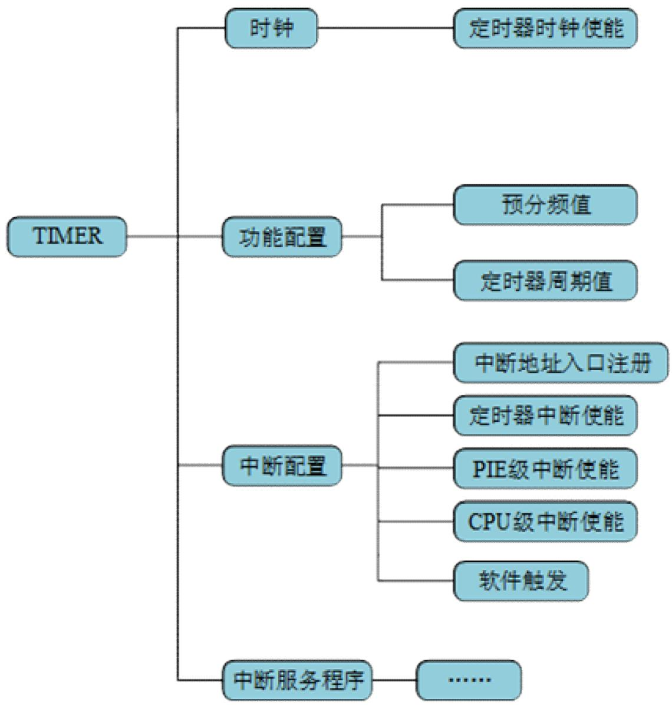
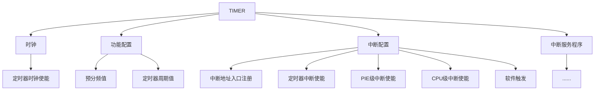

## 单片机原理及应用

## Principle And Application Of Microcontroller

福州大学电气学院

教材：《微控制器原理及应用--基于TI C2000实时微控制器》，蔡逢煌、王武、江加辉，机械工业出版社

参考资料：

¯TMS320F2802x, TMS320F2802xx Piccolo Technical Reference Manual.

¯TMS320F2802x Microcontrollers datasheet.

定时器的基础知识  
2 C2000的定时器  
3 定时器的软件架构  
应用实例—“我的时间最准”

7.1.1 定时器概述  
7.1.2 定时器内部结构  
7.1.3 定时器功能描述

1. MCU实现定时主要有软件延时、定时器两种方式。  
2.软件延时是通过执行一段固定的程序来实现延时。  
3.定时器是一个相对独立的硬件系统，与CPU并行工作，定时时间到后定时器以中断请求的方式通知CPU，处理定时相关任务。  
4. 定时器本质上是一个计数器，该计数器能对固定频率的脉冲进行计数，把时间的计量转化为对脉冲的计数。根据计数方向不同，有增计数、减计数、增减计数三种模式

增计数的工作模式是计数器按加1计数，也就是计数器在时钟脉冲的触发下连续加1。当计数值与预先设置的周期值PRD相等时，计数器重新从0开始计数，由于计数是从0开始的，因此实际的计数周期要多加1。



<details>
<summary>line chart</summary>

| Time Segment | Signal Value |
| ------------ | ------------ |
| T            | PRD          |
| T_CLK        | PRD          |
| T            | CNT          |
| T            | CLK          |
</details>

减计数的计数方式与增计数相反，计数器从某个初始值开始减1，减到0时回到初始值重新开始。

增、减计数工作模式下定时器的定时时间T为：

$$
T = T _ {C L K} \times (P R D + 1)
$$



<details>
<summary>line chart</summary>

| Time Segment | Signal Value |
| ------------ | ------------ |
| PRD          | High         |
| CNT          | Low          |
| T_CLK        | Square Wave  |
</details>

增减计数模式的计数方向由定时器自动设置，当计数器的值增加到周期值时，计数方向由增计数自动改为减计数，同样，当计数值减到0时，计数方向由减计数自动改为加计数，这种工作模式下定时器的定时时间T为：

$$
T = T _ {C L K} \times (P R D \times 2)
$$



<details>
<summary>line chart</summary>

| Time Segment | Value |
| ------------ | ----- |
| T            | T_CLK |
| T_CLK        | T_CLK |
</details>

7.2.1 定时器概述  
7.2.2 定时器内部结构  
7.2.3 定时器功能描述

F28027有3个32位的定时器TIMER0、TIMER1和TIMER2，三个定时器均采用减计数工作模式。

TIMER0和TIMER1提供给用户使用，TIMER2提供给实时操作系统使用。如果没有使用操作系统，TIMER2也可当作普通的定时器。时钟基准默认为系统时钟SYSCLKOUT。

三个定时器TIMER0、TIMER1、TIMER2分别对应三个中断请求信号TINT0、TINT1、TINT2，TINT0通过PIE进行管理，TINT1、TINT2直接与CPU的INT13、INT14相连。



<details>
<summary>flowchart</summary>


</details>

## 定时器模块：预分频器、 计数器

预分频器包括16位的预分频计数器（PSCH：PSC）和预分频设置寄存器（TDDRH：TDDR）。计数器包括32位的计数器和32位的周期寄存器。定时器的工作流程是：每经过(TDDRH:TDDR+1)个时钟周期计数器（TIMH:TIM）减1，当计数器TIMH:TIM减到0后将产生一次中断请求信号送给CPU。



<details>
<summary>flowchart</summary>


</details>

1. 预分频器：预分频计数器（PSCH:PSC）的触发信号是系统时钟信号（SYSCLKOUT）。每个时钟周期PSCH:PSC的值减1，当PSCH:PSC值为0后的一个时钟周期，发出脉冲信号（Borrow），该信号作为计数器（TIMH:TIM）的时钟信号，同时触发寄存器TDDRH:TDDR的值重新装载到寄存器PSCH:PSC。其中，寄存器PSCH:PSC为只读状态，复位后为0，通过设置寄存器TDDRH:TDDR的值进行预分频设置，每隔（TDDRH:TDDR+1）个时钟周期，寄存器TIMH:TIM值减1。

2.计数器：该计数器的触发脉冲为预分频器的输出脉冲。每个时钟周期递减1，当TIMH:TIM值减到0时，在下一个时钟周期开始时发出Borrow信号，该信号触发定时器的周期寄存器值（PRDH:PRD）重新装载到寄存器TIMH:TIM。同时，该信号作为中断触发信号，向CPU发出中断请求。  
3.重装载控制：重装载控制位（Timer Reload）有效时（高电平有效），预分频值（TDDRH:TDDR）和周期值（PRDH:PRD）重新装载到预分频计数器（PSCH:PSC）和定时计数器（TIMH:TIM）。  
4.定时器启动控制：定时器启动位（Timer start status）有效时（低电平有效）定时器开始工作。

7.3.1 寄存器及驱动函数  
7.3.2 驱动函数描述  
7.3.3 软件思维导图

<table><tr><td>寄存器</td><td>描述</td><td>地址</td><td>驱动函数名</td><td>功能</td></tr><tr><td>TIMER0TIM</td><td rowspan="2">定时器0计数寄存器</td><td>0x0C00</td><td rowspan="2">TIMER_getCount</td><td rowspan="2">CPU TIMER0获取定时器计数值</td></tr><tr><td>TIMER0TIMH</td><td>0x0C01</td></tr><tr><td>TIMER0PRD</td><td rowspan="2">定时器0周期寄存器</td><td>0x0C02</td><td rowspan="2">TIMER_setPeriod</td><td rowspan="2">CPU TIMER0设置定时器周期值</td></tr><tr><td>TIMER0PRDH</td><td>0x0C03</td></tr><tr><td rowspan="7">TIMER0TCR</td><td rowspan="7">定时器0控制寄存器</td><td rowspan="7">0x0C04</td><td>TIMER_start</td><td>CPU TIMER0启动定时器</td></tr><tr><td>TIMER_stop</td><td>CPU TIMER0停止寄存器</td></tr><tr><td>TIMER_reload</td><td>CPU TIMER0重装载预分频值和周期值</td></tr><tr><td>TIMER_getStatus</td><td>CPU TIMER0获取定时器中断标志位TIF</td></tr><tr><td>TIMER_enableInt</td><td>CPU TIMER0使能定时器中断</td></tr><tr><td>TIMER_disableInt</td><td>CPU TIMER0禁止定时器中断</td></tr><tr><td>TIMER_clearFlag</td><td>CPU TIMER0清除中断标志位</td></tr><tr><td>TIMER0TPR</td><td rowspan="2">定时器0预分频寄存器</td><td>0x0C06</td><td rowspan="2">TIMER_setDecimationFactor</td><td rowspan="2">CPU TIMER0分频设置</td></tr><tr><td>TIMER0TPRH</td><td>0x0C07</td></tr></table>

<table><tr><td>TIMER1TIM</td><td rowspan="2">定时器1计数寄存器</td><td>0x0C08</td><td rowspan="7">同定时器0</td><td rowspan="2">CPU TIMER1计数器</td></tr><tr><td>TIMER1TIMH</td><td>0x0C09</td></tr><tr><td>TIMER1PRD</td><td rowspan="2">定时器1周期寄存器</td><td>0x0C0A</td><td rowspan="2">CPU TIMER1周期值设置</td></tr><tr><td>TIMER1PRDH</td><td>0x0C0B</td></tr><tr><td>TIMER1TCR</td><td>定时器1控制寄存器</td><td>0x0C0C</td><td>CPU TIMER1控制寄存器</td></tr><tr><td>TIMER1TPR</td><td rowspan="2">定时器1预分频寄存器</td><td>0x0C0E</td><td rowspan="2">CPU TIMER1分频设置</td></tr><tr><td>TIMER1TPRH</td><td>0x0C0F</td></tr><tr><td>TIMER2TIM</td><td rowspan="2">定时器2计数定时器</td><td>0x0C10</td><td rowspan="7">同定时器0</td><td rowspan="2">CPU TIMER2计数器</td></tr><tr><td>TIMER2TIMH</td><td>0x0C11</td></tr><tr><td>TIMER2PRD</td><td rowspan="2">定时器2周期寄存器</td><td>0x0C12</td><td rowspan="2">CPU TIMER2周期值设置</td></tr><tr><td>TIMER2PRDH</td><td>0x0C13</td></tr><tr><td>TIMER2TCR</td><td>定时器2控制寄存器</td><td>0x0C14</td><td>CPU TIMER2控制寄存器</td></tr><tr><td>TIMER2TPR</td><td rowspan="2">定时器2预分频寄存器</td><td>0x0C16</td><td rowspan="2">CPU TIMER2分频设置</td></tr><tr><td>TIMER2TPRH</td><td>0x0C17</td></tr></table>

驱动函数通过结构体指针myTimer0、myTimer1、myTimer2对TIMER寄存器进行读写操作。

<table><tr><td>函数名</td><td>TIMER_getCount</td></tr><tr><td>函数原型</td><td>inline uint32_t TIMER_getCount(TIMER_Handle timerHandle)</td></tr><tr><td>功能描述</td><td>获取定时器计数值</td></tr><tr><td>输入参数</td><td>TIMER模块的结构体指针</td></tr><tr><td>返回值</td><td>定时器计数值</td></tr></table>

示例：

//获取定时器计数值

Time\_count = TIMER\_getCount(myTimer0);

<table><tr><td>函数名</td><td>TIMER_setPeriod</td></tr><tr><td>函数原型</td><td>void TIMER_setPeriod(TIMER_Handle timerHandle, const uint32_t period);</td></tr><tr><td>功能描述</td><td>设置定时器周期值</td></tr><tr><td>输入参数1</td><td>TIMER模块的结构体指针</td></tr><tr><td>输入参数2</td><td>32位无符号周期值</td></tr><tr><td>返回值</td><td>无</td></tr></table>

示例：

//设置周期值为 3000000L-1，实际周期为 3000000 个计数脉冲周期。

TIMER\_setPeriod(myTimer0, 3000000L-1);

<table><tr><td>函数名</td><td>TIMER_start</td></tr><tr><td>函数原型</td><td>void TIMER_start(TIMER_Handle timerHandle);</td></tr><tr><td>功能描述</td><td>启动定时器</td></tr><tr><td>输入参数</td><td>TIMER模块的结构体指针</td></tr><tr><td>返回值</td><td>无</td></tr></table>

示例：

//启动定时器 0

TIMER\_start(myTimer0);

<table><tr><td>函数名</td><td>TIMER_stop</td></tr><tr><td>函数原型</td><td>void TIMER_stop(TIMER_Handle timerHandle);</td></tr><tr><td>功能描述</td><td>停止定时器</td></tr><tr><td>输入参数</td><td>TIMER模块的结构体指针</td></tr><tr><td>返回值</td><td>无</td></tr></table>

示例：

//停止定时器 0

TIMER\_stop(myTimer0);

<table><tr><td>函数名</td><td>TIMER_reload</td></tr><tr><td>函数原型</td><td>void TIMER_reload(TIMER_Handle timerHandle);</td></tr><tr><td>功能描述</td><td>重装载定时器的预分频值和周期值</td></tr><tr><td>输入参数</td><td>TIMER模块的结构体指针</td></tr><tr><td>返回值</td><td>无</td></tr></table>

示例：

//重装载定时器 0

TIMER\_reload(myTimer0);

<table><tr><td>函数名</td><td>TIMER_getStatus</td></tr><tr><td>函数原型</td><td>TIMER_Status_e TIMER_getStatus(TIMER_Handle timerHandle);</td></tr><tr><td>功能描述</td><td>获取定时器中断标志位 TIF,0:计数器还没减到 0;1:计数器已经减到 0</td></tr><tr><td>输入参数</td><td>TIMER模块的结构体指针</td></tr><tr><td>返回值</td><td>定时器TIF标志位</td></tr></table>

示例：

//获取定时器 TIF标志位

Time\_status=TIMER\_getStatus(myTimer0);

<table><tr><td>函数名</td><td>TIMER_enableInt</td></tr><tr><td>函数原型</td><td>void TIMER_enableInt(TIMER_Handle timerHandle);</td></tr><tr><td>功能描述</td><td>使能定时器中断</td></tr><tr><td>输入参数</td><td>TIMER模块的结构体指针</td></tr><tr><td>返回值</td><td>无</td></tr></table>

示例：

//定时器 0 中断使能

TIMER\_enableInt(myTimer0);

<table><tr><td>函数名</td><td>TIMER_disableInt</td></tr><tr><td>函数原型</td><td>void TIMER_disableInt(TIMER_Handle timerHandle)</td></tr><tr><td>功能描述</td><td>禁止定时器中断</td></tr><tr><td>输入参数</td><td>TIMER模块的结构体指针</td></tr><tr><td>返回值</td><td>无</td></tr></table>

示例：

//禁止定时器 0 中断

TIMER\_disableInt(myTimer0)；

<table><tr><td>函数名</td><td>TIMER_clearFlag</td></tr><tr><td>函数原型</td><td>void TIMER_clearFlag(TIMER_Handle timerHandle)</td></tr><tr><td>功能描述</td><td>清除中断标志位</td></tr><tr><td>输入参数</td><td>TIMER模块的结构体指针</td></tr><tr><td>返回值</td><td>无</td></tr></table>

示例：

//清除定时器 0 中断标志位

TIMER\_clearFlag(myTimer0);

<table><tr><td>函数名</td><td>TIMER_setDecimationFactor</td></tr><tr><td>函数原型</td><td>void TIMER_setDecimationFactor(TIMER_Handle timerHandle,const uint16_t decFactor);</td></tr><tr><td>功能描述</td><td>设置预分频值,设置值为0-65535,对应分频系数1-65536</td></tr><tr><td>输入参数1</td><td>TIMER模块的结构体指针</td></tr><tr><td>输入参数2</td><td>16位预分频值</td></tr><tr><td>返回值</td><td>无</td></tr></table>

示例：

//设置预分频值为 1，既预分频系数为 2 分频。如果系统时钟频率为 60MHz，那么计数器的时钟频率为 30MHz

TIMER\_setDecimationFactor(myTimer0，1);

根据需要定时的时间，进行预分频值和周期值的计算。根据定时器的工作原理，定时时间由预分频值和周期值共同决定，按照公式计算：

定时时间T=时钟周期\*（预分频值+1）\*（周期值+1）

## （1） 定时器的配置

步骤1：停止定时器（TIMER\_stop）。

步骤2：根据计算的结果，配置预分频值

（TIMER\_setDecimationFactor）。

步骤3：根据计算的结果，配置周期值（TIMER\_setPeriod）。

步骤4：重装载预分频值和周期值（TIMER\_reload）。

步骤6：启动定时器步骤5：定时器中断使能

（TIMER\_enableInt）

（TIMER\_start）。

## （2） 中断事件配置

步骤7：中断入口地址注册（PIE\_registerPieIntHandler）

步骤8：定时器中断使能（TIMER\_enableInt）

步骤9：PIE级中断使能（PIE\_enableInt）

步骤10：CPU级中断使能（CPU\_enableInt）

## （3） 中断服务程序

在中断服务程序里面完成授时服务，清除对应的PIE中断应答位PIEACKx。



<details>
<summary>flowchart</summary>


</details>

## 7.4 应用实例---“我的时间最准”

## 1. 项目任务

利用定时器控制LED流水灯的间隔时间。在F28027LaunchPad实验板上完成实例验证。

## 2. 项目分析

定时器中断时间设置为1s，在定时器中断程序中实现流水灯的切换控制。配置预分频值为0，则预分频系数为1分频。因为系统时钟频率为60MHz，根据定时时间计算公式，周期值设置为60000000-1。

程序清单7-1CPU TIMER0功能配置  
```txt
/**********************************************************************
* 名称: myTimer_functionConfigure ()
* 功能: 设置定时器0的定时周期, 启动定时器。
* 路径: ..\chap7_TIMER_1\User_Component\myTimer\myTimer.c
**********************************************************************/
void myTimer_functionConfigure(void)
{
    // 1.TIMER stop
    TIMER_stop(myTimer0);    //TIMER0 停止
    // 2. set PreScaler
    TIMER_setPreScaler(myTimer0, 0)    //预分频系数为1
    // 3. set Period
    TIMER_setPeriod(myTimer0, 60000000L-1); //定时器周期值设置
    // 4. reload
    TIMER_reload(myTimer0);    //重装载
    // 5. TIMER start
    TIMER_start(myTimer0);    //启动定时器0
}
```

程序清单7-2中断使能配置  
```c
/******************************************************************************************
* 名称: User_Pie_eventConfigure()
* 功能: 定时器的中断使能配置。
* 路径: ..\chap7_TIMER_1\User_Component\User_Pie\User_Pie.c
******************************************************************************************/
void User_Pie_eventConfigure(void)
{
    // 1.module IE TIMER0
    TIMER_enableInt(myTimer0);    //设备级中断允许: 定时器0中断允许
    // 2. PIE PIEIERx.y TIMER0    //PIE级中断允许
    PIE_enableInt(myPie, PIE_GroupNumber_1, PIE_InterruptSource_TIMER_0)
    // 3. CPU IERx TIMER0
    CPU_enableInt(myCpu, CPU_IntNumber_1);    //CPU级中断允许
}
```

程序清单7-3中断入口地址注册  
```c
/**********************************************************************
* 名称: User_Pie_functionConfigure()
* 功能: 中断入口地址配置。
* 路径: ..\chap7_TIMER_1\User_Component\User_Pie\User_Pie.c
**********************************************************************
void User_Pie_functionConfigure(void)
{
    //register PIE vector TIMER0
    PIE_registerPieIntHandler(myPie,PIE_GroupNumber_1,PIE_SubGroupNumber_7,(intVec_t) &myTimer_Cputimer0_isr); //中断入口地址配置
}
```

程序清单7-4CPUTimeO 中断函数  
```c
/**********************************************************************
* 名称：interrupt void myTimer_Cputimer0_isr (void)
* 功能：定时器 0 中断子程序，在中断程序中进行流水灯控制。
* 路径：...\chap7_TIMER_1\Application\isr.c
**********************************************************************/
interrupt void myTimer_Cputimer0_isr(void)
{
    LED_off(LED[LED_Count]); //当前LED 灯暗
    LED_Count++; //下一个LED 灯
    if(LED_Count >=4)
    {
    LED_Count=0;
    }
    LED_on(LED[LED_Count]); //LED 灯亮
    PIE_clearInt(myPie, PIE_GroupNumber_1); //清应答位
}
```

## 思考题：

§7-1 软件延时和定时器延时的特点是什么？分别应用于什么场合？  
§7-2 定时器的类型有几种?不同类型的定时器有什么区别？  
§7-3 定时器的工作原理是什么？  
§7-4 F28027定时器的内部结构有什么特点？  
§7-5 F28027定时器的预分频器是什么作用？  
§7-6 F28027的预分频器值为4，希望定时器定时时间为1s，那么周期寄存器的值应该为多少？  
§7-7 F28027定时器最大的定时时间是多少？  
§7-8 设计并完成项目，利用按键控制流水灯的间隔时间，按键3次为个循环，实现以下功能：  
第一次按键显示间隔时间为500ms。  
第二次按键显示间隔时间1s。  
第三次按键显示间隔时间2s。